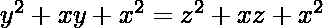
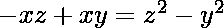
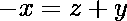

# 共线性问题是 NP 完全的证明

> 原文:[https://www . geesforgeks . org/proof-共线性-problem-is-np-complete/](https://www.geeksforgeeks.org/proof-that-collinearity-problem-is-np-complete/)

**<u>问题</u> :** 给定 3 个点 **a** 、 **b** 、 **c** ，任务是检查这三个点是否共线。

**<u>解释</u> :** 问题的一个实例是指定给问题的输入。共线性问题的一个例子是三点 **((a x ，a y )，(b x ，b y )，(c x ，cy)**。由于 [NP-Complete](https://www.geeksforgeeks.org/np-completeness-set-1/) 是同时存在于 **NP** 和 **NP-hard** 中的问题，因此问题是 NP-Complete 这一说法的证明由两部分组成:

> 1.  The problem itself lies in NP class.
> 2.  All other problems in NP class can be reduced to that by polynomial time.
>     (b can be reduced to c by polynomial time and expressed as b ≤ p c )

如果仅满足第二个条件，则问题称为 **NP-Hard** 。
但是不可能把每一个 NP 问题都简化成另一个 NP 问题来一直展示它的 NP-完全性。这就是为什么要证明一个问题是 NP 完全的，证明这个问题是 NP 完全的，任何 NP 完全问题都可以简化为 NP 完全问题。因此，可以使用以下命题来验证共线性问题是 NP 完全的:

**<u>共线性问题在 NP 中</u> :**
如果有任何问题在 NP 中，那么给出一个‘证书’，这是问题的一个解决方案和问题的一个实例(三个点的集合 **a** 、 **b** 、 **c** )我们将能够在多项式时间内识别(无论解决方案是否正确)证书。这可以通过检查来完成:

> 

**<u>共线性问题是 NP-Hard</u> :**
为了证明共线性问题是 NP-Hard，从一个已知的 [NP-Hard 问题](https://www.geeksforgeeks.org/difference-between-np-hard-and-np-complete-problem/)推导出一个约简，即 3-Sum 到共线性问题。对于 3-Sum 实例中的每个 **x** ，从 **x** 映射到 **(x，x 3 )** 。现在，从 3 个 Sum 实例 **(x，y，z)** 我们有 **((x，x 3 )、(y，y 3 )、(z，z3)**。
以下主张成立:

让设定 **S** 有共线点 **(x，x 3 )、(y，y 3 )、(z，z 3 )**
现在，

> => 
> 
> => 
> 
> => 
> 
> => 
> 
> => 

因此，(x，y，z)是共线点。这些方程式可以互换。
所以**共线性问题**是 **NP-Complete** 。