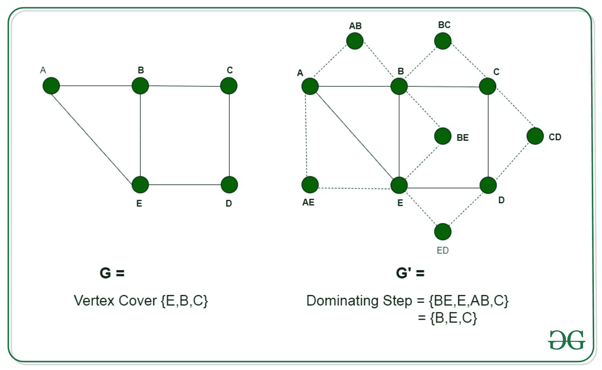

# 图的支配集是 NP 完全的证明

> 原文:[https://www . geesforgeks . org/证明占主导地位的图形集是 np-complete/](https://www.geeksforgeeks.org/proof-that-dominant-set-of-a-graph-is-np-complete/)

**先决条件:** [图形的优势集](https://www.geeksforgeeks.org/dominant-set-of-a-graph/)[NP-Complete](https://www.geeksforgeeks.org/np-completeness-set-1/)

> 图中的支配集 **G = (V，E)** 是顶点的子集 **V'** ，条件是不属于 V '的顶点与 **V'** 中的某个顶点相邻。

**问题:**给定一个图 **G(V，E)** 和一个整数 k，问题是确定该图是否有大小为 k 的支配集
**解释:**
问题的一个实例是指定给问题的输入。支配集问题的一个例子是图 G (V，E)和整数 k，问题是检查图在 G 中是否可以有支配集。由于 NP-Complete 问题，顾名思义，是一个既在 NP 中又在 NP-hard 中的问题，所以证明问题是 NP-Complete 的陈述由两部分组成:

1.  **支配集是 NP 完全的**
    如果 NP 中有任何问题，那么，给定一个‘证书’，它是问题的一个解和问题的一个实例(在这种情况下是一个图 G 和一个正整数 k)，我们将能够在多项式时间内验证(检查给定的解是否正确)证书。
    证书是形成图中支配集的一系列顶点。我们可以通过检查所有顶点都属于图的顶点，并且所有不属于这个序列的顶点都与这个集合中的一些顶点相邻来验证这个解决方案。这可以在多项式时间内完成，即 O(V +E)使用以下策略:

```
flag=true
for every vertex v in V:
  if v doesn't belong to Dominating Set:
     verify the set of edges 
     corresponding to v 
     if v is not adjacent 
        to any of the vertices in DS, 
        set flag=False and break
if (flag)
   solution is correct
else
   solution is incorrect

```

*   **Dominating Set is NP-Hard**
    In order to prove that the Dominating Set is NP-Hard, we will have to reduce a known NP-Hard problem to this problem. We will carry out a reduction from the Vertex Cover problem to the Dominating Set problem.
    Every instance of the Vertex Cover problem consists of a graph **G = (V, E)** and an integer k consisting of the subset of vertices as the input can be converted to a Dominating Set problem consisting of graph **G’ = (V’, E’)**. We will construct the graph G’ in the following way:
    *   **E'** =对于图 G 中由顶点{u，v}组成的每条边 E，添加一个新顶点{uv}，并将其单独连接到新顶点 u 和 v。
    *   **V'** =将原图 g 的所有顶点 V 相加

    通过添加对应于新顶点的新边，可以在多项式时间内获得新图 G’，这需要 *O(V+E)* 时间。这种减少可以通过以下两种说法来证明:

    *   假设图 G 有一个大小为 k 的顶点覆盖 VC，G 中的每条边都有一个顶点属于这个顶点覆盖。因此，对于由顶点{u，v}组成的每条边 e，至少 u 或 v 是顶点覆盖的一部分。所以，如果 u 包含在 VC 中，那么相邻的顶点就是 v，也是被 VC 中的一些元素覆盖的。现在，对于每个边的所有新添加的顶点 UV，顶点都与 u 和 v 相邻，其中一个至少是 VC 的一部分，如上所述。因此，所有边的附加顶点也被这个 VC 覆盖。形成大小为 k 的顶点覆盖的顶点集构成了图 G’中的支配集。因此，如果 G 有一个顶点覆盖，G’有一个相同大小的支配集。
    *   我们假设图 G’有一个大小为 k 的支配集。可能出现两种可能性，或者 DS 中的顶点是原始顶点，或者它属于每个边{u，v}的新添加的顶点 UV。在第二种情况下，由于每个新的顶点都连接到边的两个顶点 u 和 v，因此，它可以被 u 或 v 替换。由于这三个顶点形成一个三角形，因此，即使用 u 或 v 替换视图，我们也可以继续跨越替换之前跨越的所有顶点。这将导致消除所有新添加的顶点，同时跨越图 G’的所有边。新添加的顶点由修改后的 DS 支配，并覆盖 G 中的所有边，每个边 UV 至少有 u 或 v。因此，如果 G’有一个大小为 k 的支配集，那么 G 将有一个大小最大为 k 的顶点覆盖。

        下图中，顶点 B 同时支配 AB 和 BE，因此很容易替换。因此，这两个顶点是多余的。
        [](https://media.geeksforgeeks.org/wp-content/uploads/20200602015611/dominating_set1.jpg)

        因此我们可以说图 G’包含一个支配集，如果图 G 包含顶点覆盖。因此，支配集问题的任何实例都可以简化为顶点覆盖问题的实例。因此，支配集也是 NP-Hard。因为顶点覆盖同时存在于 NP 和 NP-Hard 类中，所以图的支配集是 NP-完全的。