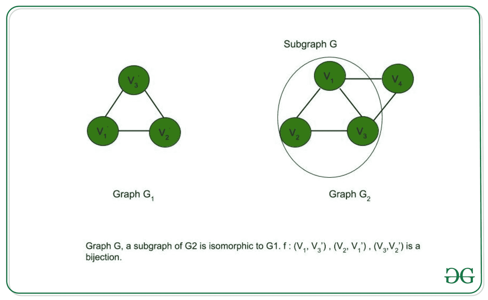

# 子图同构问题是 NP 完全的证明

> 原文:[https://www . geesforgeks . org/proof-子图-同构-问题-是-np-complete/](https://www.geeksforgeeks.org/proof-that-subgraph-isomorphism-problem-is-np-complete/)

**[子图同构问题](https://www.geeksforgeeks.org/mathematics-graph-isomorphisms-connectivity/) :** 我们有两个无向图 G 1 和 G 2 。问题是检查 G 1 是否同构于 G 2 的一个子图。

**图同构:**如果两个图 A 和 B 的顶点数和边数相同，则这两个图是同构的，并且保持了边的连通性。图 A 和 B 的顶点集之间有一个双射，因此，当且仅当 f(u)，f(v)在 B 中相邻时，图 A 中的两个顶点 u，v 彼此相邻(f 是双射)。

为了证明一个问题是 NP 完全的，我们必须证明它同时属于 NP 和 NP 难类。(既然 NP-完全问题是 NP-Hard 问题，也属于 NP)
 
**子图同构问题属于 NP–**如果一个问题属于 NP 类，那么它应该具有多项式时间的可验证性。给定证书，我们应该能够在多项式时间内验证它是否是问题的解决方案。

**证明:**

1.  <u>证书:</u>设 G 为 G 的子图 2 。我们也知道 G 1 的顶点和 G 之间的映射
2.  <u>验证:</u>我们要检查 G 1 是否同构于 G。(I)检查映射是否是双射，以及(ii)验证对于 G 1 中的每条边(u，v)，G 中是否存在边(f(u，f(v))。

因此，子图同构问题具有多项式时间可验证性，属于 NP 类。

**子图同构问题属于 NP-Hard–**如果每个 NP 问题在多项式时间内可约化为 L，则问题 L 属于 NP-Hard。为了证明子图同构问题是 NP-Hard 问题，我们尝试将一个已知的 NP-Hard 问题简化为特定实例的 S 问题。如果这种约简在多项式时间内是可能的，那么 S 也是一个 NP-Hard 问题。因此，让我们把 NP 完全的团决策问题(C)(因此，NP 中的所有问题都可以在多项式时间内化为 C)化为子图同构问题。如果这个约简在多项式时间内是可能的，那么每个 NP 问题都可以在多项式时间内约简为 S，从而证明 S 是 NP-Hard。

**证明:**让我们证明团决策问题在多项式时间内化简为子图同构问题。

让集团决策问题的输入为(G，k)。如果图 G 包含大小为 k 的团(大小为 k 的团是 G 的子图)，则输出为真。设 G1 是 k 个顶点的完全图，G 2 是 G，其中 G 1 ，G 2 是子图同构问题的输入。我们观察到 k < =n，其中 n 是 G 中的顶点数(=G 2 )。如果 k > n，那么 k 大小的团不能是 G 的子图，创建 G 1 所花费的时间是 O(k2)= O(n2)[因为 k < =n]作为 k 大小的完整图中的边数=kC2= k *(k-1)/2。G 有一个大小为 k 的团，当且仅当 G1 是 G 的子图 2 (由于 G 1 本身是 G 的子图 2 ，且每个图都同构于自身，子图同构问题的结果为真。因此，G 1 同构于 G 2 的子图。因此，如果团决策问题为真，子图同构问题为真，反之亦然。因此，对于特定的实例，团决策问题可以在多项式时间内简化为子图同构问题。

因此，子图同构问题是一个 NP 难问题

**结论:**
子图同构问题是 NP 和 NP-Hard。因此**子图同构问题是 NP-Complete** 。