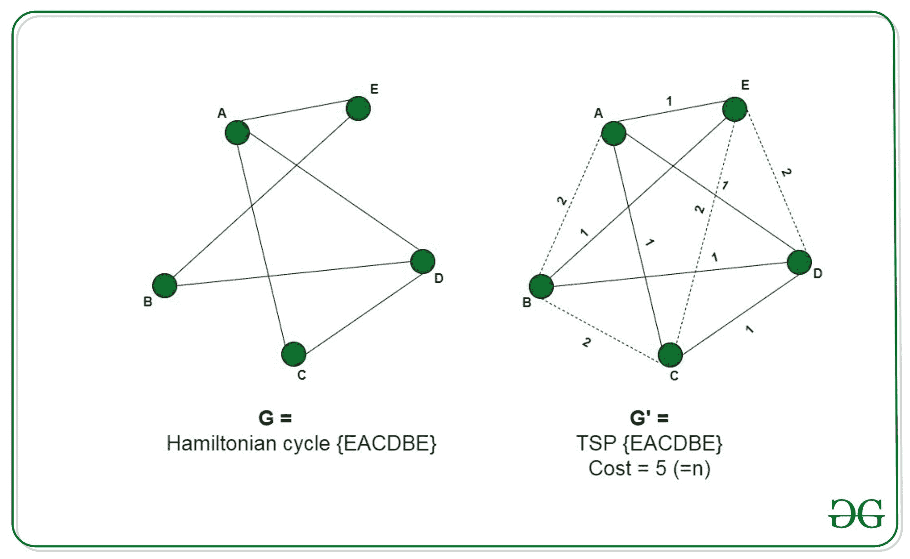

# 证明旅行推销员问题是 NP 难的

> 原文:[https://www . geeksforgeeks . org/证明-旅行推销员-问题-是-np-hard/](https://www.geeksforgeeks.org/proof-that-traveling-salesman-problem-is-np-hard/)

**先决条件:** [旅行推销员问题](https://www.geeksforgeeks.org/travelling-salesman-problem-set-1/)[NP 难](https://www.geeksforgeeks.org/difference-between-np-hard-and-np-complete-problem/)

给定一组城市和每对城市之间的距离，[旅行推销员问题](https://www.geeksforgeeks.org/travelling-salesman-problem-set-1/)找到这些城市之间的路径，使得它是最短的路径，并且遍历每个城市一次，返回到起点。

**问题–**给定一个图 **G(V，E)** ，问题是确定该图是否有一个最多由成本构成的 TSP**K**。
**解释–**
为了证明旅行推销员问题是 NP-Hard，我们将不得不把一个已知的 NP-Hard 问题简化为这个问题。我们将把哈密顿圈问题简化为旅行商问题。
哈密顿圈问题的每一个实例都由一个图 G =(V，E)组成，作为输入可以转化为一个旅行商问题，这个旅行商问题由图 G' = (V，E ')和最大成本 k 组成，我们将按照以下方式构造图 G ':
对于属于 E 的所有边 E，加上边 c(e)=1 的成本。连接原始图形 **G** 中不存在的剩余边 E '属于 E '，每个边的成本 c(e')= 2。
并设置。
只需将 G 转化为一个完整的图 G’并加上相应的代价，就可以在多项式时间内构造出新的图 G’。这种减少可以通过以下两种说法来证明:

*   让我们假设图 **G** 包含一个哈密顿圈，遍历图的所有顶点 V。现在，这些顶点与形成一个旅行商问题，因为它使用了成本 c(e)=1 的原始图的所有边。并且，由于它是一个循环，因此，它返回到原始顶点。
*   我们假设图 G’包含一个带有成本的 TSP，。TSP 遍历图的所有顶点，返回到原始顶点。现在，由于没有一个顶点被排除在图之外，并且代价和为 n，因此，它必然使用存在于 **E** 中的图的所有边，代价为 1，因此与图 **G** 形成一个[哈密顿圈](https://www.geeksforgeeks.org/hamiltonian-cycle-backtracking-6/)。

因此，如果图 **G** 包含哈密顿圈，那么我们可以说图 **G'** 包含一个 TSP。因此，旅行推销员问题的任何实例都可以简化为哈密顿圈问题的实例。因此，TSP 是 NP 难的。