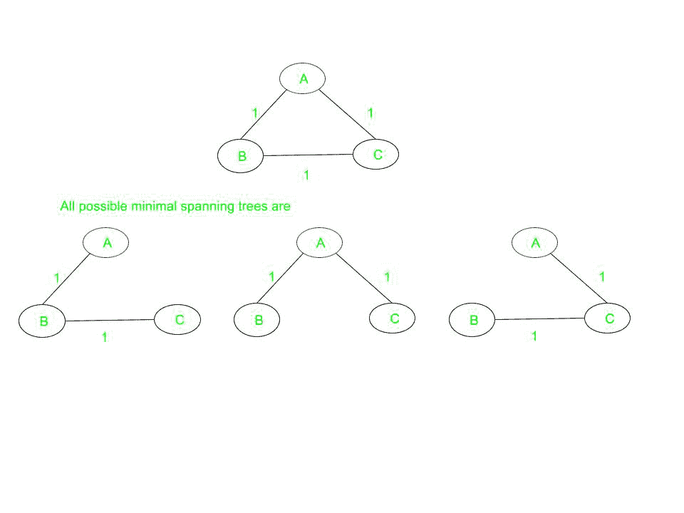

# 最小生成树的性质

> 原文:[https://www . geesforgeks . org/properties-of-minimum-生成树-mst/](https://www.geeksforgeeks.org/properties-of-minimum-spanning-tree-mst/)

对于连通的[无向图](https://www.geeksforgeeks.org/graph-data-structure-and-algorithms/)，该图的[生成树](https://www.geeksforgeeks.org/prims-minimum-spanning-tree-mst-greedy-algo-5/)是将所有顶点连接在一起的树的子图。一个图可以有多个生成树。一个加权的、连通的、无向图的最小生成树(MST) 或最小权重生成树是一个权重小于或等于所有其他可能生成树的权重的生成树。生成树的权重是赋予生成树每条边的权重之和。

在本文中，我们将讨论 **MST** 的性质:

### <u>可能的多重性</u>:

如果 **G(V，E)** 是一个[图](https://www.geeksforgeeks.org/graph-data-structure-and-algorithms/)，那么图 **G** 的每一个生成树都由**(V–1)**条边组成，其中 **V** 是图中的顶点数， **E** 是图中的边数。因此，**(E–V+1)**边不是生成树的一部分。可能有几个相同权重的最小生成树。如果一个图的所有边权重都相同，那么该图的每个生成树都是最小的。

考虑一个由三个顶点组成的完整图，并且所有的边权重都相同，那么将有三个具有相同路径长度的生成树(它们也是最小的)。下图说明了同样的情况:

每个生成树的权重等于 **2** 。

### <u>切割属性</u>:

对于图的任何一个割 **C** ，如果 **C** 割集中的一条边 **E** 的权重严格小于 **C** 割集中所有其他边的权重，那么这条边属于图的所有 MST。下图说明了同样的情况:

### <u>循环特性</u>:

对于图中的任意循环 **C** ，如果 **C** 的一条边 **E** 的权重大于 **C** 的所有其他边的单个权重，则该边不能属于 **MST** 。在上图中，在循环 **ABD** 中，边 **BD** 不能出现在任何最小生成树中，因为它在循环中的所有边中权重最大。

### <u>唯一性</u>:

如果每条边都有不同的权重，那么只有一个，即唯一的最小生成树。

*   **最小成本边:**如果一个图的最小成本边是唯一的，那么这个边包含在任何 MST 中。例如，在上图中，边缘 **AB** (最小重量的)总是包含在 MST 中。
*   如果一个新的边被添加到生成树中，那么它将变成循环的，因为每个生成树都是最小无环的。上图中，如果把边 **AD** 或 **BC** 加到合成的 MST 上，那么就会形成一个循环。
*   生成树是最小连接的，也就是说，如果从生成树中移除任何边，它将断开该图。在上图中，如果从合成的 MST 中移除任何边，那么它将断开图形。