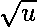
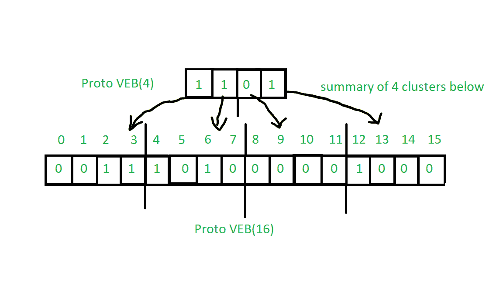
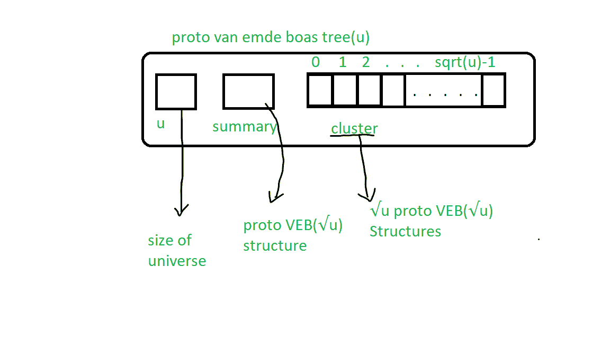
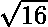
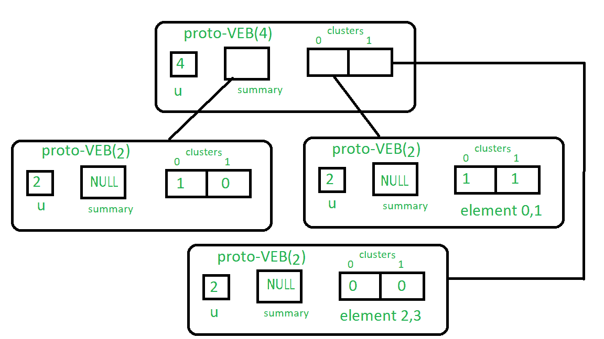

# 原型范·埃姆德·博阿斯树|第 2 集|构造

> 原文:[https://www . geesforgeks . org/proto-van-emde-boas-tree-set-2-construction/](https://www.geeksforgeeks.org/proto-van-emde-boas-tree-set-2-construction/)

Van Emde Boas Tree 支持 O(lglgN)时间内的搜索、最小、最大、后继、前置、插入和删除操作，比优先级队列、二叉查找树等任何相关数据结构都要快。Proto Van Emde Boas 树是类似原型类型的数据结构但未能达到 O(lglgN)的复杂度，我们将先学习 Proto Van Emde Boas 树，对 Van Emde Boas 树的工作有一个基本的了解。这里 N 是定义树的宇宙的大小。

**注意:** Proto Van Emde Boas 数据结构的键必须在 0 到 n 的范围内定义(n 是形式 2 <sup>2k</sup> 的正整数)，并且在不允许重复键时有效。

**缩写:**

1.  原型 VEB 是原型范·埃姆德·博阿斯树的缩写。
2.  原型 VEB( )是包含 u 个键的原型 VEB 的缩写。

**原型 VEB 树结构的基本理解:**
原型范·埃姆德·博阿斯树是递归定义的数据结构，当我们在树上时，它会缩小到 sqrt 大小。请参考[这篇文章](https://www.geeksforgeeks.org/proto-van-emde-boas-trees-set-1-background-introduction/#comment-4017451786)来了解它的基础知识。

在原型 VEB 中，我们使用一个位数组来表示一个键是否存在，如果存在，我们放 1，否则放 0。
这里，特定簇的摘要包含簇中是否存在任何键，如果至少存在一个键，则摘要在别处为 1 或 0。簇是位数组的片段。总结也是一个位数组。见下图:



**原 VEB 树的构建:**
下图代表了原 VEB 的基本结构:



递归定义结构有两个主要部分:

1.  **小结**:是一个指向大小的原 VEB 结构的指针。
2.  **集群:**它是一个指向具有大小的原 VEB 结构的指针数组。

首先，我们要了解一些功能和关键词:

*   **宇宙大小(u)** :原 VEB 结构中的键数。
*   **High(x):** 从第一张图片中，我们可以看到，如果我们想到达关键的簇，那么我们可以用来划分它。
    <u>例如</u>，我们想知道钥匙 12 的簇，那么可以用来划分，也就是 3，所以钥匙 12 在 3 <sup>rd</sup> 簇中。

```
High(x) = floor( x / )
```

*   **low(x):** 从第一张图片中，我们可以看到，如果我们想要簇中关键点的位置，我们可以应用模数运算 x % 。
    <u>例如</u>，如果你想在集群中找到 7 的位置，你可以应用 7 %  = 3，这是 2 <sup>和</sup>集群中 7 的位置。

```
low(x) = x % )
```

**递归构造程序:**

1.  基本情况:如果宇宙大小是 2，那么它是一个基本大小，所以不会有更多的摘要数组，这意味着它是空的，我们将只存储 2 个键的位数组。
2.  我们将递归地将摘要指定为大小的原 VEB 树和大小的原 VEB 给所有的集群。

见下图中的 u=4 原 VEB 结构:



下面是表示算法的代码:

## C++

```
#include <bits/stdc++.h>
using namespace std;

class Proto_Van_Emde_Boas {
public:
    // Total number of keys
    int universe_size;

    // Summary
    Proto_Van_Emde_Boas* summary;

    // Clusters array of Proto-VEB pointers
    vector<Proto_Van_Emde_Boas*> clusters;

    int root(int u)
    {
        return (int)sqrt(u);
    }

    // Function to return cluster numbers
    // in which key is present
    int high(int x)
    {
        return x / root(universe_size);
    }

    // Function to return the position
    // of x in cluster
    int low(int x)
    {
        return x % root(universe_size);
    }

    // Function to return index form
    // cluster number and position
    int generate_index(int cluster, int position)
    {
        return cluster * root(universe_size) + position;
    }

    // Constructor
    Proto_Van_Emde_Boas(int size)
    {
        universe_size = size;

        // Base case
        if (size <= 2) {

            // Set summary to nullptr as there is no
            // more summary for size 2
            summary = nullptr;

            // Vector of two pointers
            // nullptr in starting
            clusters = vector<Proto_Van_Emde_Boas*>(size, nullptr);
        }
        else {

            // Assigning Proto-VEB(sqrt(u)) to summary
            summary = new Proto_Van_Emde_Boas(root(size));

            // Creating array of Proto-VEB Tree pointers of size sqrt(u)
            // first all nullptrs are going to assign
            clusters = vector<Proto_Van_Emde_Boas*>(root(size), nullptr);

            // Assigning Proto-VEB(sqrt(u)) to all its clusters
            for (int i = 0; i < root(size); i++) {
                clusters[i] = new Proto_Van_Emde_Boas(root(size));
            }
        }
    }
};

// Driver code
int main()
{
    Proto_Van_Emde_Boas pveb(4);
}
```

**时间复杂度:** O(sqrt(n))