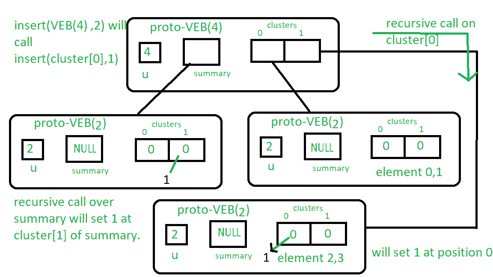

# 原型范·埃姆德·博阿斯树|集合 3 |插入和成员查询

> 原文:[https://www . geesforgeks . org/proto-van-emde-boas-tree-set-3-insert-and-is member-query/](https://www.geeksforgeeks.org/proto-van-emde-boas-tree-set-3-insertion-and-ismember-query/)

请参阅之前关于 Proto Van Emde Boas Tree 的文章，以正确理解这些。

**插入程序:**

1.  基本情况:如果原型 VEB 的大小是 2，那么将 true 分配给位数组**(在这里，由于递归结构，我们在代码中分配了原型 VEB(1)，因此现在它不是 nullptr，它在键的位置充当 true )** 。
2.  在到达基本情况之前，我们将递归调用包含键的簇上的 insert，并且现在我们使用键作为该簇中键的位置，而不是查询键。

**示例:**让我们将 2 插入到 Proto-VEB (u=4)中:从插入的过程中，我们将开始递归，因为 Proto-VEB 的大小大于 2，所以我们递归调用第 2 个簇/ 上的 insert()，它是 1，它的位置 2% 是 0，所以递归调用将是 insert(簇[1]，0)。
而集群【1】是大小为 2 的原 VEB，我们到达了基本情况，因此它将在(在代码中原 VEB(1)为真)集群【1】0<sup>第</sup>个地方分配真。
同样，我们将对汇总进行同样的操作。
为了更清楚，请参见下图:
按照从上到下写在方框附近的说明进行操作。



**是成员过程:**该过程根据密钥是否存在于原 VEB 中返回布尔值。理解看上面的图片来获得关于它的想法是相当琐碎的。

1.  **基本情况:**如果原 VEB 大小为 2，则检查关键位置的位数组值是否为真，并相应地返回值。(在代码中，我们检查键位置的指针是否为空。)
2.  **递归:**我们对包含键的簇进行递归调用，直到到达基本情况。

上述算法的实现:

## 卡片打印处理机（Card Print Processor 的缩写）

```
// C++ implementation of the approach
#include <bits/stdc++.h>
using namespace std;

class Proto_Van_Emde_Boas {
public:
    // Total number of keys
    int universe_size;

    // Summary
    Proto_Van_Emde_Boas* summary;

    // Clusters array of Proto-VEB pointers
    vector<Proto_Van_Emde_Boas*> clusters;

    int root(int u)
    {
        return int(sqrt(u));
    }

    // Function to return cluster numbers
    // in which key is present
    int high(int x)
    {
        return x / root(universe_size);
    }

    // Function to return position of x in cluster
    int low(int x)
    {
        return x % root(universe_size);
    }

    // Function to return the index from
    // cluster number and position
    int generate_index(int cluster, int position)
    {
        return cluster * root(universe_size) + position;
    }

    // Constructor
    Proto_Van_Emde_Boas(int size)
    {
        universe_size = size;

        // Base case
        if (size <= 2) {

            // Set summary to nullptr as there is no
            // more summary for size 2
            summary = nullptr;

            // Vector of two pointers
            // nullptr in starting
            clusters = vector<Proto_Van_Emde_Boas*>(size, nullptr);
        }
        else {

            // Assigning Proto-VEB(sqrt(u)) to summary
            summary = new Proto_Van_Emde_Boas(root(size));

            // Creating array of Proto-VEB Tree pointers of size sqrt(u)
            // first all nullptrs are going to assign
            clusters = vector<Proto_Van_Emde_Boas*>(root(size), nullptr);

            // Assigning Proto-VEB(sqrt(u)) to all its clusters
            for (int i = 0; i < root(size); i++) {
                clusters[i] = new Proto_Van_Emde_Boas(root(size));
            }
        }
    }
};

// Function that returns true if the
// key is present in the tree
bool isMember(Proto_Van_Emde_Boas* helper, int key)
{
    // If key is greater then universe_size then
    // returns false
    if (key >= helper->universe_size)
        return false;

    // If we reach at base case
    // the just return whether
    // pointer is nullptr then false
    // else return true
    if (helper->universe_size == 2) {
        return helper->clusters[key];
    }
    else {

        // Recursively go deep into the
        // level of Proto-VEB tree using its
        // cluster index and its position
        return isMember(helper->clusters[helper->high(key)],
                        helper->low(key));
    }
}

// Function to insert a key in the tree
void insert(Proto_Van_Emde_Boas*& helper, int key)
{
    // If we reach at base case
    // then assign Proto-VEB(1) in place
    // of nullptr
    if (helper->universe_size == 2) {
        helper->clusters[key] = new Proto_Van_Emde_Boas(1);
    }
    else {

        // Recursively using index of cluster and its
        // position in cluster
        insert(helper->clusters[helper->high(key)],
               helper->low(key));

        // Also do the same recursion in summary VEB
        insert(helper->summary, helper->high(key));
    }
}

// Driver code
int main()
{
    Proto_Van_Emde_Boas* hello = new Proto_Van_Emde_Boas(4);

    cout << isMember(hello, 3);

    insert(hello, 3);

    cout << isMember(hello, 3);
}
```

插入算法复杂性重现:

```
T(u) = 2T() + O(1)
```

该算法在 O(log2(u))最坏情况下运行。
是成员算法复杂度递归:

```
T(u) = T() + O(1)
```

该算法在 O(log2(log2(u))最坏情况下运行。