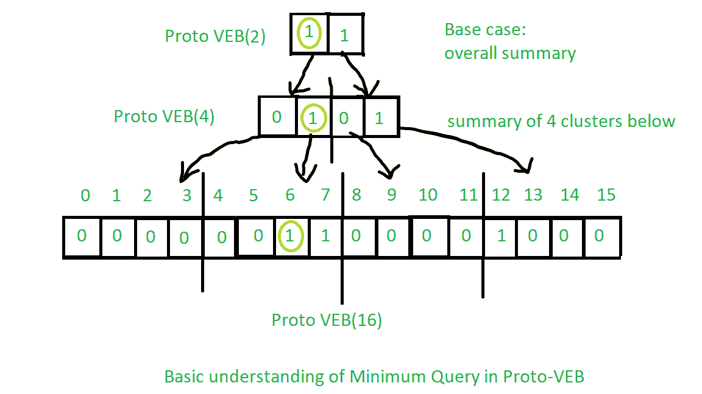
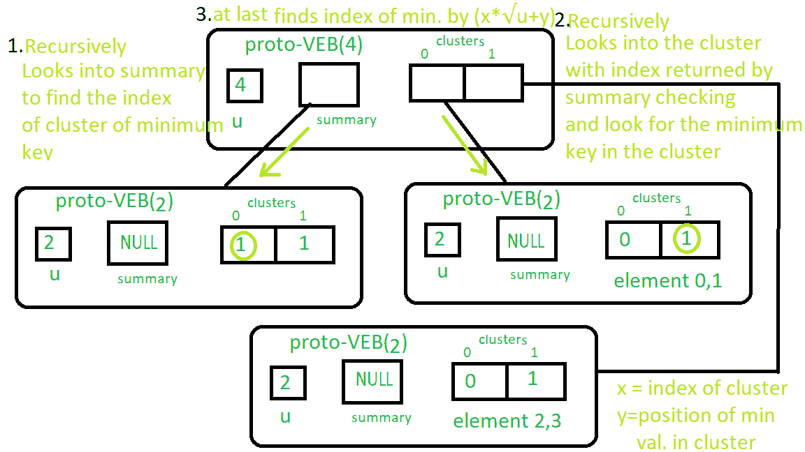
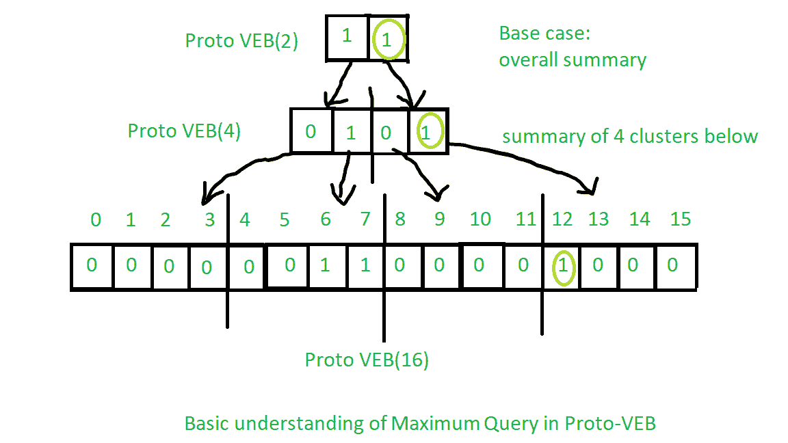

# Proto Van Emde Boas 树|集合 5 |查询:最小，最大

> 原文:[https://www . geesforgeks . org/proto-van-emde-boas-tree-set-5-query-minimum-maximum/](https://www.geeksforgeeks.org/proto-van-emde-boas-tree-set-5-queries-minimum-maximum/)

请先查看前几套[原始人范·埃姆德·博阿斯树](https://www.geeksforgeeks.org/proto-van-emde-boas-trees-set-1-background-introduction/)文章。强烈推荐。

**求最小值的程序:**

1.  **基本情况:**如果原 VEB 的大小是 2，那么我们将返回集群中存在的最小键。如果没有键，那么我们将返回-1 作为没有键的符号。
2.  **递归:**
    *   我们将在 summary 上开始递归，直到我们达到第一个真值(在代码中，summary 集群中的第一个而不是 nullptr)，这表明该集群中存在一个键。
    *   现在，我们将通过再次递归调用一个集群来找到该集群中的键的位置，以找到集群中的第一个真值(在代码中，首先不是集群中的 nullptr)，正如我们在上面所做的那样。

    *   最后，我们将根据我们在总结上从过程中获得的簇号和我们在最后一步中在簇上从过程中获得的位置返回该键的索引。

操作基本理解见下图:
从上到下观察浅绿色圆圈:



真实原型-VEB 最小操作见下图:
按照数字顺序按照说明操作。



你可以很容易地从最小程序中得到最大值的概念。见下图:
从上到下观察浅绿色圆圈:



上述算法的实现:

## C++

```
// C++ implementation of the approach
#include <bits/stdc++.h>
using namespace std;

class Proto_Van_Emde_Boas {
public:
    // Total number of keys
    int universe_size;

    // Summary
    Proto_Van_Emde_Boas* summary;

    // Clusters array of Proto-VEB pointers
    vector<Proto_Van_Emde_Boas*> clusters;

    int root(int u)
    {
        return (int)sqrt(u);
    }

    // Function to return cluster numbers
    // in which key is present
    int high(int x)
    {
        return x / root(universe_size);
    }

    // Function to return position of x in cluster
    int low(int x)
    {
        return x % root(universe_size);
    }

    // Function to return the index from
    // cluster number and position
    int generate_index(int cluster, int position)
    {
        return cluster * root(universe_size) + position;
    }

    // Constructor
    Proto_Van_Emde_Boas(int size)
    {
        universe_size = size;

        // Base case
        if (size <= 2) {

            // Set summary to nullptr as there is no
            // more summary for size 2
            summary = nullptr;

            // Vector of two pointers
            // nullptr in starting
            clusters = vector<Proto_Van_Emde_Boas*>(size, nullptr);
        }
        else {

            // Assigning Proto-VEB(sqrt(u)) to summary
            summary = new Proto_Van_Emde_Boas(root(size));

            // Creating array of Proto-VEB Tree pointers of size sqrt(u)
            // first all nullptrs are going to assign
            clusters = vector<Proto_Van_Emde_Boas*>(root(size), nullptr);

            // Assigning Proto-VEB(sqrt(u)) to all its clusters
            for (int i = 0; i < root(size); i++) {
                clusters[i] = new Proto_Van_Emde_Boas(root(size));
            }
        }
    }
};

// Function that returns true if the
// key is present in the tree
bool isMember(Proto_Van_Emde_Boas* helper, int key)
{

    // If key is greater then universe_size then
    // returns false
    if (key >= helper->universe_size)
        return false;

    // If we reach at base case
    // the just return whether
    // pointer is nullptr then false
    // else return true
    if (helper->universe_size == 2) {
        return helper->clusters[key];
    }
    else {

        // Recursively go deep into the
        // level of Proto-VEB tree using its
        // cluster index and its position
        return isMember(helper->clusters[helper->high(key)],
                        helper->low(key));
    }
}

// Function to insert a key in the tree
void insert(Proto_Van_Emde_Boas*& helper, int key)
{
    // If we reach at base case
    // then assign Proto-VEB(1) in place
    // of nullptr
    if (helper->universe_size == 2) {
        helper->clusters[key] = new Proto_Van_Emde_Boas(1);
    }
    else {

        // Recursively using index of cluster and its
        // position in cluster
        insert(helper->clusters[helper->high(key)],
               helper->low(key));

        // Also do the same recursion in summary VEB
        insert(helper->summary, helper->high(key));
    }
}

// Function to return the minimum key from the tree
int minimum(Proto_Van_Emde_Boas* helper)
{
    // Base case choses the least key
    // present in the cluster
    if (helper->universe_size == 2) {
        if (helper->clusters[0]) {
            return 0;
        }
        else if (helper->clusters[1]) {
            return 1;
        }

        // No keys present then return -1
        return -1;
    }
    else {

        // Recursively find in summary for
        // first 1 present in Proto-VEB
        int minimum_cluster = minimum(helper->summary);
        int offset;

        // If no key is present in
        // the cluster then return -1
        if (minimum_cluster == -1) {
            return -1;
        }
        else {

            // Recursively find the position of the key
            // in the minimum_cluster
            offset = minimum(helper->clusters[minimum_cluster]);

            // Returns overall index of minimum key
            return helper->generate_index(minimum_cluster, offset);
        }
    }
}

// Function to return the maximum key from the tree
int maximum(Proto_Van_Emde_Boas* helper)
{

    // Return the maximum key present in
    // the cluster
    if (helper->universe_size == 2) {
        if (helper->clusters[1]) {
            return 1;
        }
        else if (helper->clusters[0]) {
            return 0;
        }

        // Return -1 if no keys present in the
        // cluster
        return -1;
    }
    else {

        // Recursively find the last 1 present
        // in the summary
        int maximum_cluster = maximum(helper->summary);
        int offset;

        // If no key is present in
        // the cluster then return -1
        if (maximum_cluster == -1) {
            return -1;
        }
        else {

            // Recursively find the position of the key
            // in the maximum_cluster
            offset = maximum(helper->clusters[maximum_cluster]);
            return helper->generate_index(maximum_cluster, offset);
        }
    }
}

// Function to delete a key from the tree
void pveb_delete(Proto_Van_Emde_Boas*& helper, int key)
{

    // Base case: If the key is present
    // then make it nullptr
    if (helper->universe_size == 2) {
        if (helper->clusters[key]) {
            delete helper->clusters[key];
            helper->clusters[key] = nullptr;
        }
    }
    else {

        // Recursive delete to reach at the base case
        pveb_delete(helper->clusters[helper->high(key)], helper->low(key));

        bool isanyinCluster = false;

        // Iterate over the cluster of keys to check whether
        // any other key is present within that cluster
        // If yes then we should not update summary to 0
        // else update summary to 0
        for (int i = helper->high(key) * helper->root(helper->universe_size);
             i < (helper->high(key) + 1) * helper->root(helper->universe_size);
             i++) {

            // If member is present then break the loop
            if (isMember(helper->clusters[helper->high(key)], i)) {
                isanyinCluster = true;
                break;
            }
        }

        // If no member is present then
        // update summary to zero
        if (isanyinCluster == false) {
            pveb_delete(helper->summary, helper->high(key));
        }
    }
}

// Driver code
int main()
{
    Proto_Van_Emde_Boas* hello = new Proto_Van_Emde_Boas(4);

    cout << boolalpha;

    insert(hello, 2);

    insert(hello, 3);

    cout << minimum(hello) << endl;

    cout << maximum(hello) << endl;
}
```

最小和最大查询都以 0(log2(u))的时间复杂度运行。
重复关系:

```
T(u) = 2T() + O(1)
```