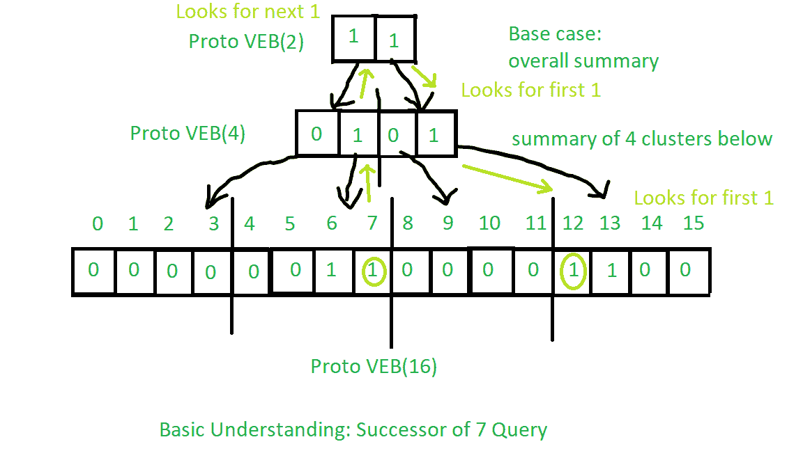
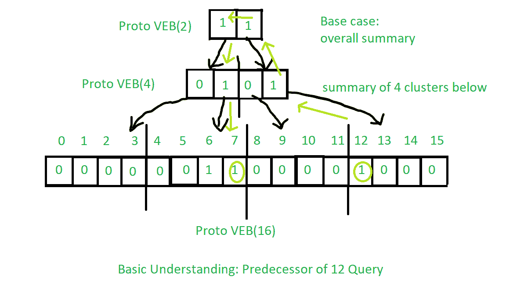

# Proto Van Emde Boas 树|集合 6 |查询:继任者和前任

> 原文:[https://www . geesforgeks . org/proto-van-emde-boas-tree-set-6-query-后继-前置/](https://www.geeksforgeeks.org/proto-van-emde-boas-tree-set-6-query-successor-and-predecessor/)

请先参考之前所有关于 Proto Van Emde Boas Tree 的文章。
**继任者查询程序:**

1.  **基本情况:**对于大小为 2 的原 VEB，唯一的可能性是密钥为 0，如果下一个密钥存在，那么它就是它的后继者或者没有后继者。所以同样的程序被应用。
2.  **递归:**
    *   首先，我们将查看当前的簇(意味着存在查询关键字的簇)，如果存在大于查询关键字的任何关键字，那么我们将是后继者，因此我们返回它。
    *   如果上述情况不是这样，那么我们将递归调用摘要上的后继过程，以在摘要中找到下一个真值。如果总结中没有下一个真值，那么我们将返回-1 作为没有更大的键存在的标志。
    *   在上面的操作中，如果我们找到任何下一个真值，那么我们将找到该簇中存在的最小键，它将是查询键的后继键。

后续查询操作的基本理解见下图:



前置任务的过程与后续任务相同，只是有一些小的变化。您应该尝试从上面对后续任务查询的描述中理解它。基本理解见下图:



下面是实现:

## C++

```
// C++ implementation of the approach
#include <bits/stdc++.h>
using namespace std;

class Proto_Van_Emde_Boas {
public:
    // Total number of keys
    int universe_size;

    // Summary
    Proto_Van_Emde_Boas* summary;

    // Clusters array of Proto-VEB pointers
    vector<Proto_Van_Emde_Boas*> clusters;

    int root(int u)
    {
        return (int)sqrt(u);
    }

    // Function to return cluster numbers
    // in which key is present
    int high(int x)
    {
        return x / root(universe_size);
    }

    // Function to return position of x in cluster
    int low(int x)
    {
        return x % root(universe_size);
    }

    // Function to return the index from
    // cluster number and position
    int generate_index(int cluster, int position)
    {
        return cluster * root(universe_size) + position;
    }

    // Constructor
    Proto_Van_Emde_Boas(int size)
    {
        universe_size = size;

        // Base case
        if (size <= 2) {

            // Set summary to nullptr as there is no
            // more summary for size 2
            summary = nullptr;

            // Vector of two pointers
            // nullptr in starting
            clusters = vector<Proto_Van_Emde_Boas*>(size, nullptr);
        }
        else {

            // Assigning Proto-VEB(sqrt(u)) to summary
            summary = new Proto_Van_Emde_Boas(root(size));

            // Creating array of Proto-VEB Tree pointers of size sqrt(u)
            // first all nullptrs are going to assign
            clusters = vector<Proto_Van_Emde_Boas*>(root(size), nullptr);

            // Assigning Proto-VEB(sqrt(u)) to all its clusters
            for (int i = 0; i < root(size); i++) {
                clusters[i] = new Proto_Van_Emde_Boas(root(size));
            }
        }
    }
};

// Function that returns true if the
// key is present in the tree
bool isMember(Proto_Van_Emde_Boas* helper, int key)
{

    // If key is greater then universe_size then
    // returns false
    if (key >= helper->universe_size)
        return false;

    // If we reach at base case
    // the just return whether
    // pointer is nullptr then false
    // else return true
    if (helper->universe_size == 2) {
        return helper->clusters[key];
    }
    else {

        // Recursively go deep into the
        // level of Proto-VEB tree using its
        // cluster index and its position
        return isMember(helper->clusters[helper->high(key)],
                        helper->low(key));
    }
}

// Function to insert a key in the tree
void insert(Proto_Van_Emde_Boas*& helper, int key)
{
    // If we reach at base case
    // then assign Proto-VEB(1) in place
    // of nullptr
    if (helper->universe_size == 2) {
        helper->clusters[key] = new Proto_Van_Emde_Boas(1);
    }
    else {

        // Recursively using index of cluster and its
        // position in cluster
        insert(helper->clusters[helper->high(key)],
               helper->low(key));

        // Also do the same recursion in summary VEB
        insert(helper->summary, helper->high(key));
    }
}

// Function to return the minimum key from the tree
int minimum(Proto_Van_Emde_Boas* helper)
{
    // Base case chooses the least key
    // present in the cluster
    if (helper->universe_size == 2) {
        if (helper->clusters[0]) {
            return 0;
        }
        else if (helper->clusters[1]) {
            return 1;
        }

        // No keys present then return -1
        return -1;
    }
    else {

        // Recursively find in summary for
        // first 1 present in Proto-VEB
        int minimum_cluster = minimum(helper->summary);
        int offset;

        // If no key is present in
        // the cluster then return -1
        if (minimum_cluster == -1) {
            return -1;
        }
        else {

            // Recursively find the position of the key
            // in the minimum_cluster
            offset = minimum(helper->clusters[minimum_cluster]);

            // Returns overall index of minimum key
            return helper->generate_index(minimum_cluster, offset);
        }
    }
}

// Function to return the maximum key from the tree
int maximum(Proto_Van_Emde_Boas* helper)
{

    // Return the maximum key present in
    // the cluster
    if (helper->universe_size == 2) {
        if (helper->clusters[1]) {
            return 1;
        }
        else if (helper->clusters[0]) {
            return 0;
        }

        // Return -1 if no keys present in the
        // cluster
        return -1;
    }
    else {

        // Recursively find the last 1 present
        // in the summary
        int maximum_cluster = maximum(helper->summary);
        int offset;

        // If no key is present in
        // the cluster then return -1
        if (maximum_cluster == -1) {
            return -1;
        }
        else {

            // Recursively find the position of the key
            // in the maximum_cluster
            offset = maximum(helper->clusters[maximum_cluster]);
            return helper->generate_index(maximum_cluster, offset);
        }
    }
}

// Function to return the successor of key in the tree
int successor(Proto_Van_Emde_Boas* helper, int key)
{
    // Base case, returns key greater than
    // our query key in the cluster if present
    // else returns -1
    if (helper->universe_size == 2) {
        if (key == 0 && helper->clusters[1])
            return 1;
        else
            return -1;
    }
    else {

        // Check if any key is greater than query key in the cluster
        int offset = successor(helper->clusters[helper->high(key)],
                               helper->low(key));

        // If it is present then return its index
        if (offset != -1)
            return helper->generate_index(helper->high(key), offset);
        else {

            // If no successor is present within the cluster then
            // go to the summary and find the next summary with
            // key present(1) named successor_cluster
            int successor_cluster = successor(helper->summary,
                                              helper->high(key));

            // If no next 1 in the summary then return -1
            if (successor_cluster == -1)
                return -1;
            else {

                // Find the minimum key in the successor_cluster
                offset = minimum(helper->clusters[successor_cluster]);

                // Generate its index and return
                return helper->generate_index(successor_cluster, offset);
            }
        }
    }
}

// Function to return the predecessor of key in the tree
int predecessor(Proto_Van_Emde_Boas* helper, int key)
{

    // Base case, find smaller key present in
    // the cluster
    // If present else return -1
    if (helper->universe_size == 2) {
        if (key == 1 && helper->clusters[0])
            return 0;
        else
            return -1;
    }
    else {

        // Check if any key is lower than query key in the cluster
        int offset = predecessor(helper->clusters[helper->high(key)],
                                 helper->low(key));

        // If it is present then return its index
        if (offset != -1)
            return helper->generate_index(helper->high(key), offset);
        else {

            // If no predecessor is present within the cluster then
            // go to the summary and find the next summary with
            // key present(1) named predecessor_cluster
            int predecessor_cluster = predecessor(helper->summary,
                                                  helper->high(key));

            // If no next 1 in the summary then return -1
            if (predecessor_cluster == -1)
                return -1;
            else {

                // Find the maximum key in the predecessor_cluster
                offset = maximum(helper->clusters[predecessor_cluster]);

                // Generate its index and return
                return helper->generate_index(predecessor_cluster, offset);
            }
        }
    }
}

// Function to delete a key from the tree
void pveb_delete(Proto_Van_Emde_Boas*& helper, int key)
{

    // Base case: If the key is present
    // then make it nullptr
    if (helper->universe_size == 2) {
        if (helper->clusters[key]) {
            delete helper->clusters[key];
            helper->clusters[key] = nullptr;
        }
    }
    else {

        // Recursive delete to reach at the base case
        pveb_delete(helper->clusters[helper->high(key)], helper->low(key));

        bool isanyinCluster = false;

        // Iterate over the cluster of keys to check whether
        // any other key is present within that cluster
        // If yes then we should not update summary to 0
        // else update summary to 0
        for (int i = helper->high(key) * helper->root(helper->universe_size);
             i < (helper->high(key) + 1) * helper->root(helper->universe_size);
             i++) {

            // If member is present then break the loop
            if (isMember(helper->clusters[helper->high(key)], i)) {
                isanyinCluster = true;
                break;
            }
        }

        // If no member is present then
        // update summary to zero
        if (isanyinCluster == false) {
            pveb_delete(helper->summary, helper->high(key));
        }
    }
}

// Driver code
int main()
{
    Proto_Van_Emde_Boas* hello = new Proto_Van_Emde_Boas(16);

    cout << boolalpha;

    insert(hello, 2);

    insert(hello, 13);

    insert(hello, 3);

    cout << successor(hello, 3) << endl;

    cout << predecessor(hello, 13) << endl;
}
```

后续查询和前置查询的重复关系:

```
T(u) = T(u) = 2T()) + O(log2())
```

**时间复杂度:**每个查询 O(log2(u)* log2(log2(u))
T3】辅助空间 : O(N)。