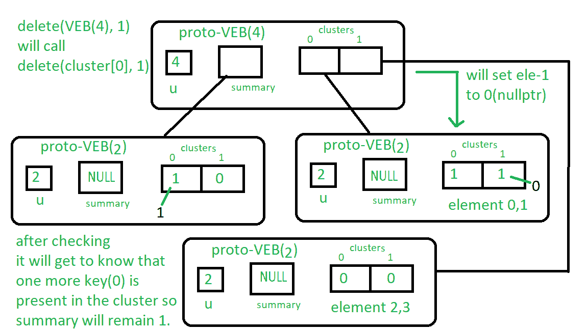

# 原范·埃姆德·博阿斯树|集合 4 |删除

> 原文:[https://www . geesforgeks . org/proto-van-emde-boas-trees-set-4-delete/](https://www.geeksforgeeks.org/proto-van-emde-boas-trees-set-4-deletion/)

请先查看前几套[原始人范·埃姆德·博阿斯树](https://www.geeksforgeeks.org/proto-van-emde-boas-trees-set-1-background-introduction/)文章。强烈推荐。
**删除程序:**

1.  **基本情况:**如果我们到达大小为 2 的原 VEB，那么我们将检查密钥是否存在。如果存在，那么我们将指针分配给 nullptr，它将设置 false 表示存在。
2.  **递归:**
    *   我们递归调用键簇上的删除函数，即高(键)和它的位置低(键)。
    *   从集群中删除密钥后(到达基本案例后)，我们检查集群中是否存在任何其他密钥。如果存在任何键，那么我们不能将摘要设置为 nullptr，否则我们将通过调用 delete over summary 将摘要设置为 nullptr。

让我们理解大小为 4 的原 VEB 上的 1 个删除:
首先，它将递归调用删除(集群[0]，1)。
所以现在基本情况得到满足，所以它将在集群[0]原型 VEB 中的位置 1，并且如果存在的话，将它设置为 nullptr。
现在，我们将检查集群[0]中是否还有任何键(请参见 delete 中的 for 循环)，0 是否存在，因此 delete(summary，0)调用不会执行，summary 将保持不变。
看下图理解:
按照盒子附近写的说明从上到下操作。



下面是实现:

## 卡片打印处理机（Card Print Processor 的缩写）

```
// C++ implementation of the approach
#include <bits/stdc++.h>
using namespace std;

class Proto_Van_Emde_Boas {
public:
    // Total number of keys
    int universe_size;

    // Summary
    Proto_Van_Emde_Boas* summary;

    // Clusters array of Proto-VEB pointers
    vector<Proto_Van_Emde_Boas*> clusters;

    int root(int u)
    {
        return int(sqrt(u));
    }

    // Function to return cluster numbers
    // in which key is present
    int high(int x)
    {
        return x / root(universe_size);
    }

    // Function to return position of x in cluster
    int low(int x)
    {
        return x % root(universe_size);
    }

    // Function to return the index from
    // cluster number and position
    int generate_index(int cluster, int position)
    {
        return cluster * root(universe_size) + position;
    }

    // Constructor
    Proto_Van_Emde_Boas(int size)
    {
        universe_size = size;

        // Base case
        if (size <= 2) {

            // Set summary to nullptr as there is no
            // more summary for size 2
            summary = nullptr;

            // Vector of two pointers
            // nullptr in starting
            clusters = vector<Proto_Van_Emde_Boas*>(size, nullptr);
        }
        else {

            // Assigning Proto-VEB(sqrt(u)) to summary
            summary = new Proto_Van_Emde_Boas(root(size));

            // Creating array of Proto-VEB Tree pointers of size sqrt(u)
            // first all nullptrs are going to assign
            clusters = vector<Proto_Van_Emde_Boas*>(root(size), nullptr);

            // Assigning Proto-VEB(sqrt(u)) to all its clusters
            for (int i = 0; i < root(size); i++) {
                clusters[i] = new Proto_Van_Emde_Boas(root(size));
            }
        }
    }
};

// Function that returns true if the
// key is present in the tree
bool isMember(Proto_Van_Emde_Boas* helper, int key)
{

    // If key is greater then universe_size then
    // returns false
    if (key >= helper->universe_size)
        return false;

    // If we reach at base case
    // the just return whether
    // pointer is nullptr then false
    // else return true
    if (helper->universe_size == 2) {
        return helper->clusters[key];
    }
    else {

        // Recursively go deep into the
        // level of Proto-VEB tree using its
        // cluster index and its position
        return isMember(helper->clusters[helper->high(key)],
                        helper->low(key));
    }
}

// Function to insert a key in the tree
void insert(Proto_Van_Emde_Boas*& helper, int key)
{
    // If we reach at base case
    // then assign Proto-VEB(1) in place
    // of nullptr
    if (helper->universe_size == 2) {
        helper->clusters[key] = new Proto_Van_Emde_Boas(1);
    }
    else {

        // Recursively using index of cluster and its
        // position in cluster
        insert(helper->clusters[helper->high(key)],
               helper->low(key));

        // Also do the same recursion in summary VEB
        insert(helper->summary, helper->high(key));
    }
}

// Function to delete a key from the tree
void pveb_delete(Proto_Van_Emde_Boas*& helper, int key)
{

    // Base case: If the key is present
    // then make it nullptr
    if (helper->universe_size == 2) {
        if (helper->clusters[key]) {
            delete helper->clusters[key];
            helper->clusters[key] = nullptr;
        }
    }
    else {

        // Recursive delete to reach at the base case
        pveb_delete(helper->clusters[helper->high(key)], helper->low(key));

        bool isanyinCluster = false;

        // Iterate over the cluster of keys to check whether
        // any other key is present within that cluster
        // If yes then we should not update summary to 0
        // else update summary to 0
        for (int i = helper->high(key) * helper->root(helper->universe_size);
             i < (helper->high(key) + 1) * helper->root(helper->universe_size);
             i++) {

            // If member is present then break the loop
            if (isMember(helper->clusters[helper->high(key)], i)) {
                isanyinCluster = true;
                break;
            }
        }

        // If no member is present then
        // update summary to zero
        if (isanyinCluster == false) {
            pveb_delete(helper->summary, helper->high(key));
        }
    }
}

// Driver code
int main()
{
    Proto_Van_Emde_Boas* hello = new Proto_Van_Emde_Boas(4);

    cout << isMember(hello, 2);

    insert(hello, 2);

    insert(hello, 3);

    cout << isMember(hello, 2);

    pveb_delete(hello, 2);

    cout << isMember(hello, 2);
}
```

删除的重复关系:

```
T(u) = T(u) = 2T()) + O(log2())
```

**时间复杂度**:O(log2(u)* log2(log2(u)))