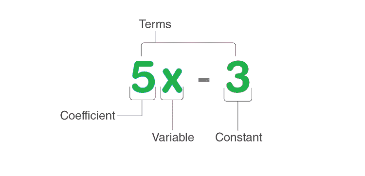

# 证明任意自然数的平方要么是 3 的倍数，要么是 3 的倍数的 1 倍以上

> 原文:[https://www . geesforgeks . org/proof-任何自然数的平方不是 3 的倍数就是 3 的倍数/](https://www.geeksforgeeks.org/prove-that-the-square-of-any-natural-number-is-either-a-multiple-of-3-or-one-more-than-a-multiple-of-3/)

数字系统是用符号和数字以某种方式表示数字的系统。人们可以认为它是一本数学语法书。一听到“数字”这个词，1，2，3，…立即被爆头。数字系统定义了它们的值、要执行的操作和其他属性。每个数字都是唯一的。它有许多变体。因此，它可以被认为是自然数、整数、偶数、奇数、素数、合数等。

1.  **自然数**–包含从 1 开始的数字。
2.  **整数**–包含从 0 开始的数字。
3.  **偶数**–可被 2 整除的数字。
4.  **奇数**–不能被 2 整除的数字。
5.  **质数**–只能被 1 整除且只能被自身整除的数。即只有两个因素。
6.  **复合数**–可被 1 整除的数以及自身和他人。即两个以上的因素。

### 代数学

代数是数学的一个分支，它强调各种符号的使用以及可以对它们进行的数学运算。在代数中，像字母这样的符号被用来表示 a、b、c 或 x，以及许多其他没有预定义值的符号。它们的值不是固定的，因此称为变量。人们可以声明任意数量的变量，并为它们定义特定的值。这些符号或变量可以在算术运算的帮助下进行操作，如加法、减法、乘法和除法。让我们来处理代数的一个应用，即**代数表达式。**

代数表达式由系数、项、变量和常数等组成。人们必须通过数学运算来确定未知变量的值。

### 自然数

自然数是从 1 到无穷大的计数数字，它们用于计数目的。例如 1，2，3，4，…。，都是自然数。基本上，自然数是实数系统不可分割的一部分。

> 然而，自然数不包括零、分数、小数、负数。

一组自然数用 N 表示，使得 N = {1，2，3，4，5，6，7，8，…。}.

### 用代数证明任意自然数的平方要么是 3 的倍数，要么是 3 的倍数的 1 倍以上。

**解决方案:**

> 假设，我们有一个自然数 n。
> 
> 考虑三种情况，其中 N 的形式为 3*N，3*N+1，3*N+2。
> 
> 平方，我们得到
> 
> *   第一项的平方是 9N 2 ，是 3 的倍数。
> *   第二项的平方是:
> 
> 9N2+6N+1 = 3(3N2+2N)+1，比 3 的倍数多一。
> 
> *   第三项的平方是:
> 
> 9N2+12N+4 = 9N2+12N+3+1 = 3(3N2+4N+1)+1，是 3 的一倍多。
> 
> 因此，可以说，对于 N 2 为 3 的倍数，N 应该是 3N、3N+1、3N+2 等形式。
> 
> **例:**
> 
> <figure class="table">
> 
> | 平方数 | 除以 3 后的余数 |
> | --- | --- |
> | 2 2 = 4 = 3 × 1 + 1 | one |
> | 3 2 = 9 = 3 × 3 + 0 | Zero |
> | 4 2 = 16 = 3 × 5 + 1 | one |
> | 5 2 = 25 = 3 × 8 + 1 | one |
> | 6 2 = 36 = 3 × 12 + 0 | Zero |
> | 7 2 = 49 = 3 × 16 + 1 | one |
> 
> **因此，任何自然数的平方要么是 3 的倍数，要么是 3 的倍数的 1 倍以上。**
> 
> </figure>

### 类似问题

**问题 1:证明连续两个平方数之和为奇数？**

**解决方案:**

> 假设 N 和 N + 1 是两个连续的数，其中 N 是任意整数。
> 
> 我们必须确定他们的总数。所以，
> 
> 总和= N2+(N+1)2= N2+N2+2N+1 = 2N2+2N+1 = 2(N2+N)+1
> 
> 奇数的定义是 2 的一倍多。
> 
> 总和是 2 的一倍多。所以，它们的和是奇数。
> 
> 示例:
> 
> **输入 N =** 2 和 **N + 1 =** 3
> 
> **输出**22+32= 4+9 = 13
> 
> **结论**和为奇数。

**问题 2:证明如果 m 不是自然数的平方，那么√m 是无理数。**

**解决方案:**

> 设 m 为任意正整数，使得不存在 m = x 2 ，其中 x 为整数。
> 
> 我们假设√m 是有理数。那么它可以写成:
> 
> √m = p/q≤1
> 
> 其中 p 和 q 除了 1 之外没有共同的因子。
> 
> 对等式(1)的两边求平方
> 
> m = p 2 / q 2 。
> 
> 因为 n 是正整数，p 和 q 除了(1)没有共同的因子。设 q = 1。
> 
> m = p 2
> 
> 这个结果与我们假设 m 不是一个数的平方是矛盾的。因此√m 是非理性的。

**问题 3:证明如果 n 是自然数，那么√n 是无理数或自然数。**

**解决方案:**

> 设 n 为任意自然数。
> 
> 情况 1: n 是一个完美的正方形(1，4，9，16 等。)
> 
> <figure class="table">
> 
> | **自然数(n)** | **一个数的根(√n)** | **定义√n** |
> | one | one | 定义明确 |
> | four | Two | 定义明确 |
> | nine | three | 定义明确 |
> | Thirty-six | six | 定义明确 |
> 
> </figure>
> 
> 因此，√n 是一个自然数。
> 
> 情况二:n 不是一个完美的正方形(√2、√3、√7 等)。)
> 
> <figure class="table">
> 
> | **自然数(n)** | **一个数的根(√n)** | **定义√n** |
> | Two | √2 | 定义不明确 |
> | three | √3 | 定义不明确 |
> | seven | √3 | 定义不明确 |
> | Nineteen | √18 | 定义不明确 |
> 
> 因此，√n 是无理数。
> 
> **结论** √n 不是自然数就是无理数。
> 
> </figure>

**问题 4:证明两个完美平方数的乘积也是一个** **完美平方。**

**解决方案:**

> 设 p 和 q 是任意两个正整数。
> 
> 因为 p 和 q 都是完美的正方形，所以我们可以写
> 
> p = a 2
> 
> q = b 2
> 
> 其中 a 和 b 是任意两个整数。
> 
> p×q = a2×b2=(a×a)×(b×b)=(a×b)×(a×b)=(ab)×(ab)=(ab)2
> 
> 因此，结果是 ab 的完美平方。
> 
> **结论**两个完美平方数的乘积也是完美平方。
> 
> **示例:**
> 
> **输入** p=4，q=9
> 
> **输出** pq= 4*9 = 36 =6 2
> 
> **这是一个完美的正方形。**