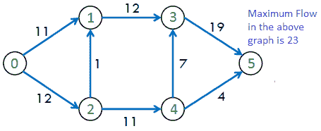
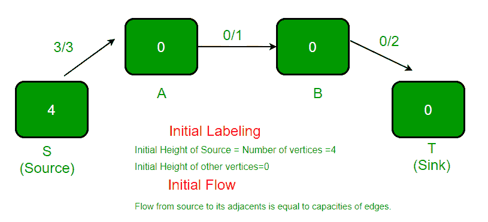
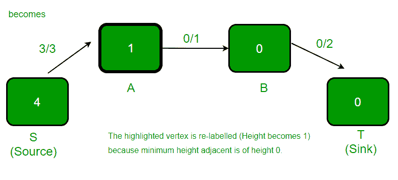
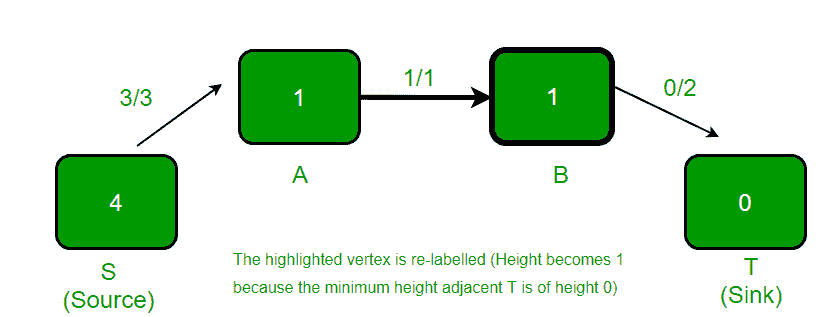
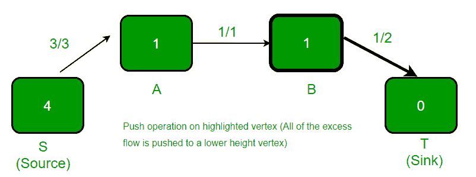
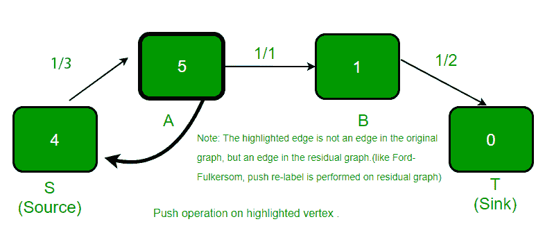

# 推送重贴算法|集合 1(介绍和说明)

> 原文:[https://www . geesforgeks . org/push-relabel-algorithm-set-1-introduction-and-插图/](https://www.geeksforgeeks.org/push-relabel-algorithm-set-1-introduction-and-illustration/)

给定一个表示每个边都有容量的流网络的图。同样给定图中的两个顶点*源*s’和*汇*t ’,找到从 s 到 t 的最大可能流量，约束如下:

**a)** 边上的流量不超过给定的边容量。

**b)** 除 s 和 t 外，每个顶点的来流等于出流。

例如，考虑以下来自 CLRS 书籍的图表。
[](https://media.geeksforgeeks.org/wp-content/cdn-uploads/ford_fulkerson11.png)

上图中最大可能流量为 23。
[](https://media.geeksforgeeks.org/wp-content/cdn-uploads/ford_fulkerson2.png)

我们已经讨论了[福特富尔克森算法](https://www.geeksforgeeks.org/ford-fulkerson-algorithm-for-maximum-flow-problem/)，该算法使用增加路径来计算最大流量。

**Push-Relabel Algorithm**

推-重新标记法比福特-富尔克森算法更有效。在这篇文章中，戈德堡的“通用”最大流算法在**0(V<sup>2</sup>E)**时间运行。这个时间复杂度优于 O(E <sup>2</sup> V)，后者是 Edmond-Karp 算法(福特-富尔克森基于 BFS 的实现)的时间复杂度。存在一种基于推-重标记方法的算法，该算法在 O(V <sup>3</sup> 中工作，甚至比这里讨论的算法更好。

**与福特富尔克森的相似之处**

*   像福特-富尔克森一样，Push-Relabel 也适用于剩余图(流网络的剩余图是指示额外可能流的图。如果在残差图中存在从源到宿的路径，则可以添加流)。

**与福特富尔克森的差异**

*   推送-重新标记算法在更本地化的环境中工作。推-重标记算法不是检查整个剩余网络来寻找扩充路径，而是一次对一个顶点起作用(来源:CLRS Book)。
*   在福特-富尔克森模型中，每个顶点(除了源和汇)的总流出和总流入之间的净差保持为 0。Push-Relabel 算法允许流入量在达到最终流量之前超过流出量。在最终流量中，除了源和汇之外，所有流量的净差值都是 0。
*   时间复杂度更有效。

推动-重新标记算法(考虑流体流动问题)背后的直觉是，我们将边缘视为水管，节点视为接头。水源被认为是最高级别的，它向所有相邻节点供水。一旦一个节点有多余的水，它**将**的水推到一个更小高度的节点。如果水在一个顶点被局部困住，这个顶点被**重新标记**，这意味着它的高度增加了。

下面是一些有用的事实，在我们进行算法之前要考虑。

*   每个顶点都关联了一个高度变量和一个过量流。**高度**用于确定一个顶点是否可以将流推送到相邻的顶点(一个顶点只能将流推送到一个较小高度的顶点)。**过剩流量**是进入顶点的总流量减去流出顶点的总流量的差值。

    ```
         Excess Flow of u = Total Inflow to u - 
                            Total Outflow from u
    ```

*   比如福特·富尔克森。每条边都有一个**流量**(表示电流)和一个**容量**

下面是完整算法的抽象步骤。

```
Push-Relabel Algorithm 
1) Initialize PreFlow : Initialize Flows 
   and Heights 

2) While it is possible to perform a Push() or 
   Relablel() on a vertex
   // Or while there is a vertex that has excess flow
           Do Push() or Relabel()

// At this point all vertices have Excess Flow as 0 (Except source
// and sink)
3) Return flow.

```

推-重标记算法主要有三种操作

1.  **初始化预流()**初始化所有顶点的高度和流向。

    ```
    Preflow() 
    1) Initialize height and flow of every vertex as 0.
    2) Initialize height of source vertex equal to total 
       number of vertices in graph.
    3) Initialize flow of every edge as 0.
    4) For all vertices adjacent to source s, flow and  
       excess flow is equal to capacity initially.
    ```

2.  **Push()** 用于使流量从有多余流量的节点流出。如果一个顶点有多余的流，并且有一个高度较小的相邻顶点(在剩余图中)，我们把流从顶点推到高度较低的相邻顶点。通过管道(边缘)的推动流量等于过量流量和边缘容量的最小值。
3.  **当一个顶点有多余的流，并且它的相邻顶点都不在较低的高度时，使用重新标记()**操作。我们基本上增加顶点的高度，这样我们就可以执行 push()。为了增加高度，我们选择相邻的最小高度(在残差图中，即我们可以添加流量的相邻高度)并添加 1。

请注意，上述操作是在残差图上执行的(如[福特-富尔克森](https://www.geeksforgeeks.org/ford-fulkerson-algorithm-for-maximum-flow-problem/))。

<center>**Illustration:**</center>

Before we proceed to below example, we need to make sure that we understand residual graph (See [this](https://www.geeksforgeeks.org/ford-fulkerson-algorithm-for-maximum-flow-problem/) for more details of residual graph). Residual graph is different from graphs shown.

每当我们推或加一个从顶点 u 到 v 的流时，我们在剩余图中做以下更新:
1)我们从 u 到 v 的边的容量中减去该流，如果边的容量变为 0，那么该边在剩余图中不再存在。
2)我们将流量添加到从 v 到 u 的边的容量中。

```
For example, consider two vertices u an v.

In original graph
        3/10
   u ---------> v
    3 is current flow from u to v and
    10 is capacity of edge from u to v.

In residual Graph, there are two edges corresponding
to one edge shown above.
         7
   u ---------> v

         3
   u <--------- v 
```

1.  Initial given flow graph.
    [](https://media.geeksforgeeks.org/wp-content/uploads/push-rebel.png)

    。

2.  After PreFlow operation. In residual graph, there is an edge from A to S with capacity 3 and no edge from S to A.
    [](https://media.geeksforgeeks.org/wp-content/uploads/push-rebel1.png)

    。

3.  The highlighted vertex is relabeled (height becomes 1) as it has excess flow and there is no adjacent with smaller height. The new height is equal to minimum of heights of adjacent plus 1.  In residual graph, there are two adjacent of vertex A, one is S and other is B.  Height of S is 4 and height of B is 0.  Minimum of these two heights is 0\. We take the minimum and add 1 to it.
    [](https://media.geeksforgeeks.org/wp-content/uploads/push-rebel2.png)

    。

4.  The highlighted vertex has excess flow and there is an adjacent with lower height, so push() happens. Excess flow of vertex A is 2 and capacity of edge (A, B) is 1\. Therefore, the amount of pushed flow is 1 (minimum of two values).
    [](https://media.geeksforgeeks.org/wp-content/uploads/push-rebel3.png)

    。

5.  The highlighted vertex is relabeled (height becomes 1) as it has excess flow and there is no adjacent with smaller height.
    [](https://media.geeksforgeeks.org/wp-content/uploads/push-rebel4.png)

    。

6.  The highlighted vertex has excess flow and there is an adjacent with lower height, so flow() is pushed from B to T.
    [](https://media.geeksforgeeks.org/wp-content/uploads/push-rebel5.png)

    。

7.  The highlighted vertex is relabeled (height becomes 5) as it has excess flow and there is no adjacent with smaller height.
    [](https://media.geeksforgeeks.org/wp-content/uploads/push-rebel6.png)

    。

8.  The highlighted vertex has excess flow and there is an adjacent with lower height, so push() happens.
    [](https://media.geeksforgeeks.org/wp-content/uploads/push-rebel7.png)

    。

9.  高亮显示的顶点被重新标记(高度增加 1)，因为它有多余的流量，并且没有高度较小的相邻顶点。
    [](https://media.geeksforgeeks.org/wp-content/uploads/push-rebel8.png)

以上例子摘自[此处](http://melodi.ee.washington.edu/~bilmes/grg/pushrelabel1.ppt)。

[推送重贴算法|集合 2(实现)](https://www.geeksforgeeks.org/push-relabel-algorithm-set-2-implementation/)

本文由**西达尔特·拉瓦尼**供稿。如果你喜欢极客博客并想投稿，你也可以写一篇文章并把你的文章邮寄到 contribute@geeksforgeeks.org。看到你的文章出现在极客博客主页上，帮助其他极客。

如果您发现任何不正确的地方，或者您想分享更多关于上面讨论的主题的信息，请写评论