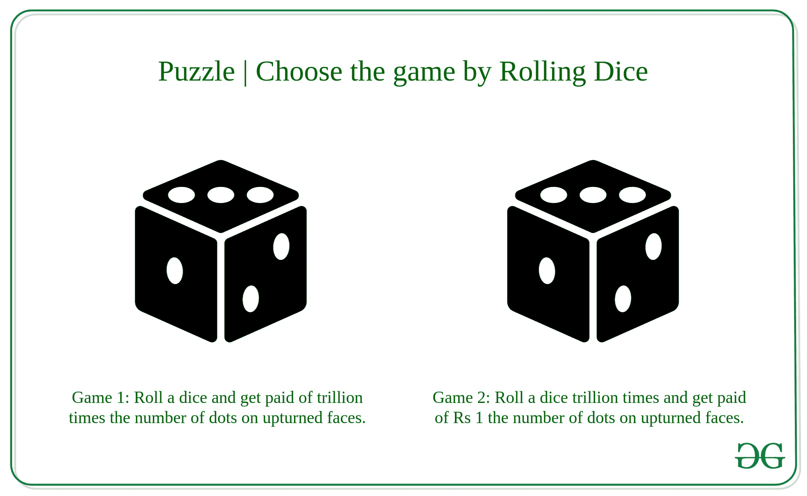

# 拼图|选择掷骰子游戏

> 原文:[https://www . geesforgeks . org/拼图-选择掷骰子游戏/](https://www.geeksforgeeks.org/puzzle-choose-the-game-of-rolling-dice/)

**谜题:**你是个厌恶风险的人。有两个游戏提供给你。

*   **游戏一:**你掷骰子一次，得到的报酬是骰子上翻面点数的万亿倍。
*   **第二场:**你掷骰子一万亿次。每掷一次，你将获得骰子上翻面点数的 1 倍卢比。你更喜欢哪个游戏？

**解决方案:**

这两个游戏的预期平均收益是 3.5 万亿卢比。然而，第二场比赛的波动性比第一场要小得多。

[伯努利定理](https://www.geeksforgeeks.org/python-bernoulli-distribution-in-statistics/)指出，如果你有一个独立且同分布的随机变量的样本，随着样本量的增大，样本均值将趋向于总体均值，因此实际收益将更接近游戏二中的预期收益。**作为一个厌恶风险的个体，你选择第二场。**