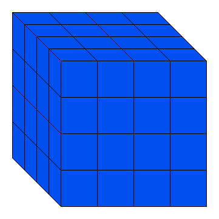
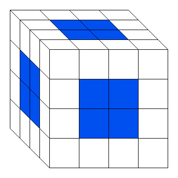
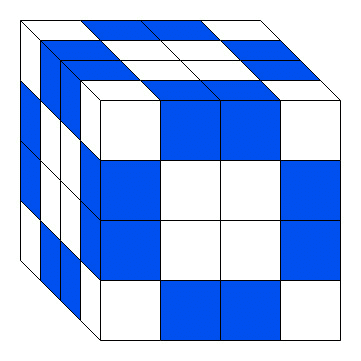
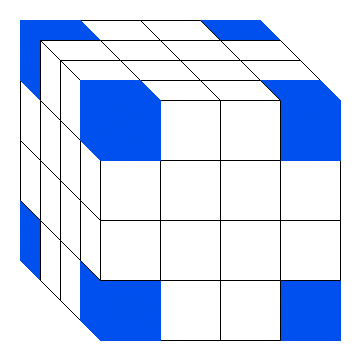
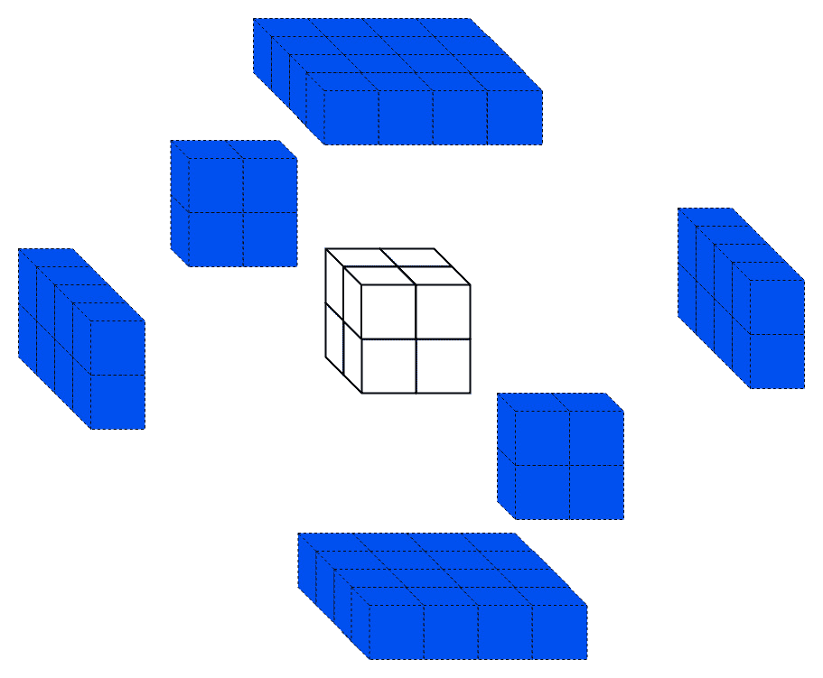

# 拼图|切割蓝色彩绘立方体

> 原文:[https://www.geeksforgeeks.org/puzzle-cut-blue-painted-cube/](https://www.geeksforgeeks.org/puzzle-cut-blue-painted-cube/)

一个实心的 n 英寸的木头立方体的六面都涂有蓝色的油漆。

然后立方体被切成更小的一英寸立方体。这些新的一英寸立方体将有三个蓝色面、两个蓝色面、一个蓝色面或没有蓝色面。

每种 1 英寸立方体有多少个？

### 解决方案:

这个难题可以用逻辑或数学方法解决。

切割后，
立方体的总数为:n*n*n = n^3

然后，利用以下公式可以求出每种立方体的
数:

*   1 sided painted =**6 * (n-2)^2**

    

*   2 sided painted = **12 *(n-2 )**

    

*   3 sided painted = **Always 8** (a cube has 8 corner)

    

*   No sided painted =**(n-2)^3**

    

### 示例:

**问题 1:**
一个 4 英寸的实心木方的六面都涂有蓝色油漆。然后立方体被切成更小的一英寸立方体。这些新的一英寸立方体要么有三个蓝色面，两个蓝色面，一个蓝色面，要么没有蓝色面。那么每个一英寸立方体有多少个？

**解决方案:**
给定 n=4，然后
无侧涂= **(4-2)^3** = > 8
1 侧涂=**6 *(n-2)^2**=>24
2 侧涂=**12 *(n-2)**=>24
3 侧涂= **始终 8** (立方体有 8 个角)

**问题 2:**
一个 8 英寸的实心木方，六面都涂有蓝色油漆。然后立方体被切成更小的一英寸立方体。这些新的一英寸立方体要么有三个蓝色面，两个蓝色面，一个蓝色面，要么没有蓝色面。那么每个一英寸立方体有多少个？

**解决方案:**
给定 n=8，则
无侧涂= **(8-2)^3** = > 216
1 侧涂=**6 *(n-2)^2**=>216
2 侧涂=**12 *(n-2)**=>72
3 侧涂= **始终 8** (立方体有 8 个角)

**问题 3:**
当 64 英寸立方体切割成更小的 4 英寸立方体时，则**n =给定 _ size/切割 _size**
对于给定问题
n=64/4 =16
则
无侧涂=**(16-2)^3**=>2744
1 侧涂=**6 *(16-2)^2**=>1176
2 侧涂=