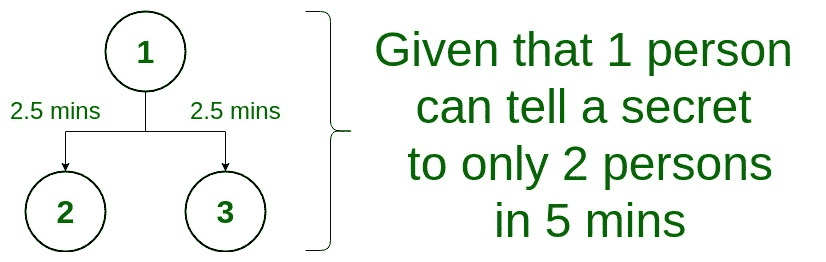
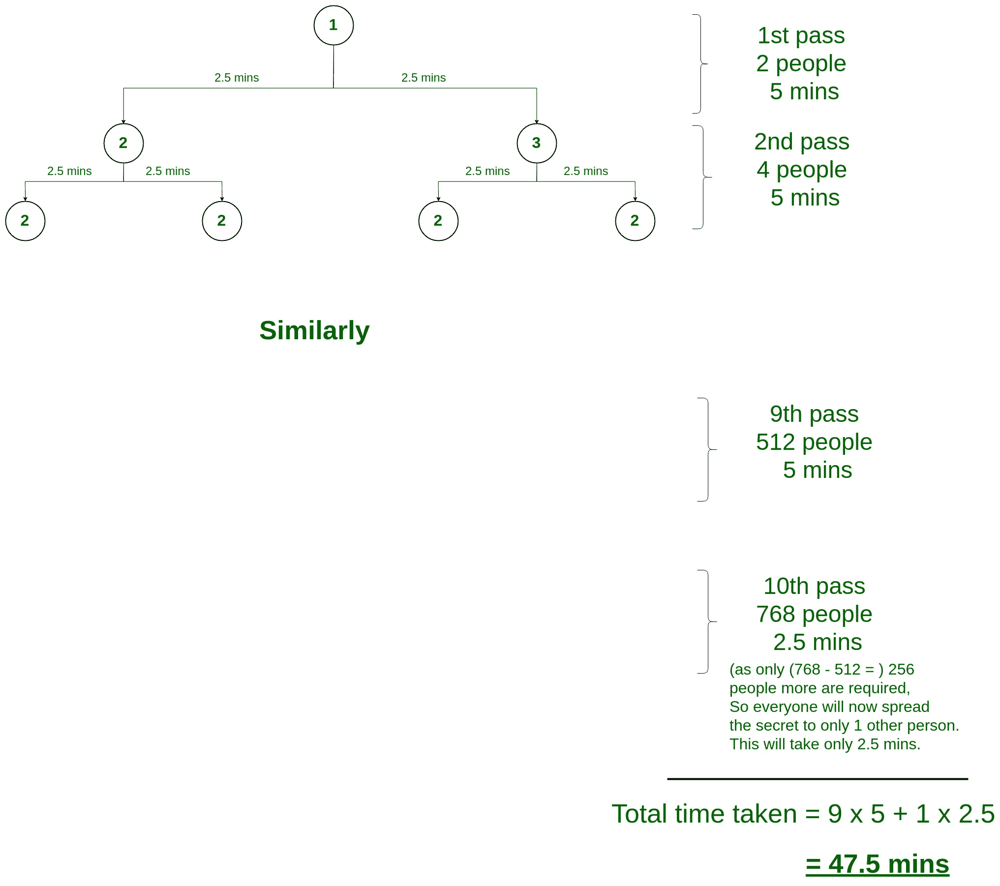

# 谜题|泄露秘密

> 原文:[https://www.geeksforgeeks.org/puzzle-disclosing-secret/](https://www.geeksforgeeks.org/puzzle-disclosing-secret/)

**问题表述:**一个秘密 5 分钟只能告诉 2 个人。同一个人告诉 2 个以上的人等等。那么将一个秘密传播给 768 个人需要多长时间？

**解:**
一开始，只让 1 个人知道这个秘密。

1.  现在，这 1 个人将在 5 分钟内把秘密告诉透露给另外 2 个人。**(已知秘密= 2，剩余= 766 人)**

*   现在，这 2 个人将在 5 分钟内把秘密告诉透露给另外 4 个人。**(已知秘密= 4，剩余= 764 人)***   现在，这 4 个人将在 5 分钟内把秘密告诉透露给另外 8 个人。**(已知秘密= 8，剩余= 760 人)***   现在，这 8 个人将在 5 分钟内把秘密告诉透露给另外 16 个人。**(已知秘密= 16，剩余= 752 人)***   现在，这 16 个人将在 5 分钟内告诉其他 32 个人泄露秘密。**(已知秘密= 32，剩余= 736 人)***   现在，这 32 个人将在 5 分钟内把秘密告诉透露给另外 64 个人。**(已知秘密= 64，剩余= 704 人)***   现在，这 64 个人将在 5 分钟内把秘密告诉透露给其他 128 个人。**(已知秘密= 128，剩余= 640 人)***   现在，这 128 人将在 5 分钟内告诉其他 256 人泄露秘密。**(已知秘密= 256，剩余= 512 人)***   现在，这 256 人将在 5 分钟内告诉 512 人泄露秘密。**(已知秘密= 512，剩余= 256 人)***   Now, as only 256 persons are left for the secret to being known, therefore, this 512 person will tell disclose the secret to only 1 person each i.e. 256 other persons in 2.5 mins. **(Secret known = 768, Remaining = 0 persons)**

    **总时间=** 9 * 5 + 1 * 2.5 = 47.5 分钟

    

    ### 因此，向 768 人披露秘密的总时间= 47.5 分钟