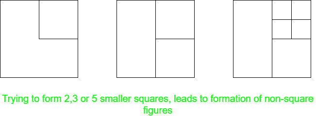
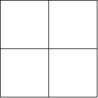
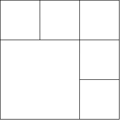
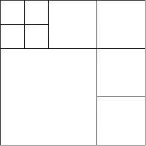

# 拼图|将一个正方形分成 N 个更小的正方形

> 原文:[https://www . geesforgeks . org/拼图-将一个正方形分成 n 个更小的正方形/](https://www.geeksforgeeks.org/puzzle-dividing-a-square-into-n-smaller-squares/)

**谜题:**找出 **N** 的所有值，对于这些值，可以将一个正方形分解成 **N 个更小的正方形**，并勾勒出进行这种分解的算法。

**解:**观察的基本点是正方形有 4 个直角。所以，要把它分成更小的正方形，它的每一个**直角**必须落入另一个正方形中，因为不止一个**直角**加起来会产生一个非正方形的数字。

现在，考虑以下情况:

1.  **当 N = 2、3 或 5 时:** **不可能有这样的划分**，因为它违反了上述给定的条件，并且获得了非形状的图形。

*   **When N = 4:** This is the easiest case. Just **divide the square horizontally and vertically, from the centre**. The resulting figure will have 4 squares.

    

    *   **When N is even and greater than 4:** This case can be generalised by considering **N = 2k** and forming **2k – 1**, equal squares along adjacent sides of the given square. However, the side length of each smaller square should be equal to **1/k** of the length of the given square.

    **例如:**考虑如图所示 **N = 6** 时的例子，这里我们沿着原正方形的边的顶部和右侧，每边 **(1/3)rd** 形成了 **5 个正方形**。此外，还剩下一个正方形的边 **(2/k)** ，总共有 6 个正方形。

    

    *   **Case N is odd and greater than 5:** This case builds upon the solution for even values of **N**. If **N** is odd, we can break it as **N = 2k + 1**, which further can be written as **N = 2(k – 1) + 3**. Now, we can first form **2(k – 1)** squares using the above approach, and then divide, on of the obtained squares, into four smaller squares, which will increase the overall square count by 3.

    **例如:**考虑 **N = 9** 时的例子，如图所示。这里我们先形成 **6 格**，然后把左上角的方块分成 **4** 个更小的方块，得到总计 **9** 个方块。

    