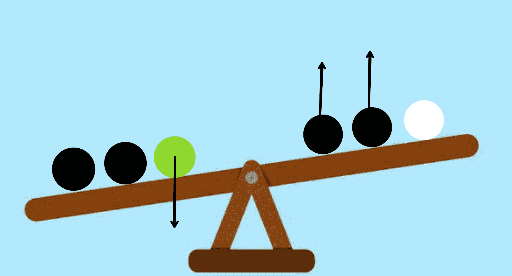

# 谜题|找到超重的岛民

> 原文:[https://www . geesforgeks . org/拼图-寻找超重岛民/](https://www.geeksforgeeks.org/puzzle-find-the-overweight-islander/)

一个岛上有 12 个人。11 个重量完全相同，但其中一个稍轻或稍重。有一个跷跷板来决定谁是唯一出局的人。找出跷跷板的最小使用次数。

**解:**跷跷板需要的最小次数为 3 次。

**说明:** A [分治法](https://www.geeksforgeeks.org/divide-and-conquer/)可以如下解决这个问题。

**第一步:**将 12 人分成 3 组，每组 4 人(A、B & C)，称第一组(A)与第二组(B)的重量。
**第二步:**有两种可能的结果。

*   **情况 1:** 它们平衡。
*   **情况 2:** 它们不平衡

<u>**案例 1**</u>

 
这意味着 C 组包含了奇数出局。现在将 C 组分成两个小组，分别为 3 名男子(C1)和 1 名男子(C2)，将 C1 组与 A 组或 B 组的 3 名正常男子进行称重，并留出 C2 组。这里同样有三种可能的结果-

*   **球的平衡:**这意味着 C2 组的男人是最奇怪的，通过将他与正常人进行比较，我们可以知道这个人是重还是轻。
    
*   **C1 更轻:**如果发生这种情况，那么通过将这 3 个人分成三个不同的组，并称量任意两个人的重量，将足以找出一个奇数，该男子将更轻。
*   **C1 更重:**如果发生这种情况，与子案例 1b 相同的划分方法将足以找出奇数，并且该男子将更重。

<u>**病例 2**</u>

 
本案共有 8 名嫌疑人。现在将这个组分为两个亚组，5 名男性(A1)和 3 名男性(B1)，假设亚组 A1 包含 4 名较重的嫌疑人和 1 名较轻的嫌疑人，亚组 B1 包含 3 名较轻的嫌疑人。现在比较 A1 亚组，一边有 2 个较重的嫌疑人和 1 个较轻的嫌疑人，另一边有剩余的 2 个较重的嫌疑人和一个来自 C 组的正常人。这里同样有 3 种可能的结果:

*   **平衡:**如果他们平衡，那么奇数人是 B1 组的三个较轻的嫌疑人之一。再一次，在剩下的三个较轻的嫌疑人中权衡这两个人将会解决问题，而这个人将会变轻。
    
*   **重量左移:**如果重量左移。因为位置的原因，我们可以看到右边两个较重的嫌疑人向上，所以他们不可能是奇数，因此他们的体重正常。同样，左边一个较轻的嫌疑人往下走，所以他也不可能是奇数，因此他的体重也必须正常。最后，称量剩余的 2 个较重的嫌疑人将解决问题，平均值将更重。
    
*   **重量向右移动:**如果重量向右移动。再次根据位置，我们可以看到左边两个较重的嫌疑人向上，因此体重正常。其余三名男子仍是嫌疑人(1 名较轻，2 名较重)。现在将两个较重的嫌疑人相互权衡，如果他们平衡，那么较轻的嫌疑人是奇数，将会较轻，如果他们不平衡，那么无论哪一方往下走，都是奇数的人，并且较重。
    

**参考:**[https://莫名其妙. stackexchange . com/questions/15426/Brooklyn-nine-nine-谜语-称重-岛民](https://puzzling.stackexchange.com/questions/15426/brooklyn-nine-nine-riddle-weighing-islanders)