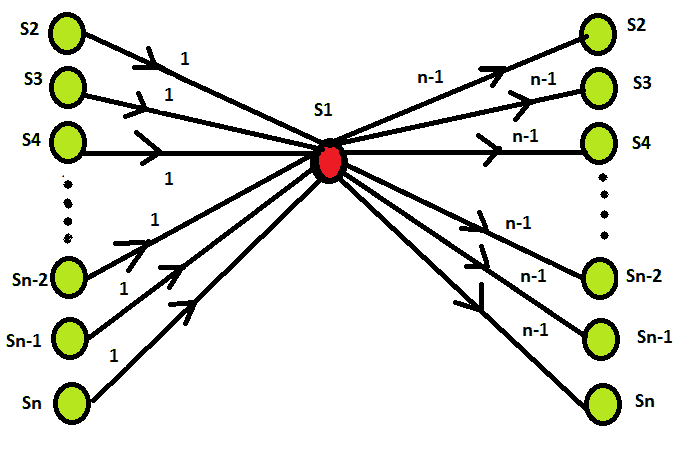
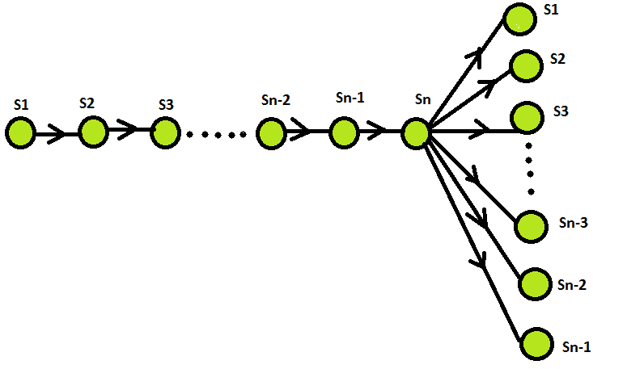

# 谜题|消息传播

> 原文:[https://www.geeksforgeeks.org/puzzle-message-spreading/](https://www.geeksforgeeks.org/puzzle-message-spreading/)

一个班有 n 个学生，每个人都有一个不同的有趣故事。由于学生们在课堂上越来越无聊，他们决定想出一个游戏来打发时间。他们想通过发送电子信息来互相分享有趣的故事。假设发送者包括他或她在发送消息时知道的所有有趣的故事，并且一条消息可能只有一个收件人。他们需要发送多少条消息才能保证每个人都能得到所有有趣的故事？

**解决方案:**最小消息数等于 2n–2。有几种方法可以做到这一点。

**方法 1 :** 学生可以指定一个学生，比如说，学生 1，其他人把他们知道的有趣的故事发给他。收到所有这些信息后，学生 1 将所有有趣的故事与他或她的有趣故事结合起来，并将这种结合的信息发送给其他 n-1 名学生。通过下图可以理解。代表 n 名学生，如 S1，S2，S3，……..，Sn。学生们指定 S1，其他学生把他们知道的有趣的故事发给他。

收到所有这些信息后，学生 1 将所有有趣的故事与他或她的有趣故事结合起来，并将这种结合的信息发送给其他 n-1 名学生。因此，消息的最小数量等于 2n–2。

**方法 2(贪婪算法):**将学生从 1 到 n 编号为 S1、S2、S3、…………、Sn，并发送前 n–1 条消息，如下所示:从 S1 到 S2，从 S2 到 S3，以此类推，直到消息结合了学生 S1、S2、。。。，Sn–1 发送给人 n。然后将学生 n(即 Sn)的所有 n 个有趣故事组合在一起的消息发送给 S2 S1 的学生。。。，Sn–1。

因此，消息的最小数量等于 2n–2。

**注:**2n–2 条消息是解谜所需的最小数量，这一事实源于这样一个事实，即学生人数增加一个至少需要两条额外的消息，即往返于额外学生的消息，这正是上述方法所提供的。

参考:[算法谜题——阿纳尼·莱维丁，玛丽亚·莱维丁](https://www.amazon.in/Algorithmic-Puzzles-Anany-Levitin/dp/0199740445)