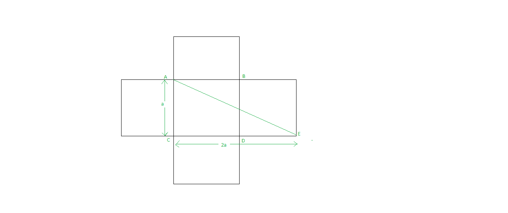
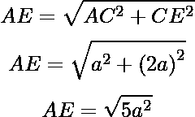

# 拼图|蜥蜴的最小距离

> 原文:[https://www . geesforgeks . org/拼图-蜥蜴的最小距离/](https://www.geeksforgeeks.org/puzzle-minimum-distance-for-lizard/)

一只蜥蜴出现在立方体的一角，它想到达立方体的对角。你必须计算蜥蜴到达目的地的最小距离。
注意:蜥蜴不会飞，它是沿着墙移动的。
给你**一个**代表立方体的一边。你必须计算蜥蜴必须行进的最小距离。
**例:**

```
Input : 5
Output :11.1803

Input :2
Output :4.47214
```

因为我们必须计算从一个角到对角的另一个角的最小距离。如果蜥蜴能飞，那么最短的距离将是对角线的长度。但它不能。



所以，要计算最小距离，只需打开立方体，如图所示。
让我们假设，蜥蜴最初在点 **E** 。它必须到达点 **A** (因为 A 在 E 的斜对面)。现在我们要找到 **AE** 。
就用勾股定理，As
AC=a
CE=CD+DE=2a



## C++

```
// CPP program to find minimum distance to be travlled
// by lizard.
#include <bits/stdc++.h>
#define ll long long int
using namespace std;
int main()
{
    // side of cube
    ll a = 5;

    // understand from diagram
    ll AC = a;

    // understand from diagram
    ll CE = 2 * a;

    // minimum distance
    double shortestDistace = sqrt(AC * AC + CE * CE);

    cout << shortestDistace << endl;
    return 0;
}
```

## Java 语言(一种计算机语言，尤用于创建网站)

```
//Java program to find minimum
//distance to be travelled by lizard
import java.util.*;

class solution
{
public static void main(String arr[])
{
    // side of the cube
    int a = 5;

    // understand from diagram
    int AC = a;

    // understand from diagram
    int CE = 2 * a;

    // minimum distance
    double shortestDistace = Math.sqrt(AC * AC + CE * CE);

    System.out.println(shortestDistace);
}
}
```

## 蟒蛇 3

```
# Python3 program to find minimum
# distance to be travelled by lizard

import math

#side of cube
if __name__=='__main__':
    a = 5

#understand from diagram
    AC = a

#understand from diagram
    CE = 2 * a

#minimum distance
    shortestDistace = math.sqrt(AC * AC + CE * CE)

    print(shortestDistace)

#this code is Contributed by Shashank_Sharma
```

## C#

```
// C# program to find minimum
// distance to be travelled by lizard
using System;

class GFG
{
public static void Main()
{
    // side of the cube
    int a = 5;

    // understand from diagram
    int AC = a;

    // understand from diagram
    int CE = 2 * a;

    // minimum distance
    double shortestDistace = Math.Sqrt(AC * AC + CE * CE);

    Console.Write(shortestDistace);
}
}

// This code is contributed by ita_c
```

## 服务器端编程语言（Professional Hypertext Preprocessor 的缩写）

```
<?php
// PHP program to find minimum distance
// to be travlled by lizard.

// side of cube
$a = 5;

// understand from diagram
$AC = $a;

// understand from diagram
$CE = 2 * $a;

// minimum distance
$shortestDistance = (double)(sqrt($AC * $AC +
                                  $CE * $CE));

echo $shortestDistance . "\n";

// This code is contributed
// by Akanksha Rai
?>
```

## java 描述语言

```
<script>

// Javascript program to find minimum distance to be travlled
// by lizard.

// side of cube
var a = 5;

// understand from diagram
var AC = a;

// understand from diagram
var CE = 2 * a;

// minimum distance
var shortestDistace = Math.sqrt(AC * AC + CE * CE);

document.write( shortestDistace.toFixed(4));

</script>
```

**Output:** 

```
11.1803
```