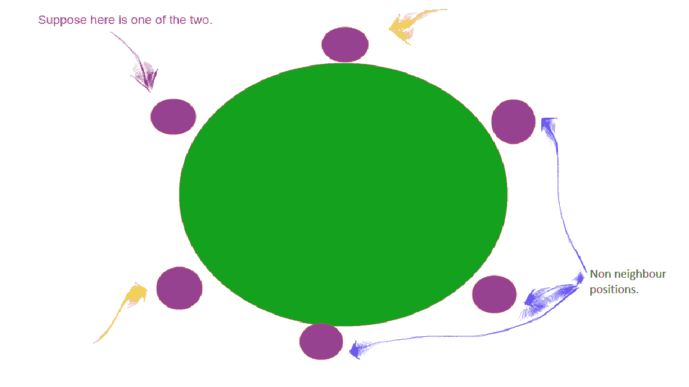

# 拼图|圆桌邻居

> 原文:[https://www . geesforgeks . org/拼图-圆桌邻居/](https://www.geeksforgeeks.org/puzzle-neighbors-in-a-round-table/)

圆桌上有 6 个人，其中两个人同名。这两个同名的个体成为邻居的概率有多大？

**解决方法(方法 1):** 一张圆桌可以坐 6 个人的方式总数为 **(6-1)！= 5!= 120** 。
如果我们把两个同名的人看成一个人，有 5 个人可以坐在 **(5-1)！**方式和这些个人可以一起坐在 **2！**方式。

所以，要求概率=(2*(5-1)！)/(6-1)!= **2/5** 。
那么，答案是 2/5 = **0.4** 。

**解决方法(方法 2):** 我们把一个同名同姓的家伙固定在任意位置。现在我们还剩 5 个位置，其中 2 个可以坐邻居。
所以，答案是 2/5 = **0.4** 。
