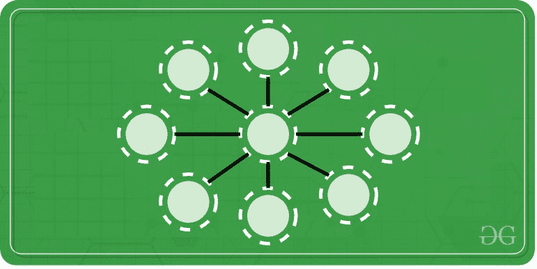

# 拼图|将数字 1 到 9 放在一个圆中，使直线中每个三连音的和为 15

> 原文:[https://www . geesforgeks . org/拼图-地点-数字-1 到 9-在一个圆中-这样-直线中每三个一组的总和是-15/](https://www.geeksforgeeks.org/puzzle-place-numbers-1-to-9-in-a-circle-such-that-sum-of-every-triplet-in-straight-line-is-15/)

把数字 1 到 9 放在一个圆里，这样在一条直线上有三个数字的地方，它们加起来就是 15。

### **<u>解决方案:</u>**

<video class="wp-video-shortcode" id="video-450389-1" width="640" height="360" preload="metadata" controls=""><source type="video/mp4" src="https://media.geeksforgeeks.org/wp-content/uploads/20200710130155/wpv.mp4?_=1">[https://media.geeksforgeeks.org/wp-content/uploads/20200710130155/wpv.mp4](https://media.geeksforgeeks.org/wp-content/uploads/20200710130155/wpv.mp4)</video>

*   第一个数字和最后一个数字的和是十(1 + 9 = 10)。
*   类似地，第二个数和第二个最后一个元素的和也是十(2 + 8 = 10)
*   以同样的方式(3，7)和(4，6)又形成两对，加起来是十对。
*   所以这四对(1，9)、(2，8)、(3，7)、(4，6)占据了外部的圆圈或地方。
*   里面的一个被 5 占据了。

1 + 9 + 5 =15

2 + 8 + 5 =15

3 + 7 + 5 =15

4 + 6 + 5 =15

*   成对元素(1，9)、(2，8)、(3，7)、(4，6)必须相对放置，以获得所需的总和。这意味着 1 与 9 相对放置，2 与 8 相对放置，3 与 7 相对放置，4 与 6 相对放置，5 位于中心。