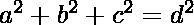
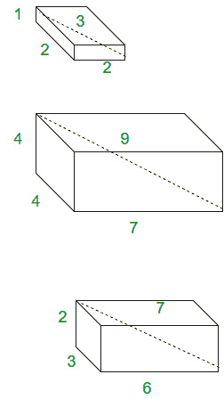

# 毕达哥拉斯四重

> 原文:[https://www.geeksforgeeks.org/pythagorean-quadruple/](https://www.geeksforgeeks.org/pythagorean-quadruple/)

给定四个点，检查它们是否构成毕达哥拉斯四重。
定义为整数 a、b、c、d 的元组，使得。它们基本上是**丢番图方程**的解。在几何解释中，它表示一个具有整数边长|a|、|b|、|c|的**长方体**，其空间对角线为|d|。



这里显示的长方体侧面是毕达哥拉斯四角体的例子。
当它们的最大公约数为 1 时为本原。每一个毕达哥拉斯四元组都是一个原始四元组的整数倍。我们可以通过公式
生成 a 为奇数的原始毕达哥拉斯四元组集

> **a = m<sup>2</sup>+n<sup>2</sup>–p<sup>2</sup>–q<sup>2</sup>、**
> T11】b = 2(MQ+NP)+T13】+T14】c = 2(NQ–MP)+T16】T17】d = m<sup>2</sup>+n<sup>2</sup>+p<sup>2</sup>+q

其中 m、n、p、q 是最大公约数为 1 的非负整数，使得 m + n + p + q 为奇数。因此，所有原始的毕达哥拉斯四足动物都以**勒贝格的同一性**为特征。

> **(m<sup>2</sup>+n<sup>2</sup>+p<sup>2</sup>+q<sup>2</sup>)<sup>2</sup>=(2mq+2nq)<sup>2</sup>+2(NQ–MP)<sup>2</sup>+(m<sup>2</sup>+n<sup>2</sup>–p<sup>2</sup>–q<sup>2</sup>**

## C++

```
// C++ code to detect Pythagorean Quadruples.
#include <bits/stdc++.h>
using namespace std;

// function for checking
bool pythagorean_quadruple(int a, int b, int c,
                                        int d)
{
    int sum = a * a + b * b + c * c;
    if (d * d == sum)
        return true;
    else
        return false;
}

// Driver Code
int main()
{
    int a = 1, b = 2, c = 2, d = 3;
    if (pythagorean_quadruple(a, b, c, d))
        cout << "Yes" << endl;
    else
        cout << "No" << endl;
}
```

## Java 语言(一种计算机语言，尤用于创建网站)

```
// Java code to detect Pythagorean Quadruples.
import java.io.*;
import java.util.*;

class GFG {

// function for checking
static Boolean pythagorean_quadruple(int a, int b,
                                   int c, int d)
{
    int sum = a * a + b * b + c * c;
    if (d * d == sum)
        return true;
    else
        return false;
}

// Driver function
    public static void main (String[] args) {
    int a = 1, b = 2, c = 2, d = 3;
    if (pythagorean_quadruple(a, b, c, d))
        System.out.println("Yes");
    else
        System.out.println("No" );

    }
}
// This code is contributed by Gitanjali.
```

## 蟒蛇 3

```
# Python  code to detect
# Pythagorean Quadruples.
import math

# function for checking
def pythagorean_quadruple(a,b, c, d):

    sum = a * a + b * b + c * c;
    if (d * d == sum):
        return True
    else:
        return False

#driver code
a = 1
b = 2
c = 2
d = 3
if (pythagorean_quadruple(a, b, c, d)):
    print("Yes")
else:
     print("No" )

# This code is contributed
# by Gitanjali.
```

## C#

```
// C# code to detect
// Pythagorean Quadruples.
using System;

class GFG {

    // function for checking
    static Boolean pythagorean_quadruple(int a,
                            int b, int c, int d)
    {
        int sum = a * a + b * b + c * c;
        if (d * d == sum)
            return true;
        else
            return false;
    }

    // Driver function
        public static void Main () {

        int a = 1, b = 2, c = 2, d = 3;

        if (pythagorean_quadruple(a, b, c, d))
            Console.WriteLine("Yes");
        else
            Console.WriteLine("No" );

    }
}

// This code is contributed by vt_M.
```

## 服务器端编程语言（Professional Hypertext Preprocessor 的缩写）

```
<?php
// php code to detect Pythagorean Quadruples.

// function for checking
function pythagorean_quadruple($a, $b, $c, $d)
{
    $sum = $a * $a + $b * $b + $c * $c;

    if ($d * $d == $sum)
        return true;
    else
        return false;
}

// Driver Code
    $a = 1; $b = 2; $c = 2; $d = 3;

    if (pythagorean_quadruple($a, $b, $c, $d))
        echo "Yes" ;
    else
        echo "No" ;

// This code is contributed by anuj_67.
?>
```

## java 描述语言

```
<script>

// JavaScript program to detect Pythagorean Quadruples.

// function for checking
function pythagorean_quadruple(a, b,
                                   c, d)
{
    let sum = a * a + b * b + c * c;
    if (d * d == sum)
        return true;
    else
        return false;
}

// Driver code

        let a = 1, b = 2, c = 2, d = 3;
    if (pythagorean_quadruple(a, b, c, d))
        document.write("Yes");
    else
        document.write("No" );

</script>
```

**输出:**

```
Yes
```

参考文献[【wiki】](https://en.wikipedia.org/wiki/Pythagorean_quadruple)
[【mathworld】](http://mathworld.wolfram.com/PythagoreanQuadruple.html)