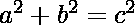
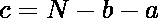
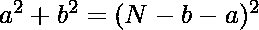
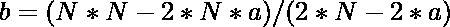

# 单圈给定和的勾股三元组

> 原文:[https://www . geeksforgeeks . org/毕达哥拉斯-给定和的三元组-使用单循环/](https://www.geeksforgeeks.org/pythagorean-triplet-with-given-sum-using-single-loop/)

A [毕达哥拉斯三元组](https://www.geeksforgeeks.org/find-pythagorean-triplet-in-an-unsorted-array/)是一组自然数，使得 a < b < c，对于



给定一个数 N，求一个和为给定 N 或返回-1 的毕达哥拉斯三元组。

**示例:**

```
Input: 12  
Output: 3 4 5
Explanation:
As 32 + 42 = 52

Input: 82
Output: -1
```

**方法:**思路是根据 **a** 求 **b** 和 **c** 的值，从 1 到 n 迭代 a，要根据 a 求 b 和 c 的值，我们要做以下工作:

我们有两个方程，

 [Tex] a + b + c = N [/Tex]

我们将根据 a 和 b 找到 c 的值，然后把这个值放在等式 1 中，求解 b。

从等式 2 中，



现在，把这个值放在等式 1 中。



求解上述方程后，我们将得到:

[特克斯]c = N–b–a[/特克斯]

现在，从 1 到 N 迭代 a，分别计算 b 和 c 的值。然后，检查是否


## C++

```
// C++ program to find the Pythagorean
// Triplet with given sum
#include <bits/stdc++.h>
using namespace std;

// Function to calculate the
// Pythagorean triplet in O(n)
void PythagoreanTriplet(int n)
{
    int flag = 0;

    // Iterate a from 1 to N-1.
    for (int a = 1; a < n; a++)
    {
        // Calculate value of b
        int b = (n * n - 2 * n * a)
                / (2 * n - 2 * a);

        // The value of c = n - a - b
        int c = n - a - b;

        if (a * a + b * b == c * c
            && b > 0 && c > 0)
        {
            cout << a << " " << b << " " << c;
            flag = 1;
            break;
        }
    }

    if (flag == 0) {
        cout << "-1";
    }

    return;
}

// Driver Code
int main()
{
    int N = 12;

    // Function call
    PythagoreanTriplet(N);

    return 0;
}
```

## Java 语言(一种计算机语言，尤用于创建网站)

```
// Java program to find the Pythagorean
// Triplet with given sum

class GFG {

    // Function to calculate the
    // Pythagorean triplet in O(n)
    static void PythagoreanTriplet(int n)
    {
        int flag = 0;

        // Iterate a from 1 to N-1.
        for (int a = 1; a < n; a++)
        {
            // Calculate value of b
            int b = (n * n - 2 * n * a)
              / (2 * n - 2 * a);

            // The value of c = n - a - b
            int c = n - a - b;

            if (a * a + b * b == c * c
                && b > 0 && c > 0)
            {
                System.out
                  .print(a + " " + b + " " + c);
                flag = 1;
                break;
            }
        }

        if (flag == 0)
        {
            System.out.print("-1");
        }

        return;
    }

    // Driver Code
    public static void main(String[] args)
    {
        int N = 12;

        // Function call
        PythagoreanTriplet(N);
    }
}

// This code contributed by sapnasingh4991
```

## 蟒蛇 3

```
# Python3 program to find the Pythagorean
# Triplet with a given sum

# Function to calculate the
# Pythagorean triplet in O(n)

def PythagoreanTriplet(n):
    flag = 0

    # Iterate a from 1 to N-1.
    for a in range(1, n, 1):

        # Calculate value of b
        b = (n * n - 2 * n * a) // (2 * n - 2 * a)

        # The value of c = n - a - b
        c = n - a - b

        if (a * a + b * b == c * c
            and b > 0 and c > 0):
            print(a, b, c)
            flag = 1
            break

    if(flag == 0):
        print("-1")

    return

# Driver code
if __name__ == '__main__':
    N = 12

    # Function call
    PythagoreanTriplet(N)

# This code is contributed by Bhupendra_Singh
```

## C#

```
// C# program to find the Pythagorean
// Triplet with given sum
using System;

class GFG {

    // Function to calculate the
    // Pythagorean triplet in O(n)
    static void PythagoreanTriplet(int n)
    {
        int flag = 0;

        // Iterate a from 1 to N-1.
        for (int a = 1; a < n; a++)
        {
            // Calculate value of b
            int b = (n * n - 2 * n * a)
              / (2 * n - 2 * a);

            // The value of c = n - a - b
            int c = n - a - b;
            if (a * a + b * b == c * c
                && b > 0 && c > 0)
            {
                Console.Write(a + " " + b + " " + c);
                flag = 1;
                break;
            }
        }

        if (flag == 0) {
            Console.Write("-1");
        }
        return;
    }

    // Driver code
    public static void Main(String[] args)
    {
        int N = 12;

        // Function call
        PythagoreanTriplet(N);
    }
}

// This code is contributed by shivanisinghss2110
```

## java 描述语言

```
<script>
    // Javascript program to find the Pythagorean
      // Triplet with given sum

    // Function to calculate the
    // Pythagorean triplet in O(n)
    function PythagoreanTriplet(n)
    {
        let flag = 0;

        // Iterate a from 1 to N-1.
        for (let a = 1; a < n; a++)
        {
            // Calculate value of b
            let b = (n * n - 2 * n * a)
                    / (2 * n - 2 * a);

            // The value of c = n - a - b
            let c = n - a - b;

            if (a * a + b * b == c * c
                && b > 0 && c > 0)
            {
                document.write(a + " " + b + " " + c);
                flag = 1;
                break;
            }
        }

        if (flag == 0) {
            document.write("-1");
        }

        return;
    }

    let N = 12;

    // Function call
    PythagoreanTriplet(N);

// Tis code is contributed by divyeshrabadiya
</script>
```

**Output**

```
3 4 5
```

**时间复杂度:** O(N)

**辅助空间:** O(1)