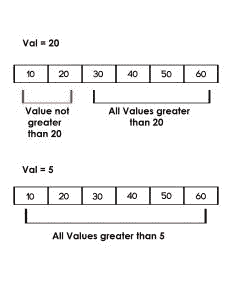

# Python |检查列表中是否所有大于给定值的值

> 原文:[https://www . geesforgeks . org/python-check-values-list-greater-given-value/](https://www.geeksforgeeks.org/python-check-values-list-greater-given-value/)

给定一个列表，打印列表中大于给定值

的所有值示例:

```
Input : list = [10, 20, 30, 40, 50] 
        given value = 20 
Output : No

Input : list = [10, 20, 30, 40, 50] 
        given value = 5 
Output : Yes

```

**方法 1:遍历列表**

通过遍历列表，我们可以比较每个元素，并检查给定列表中的所有元素是否都大于给定值。

```
# python program to check if all 
# values in the list are greater 
# than val using traversal

def check(list1, val):

    # traverse in the list
    for x in list1:

        # compare with all the values
        # with val
        if val>= x:
            return False 
    return True

# driver code 
list1 =[10, 20, 30, 40, 50, 60]
val = 5
if(check(list1, val)):
    print"Yes"
else:
    print"No"

val = 20 
if(check(list1, val)):
    print"Yes"
else:
    print"No"
```

**输出:**

```
Yes
No

```

**方法二:使用 all()函数:**

使用 [all()函数](https://www.geeksforgeeks.org/any-all-in-python/)我们可以检查是否所有值都大于单行中的任何给定值。如果 all()函数中的给定条件对所有值都为真，则返回 true，否则返回 false。

```
# python program to check if all 
# values in the list are greater
# than val using all() function

def check(list1, val):
    return(all(x > val for x in list1))

# driver code 
list1 =[10, 20, 30, 40, 50, 60]
val = 5
if(check(list1, val)):
    print"Yes"
else:
    print"No"

val = 20 
if (check(list1, val)):
    print"Yes"
else:
    print"No"
```

**输出:**

```
Yes
No

```