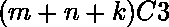
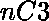
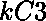
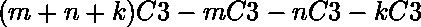

# Python–找出三条线上给定点的三角形的最大数量

> 原文:[https://www . geeksforgeeks . org/python-找到三行给定点三角形的最大数量/](https://www.geeksforgeeks.org/python-find-the-maximum-number-of-triangles-with-given-points-on-three-lines/)

给定位于同一平面的三条平行直线 *l1* 、 *l2* 和 *l3* 。 *m* 、 *n* 和 *k* 点的总数分别位于 *l1* 、 *l2* 、 *l3* 线上。本文旨在找出在这些点上由顶点形成的三角形的最大数量。

**示例:**

> **输入:** m = 14，n = 34，k = 114
> T3】输出: 448708.0
> 
> **输入:** m = 95，n = 77，k = 94
> **输出:** 2755951.0

**进场-**

1.  三角形总数= 
2.  从 l1 平面开始不是有效三角形的三角形数量= 
3.  从 l2 平面开始不是有效三角形的三角形数量= 
4.  从 l3 平面开始不是有效三角形的三角形数量= 
5.  所以有效三角形的数量= 

**下面是该方法的 Python 代码实现。**

## 蟒蛇 3

```
# Python code implementation
import math
def nooftriangle(m, n, k):

    # r1 = (m + n + k)C3
    r1 = math.factorial(m + n + k) / (
            math.factorial(3) * math.factorial(m + n + k - 3))
    # r2 = mC3
    r2 = math.factorial(m) / (math.factorial(3) * math.factorial(m - 3))

    # r3 = nC3
    r3 = math.factorial(n) / (math.factorial(3) * math.factorial(n - 3))

    #r4 = kC3
    r4 = math.factorial(k) / (math.factorial(3) * math.factorial(k - 3))

    result = r1 - r2 - r3 - r4
    return(result)

# Driver code
m = 17
n = 16
k = 11
print("Number of triangles : ", nooftriangle(m, n, k))

```

**输出:**

```
Number of triangles :  11839.0
```