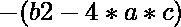

# Python |求多项式方程的解

> 原文:[https://www . geesforgeks . org/python-求多项式方程的解/](https://www.geeksforgeeks.org/python-finding-solutions-of-a-polynomial-equation/)

给定一个二次方程，任务是找到它的可能解。
**例:**

```
Input : 
enter the coef of x2 : 1
enter the coef of x  : 2
enter the constant    : 1
Output :
the value for x is -1.0

Input :
enter the coef of x2 : 2
enter the coef of x  : 3
enter the constant    : 2
Output :
x1 = -3+5.656854249492381i/4 and x2 = -3-5.656854249492381i/4
```

**算法:**

```
Start.
Prompt the values for a, b, c. 
Compute i = b**2-4*a*c
If i get negative value g=square root(-i)
Else h = sqrt(i)
Compute e = -b+h/(2*a)
Compute f = -b-h/(2*a)
If condition e==f then
    Print e
Else
    Print e and f
If i is negative then
    Print -b+g/(2*a) and -b-g/(2*a)
stop
```

**下面是上述任务的 Python 实现。**

## 蟒蛇 3

```
# Python program for solving a quadratic equation.

from math import sqrt  
try:    

    # if user gives non int values it will go to except block
    a = 1
    b = 2
    c = 1
    i = b**2-4 * a * c

    # magic condition for complex values
    g = sqrt(-i)
    try:
        d = sqrt(i)
        # two resultants
        e = (-b + d) / 2 * a 
        f = (-b-d) / 2 * a
        if e == f:
            print("the values for x is " + str(e))
        else:
            print("the value for x1 is " + str(e) +
                  " and x2 is " + str(f))
    except ValueError:
        print("the result for your equation is in complex")

        # to print complex resultants.
        print("x1 = " + str(-b) + "+" + str(g) + "i/" + str(2 * a) +
              " and x2 = " + str(-b) + "-" + str(g) + "i/" +
              str(2 * a))  

except ValueError:
    print("enter a number not a string or char")
```

**输出:**

```
the values for x is -1.0
```

**说明:**
首先，这个程序会从用户那里得到三个输入。数值为系数、系数和常数。然后执行公式

，对于复数，的值为负。取负值会抛出一个值错误。在这种情况下，将的结果翻转过来，然后根。最后别忘了包含。