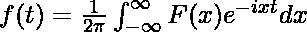

# Python |快速傅里叶逆变换

> 原文:[https://www . geeksforgeeks . org/python-逆-快速傅立叶变换/](https://www.geeksforgeeks.org/python-inverse-fast-fourier-transformation/)

**快速傅里叶逆变换(IDFT)** 是一种撤销离散傅里叶变换过程的算法。它也被称为反向傅里叶变换。它将空间或时间信号转换成频域信号。离散傅立叶变换信号是通过将值序列分布到不同的频率分量而产生的。直接在傅里叶变换上进行转换在计算上过于昂贵。因此，使用快速傅立叶变换，因为它通过将离散傅立叶变换矩阵分解为稀疏因子的乘积来快速计算。因此，它将离散傅立叶变换的计算复杂度从 **O(N <sup>2</sup> )降低到了 O(N 对数 N)** 。在处理大型数据集时，这是一个巨大的差异。此外，在存在舍入误差的情况下，与直接的离散傅立叶变换定义相比，快速傅立叶变换算法非常精确。

这种变换是从配置空间到频率空间的转换，这对于探索某些问题的变换以便更有效地计算以及探索信号的功率谱都是非常重要的。这个翻译可以是从 xn 到 Xk。它将空间或时间数据转换为频域数据。

<center></center>

**sympy . Discrete . transforms . IFFT():**T2【它可以在复域中执行离散傅里叶逆变换(DFT)。
序列自动向右填充零，因为基数-2 快速傅立叶变换要求样本点数为 2 的幂。对于短序列，仅将此方法与默认参数一起使用，因为序列的大小会增加表达式的复杂性。

```
 Parameters : 

-> seq : [iterable] sequence on which Inverse DFT is to be applied.
-> dps : [Integer] number of decimal digits for precision.

Returns : 
Fast Fourier Transform

```

**例 1:**

```
# import sympy 
from sympy import ifft

# sequence 
seq = [15, 21, 13, 44]

# fft
transform = ifft(seq)
print ("Inverse FFT : ", transform)
```

**输出:**

```
Inverse FFT :  [93/4, 1/2 + 23*I/4, -37/4, 1/2 - 23*I/4]
```

**例 2:**

```
# import sympy 
from sympy import ifft

# sequence 
seq = [15, 21, 13, 44]

decimal_point = 4

# fft
transform = ifft(seq, decimal_point )
print ("Inverse FFT : ", transform)
```

**输出:**

```
Inverse FFT :  [23.25, 0.5 + 5.75*I, -9.250, 0.5 - 5.75*I]

```