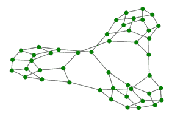
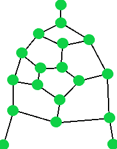
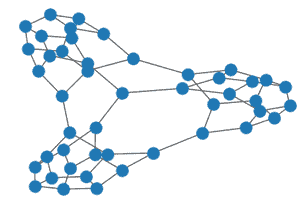
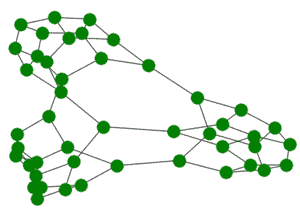
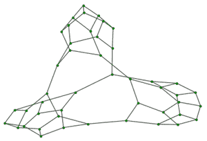

# Python 网络 x–Tutte 图

> 原文:[https://www.geeksforgeeks.org/python-networkx-tutte-graph/](https://www.geeksforgeeks.org/python-networkx-tutte-graph/)

它是一个有 46 个顶点和 69 条边的图。它之所以重要，是因为它是 Tait 猜想的例外，Tait 猜想认为每个 3-正多面体都有一个哈密顿圈。



图特图

**图特图的属性:**

*   这是一个三次多面体图，从上图可以明显看出，它既是三次的又是多面体的
*   它是非哈密顿图。
*   这是一个平面图。
*   图的色数是 3。
*   它可以通过连接 3 个 Tutte 片段来构建，从而得到的图是 s 3 连接的平面图。
*   图特碎片的示意图如下。



图特碎片

*   从上图可以明显看出，一个 Tutte 片段有 18 个节点。

我们将使用 [*网络*](https://www.geeksforgeeks.org/networkx-python-software-package-study-complex-networks/) 模块来实现图图。它带有一个内置功能 *networkx.tutte_graph()* ，可以使用 *networkx.draw()* 方法进行说明。

**语法:**

> 绘制(G，节点大小，节点颜色)
> 
> **参数:**
> 
> *   **G:** 指 Tutte 图形对象
> *   **node_size:** 指节点的大小。
> *   **node_color:** 指节点的颜色。

**下面是一些描述如何用 Python 说明 Tutte 图的例子:**

**例 1:**

## 蟒蛇 3

```
# import required module
import networkx

# create object
G = networkx.tutte_graph()

# illustrate graph
networkx.draw(G)
```

**输出:**



**例 2:**

## 蟒蛇 3

```
# import required module
import networkx

# create object
G = networkx.tutte_graph()

# illustrate graph
networkx.draw(G, node_color='green')
```

**输出:**



**例 3:**

## 蟒蛇 3

```
# import required module
import networkx

# create object
G = networkx.tutte_graph()

# illustrate graph
networkx.draw(G, node_size=15,
              node_color='green')
```

**输出:**



**注意:**输出图形插图的形状是随机生成的，但节点的数量、大小和颜色将根据 *networkx.draw()* 方法中传递的参数来确定。