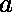
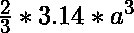
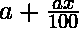
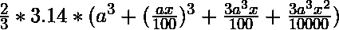
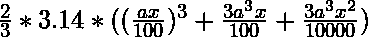
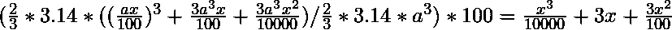

# Python |如果半径增加，半球体积增加的百分比

> 原文:[https://www . geeksforgeeks . org/python-百分比-半球增加-体积-如果半径增加/](https://www.geeksforgeeks.org/python-percentage-increase-in-hemisphere-volume-if-radius-is-increased/)

假设半球的半径增加了一个固定的百分比，那么目标是计算半球体积增加的百分比。

> **例:**
> **输入:**
> 20
> **输出:**
> 72.8 %
> 
> **输入:**T2 70
> T4【输出:T6】391.3%

**进场:**
让，半球半径= 
给定百分比增加= 
体积增加前= 
新半径增加后= 
所以，新体积= 
体积变化= 
体积增加百分比= 

**下面是上述方法的 Python 代码实现。**

```
# Python3 program to find percentage increase 
# in the volume of the hemisphere 
# if the radius is increased by a given percentage 

def newvol(x): 

    print("percentage increase in the  volume of the"
          " hemisphere is ", pow(x, 3) / 10000 + 3 * x 
                + (3 * pow(x, 2)) / 100, "%") 

# Driver code 
x = 10.0
newvol(x) 
```

**输出:**

```
percentage increase in the volume of the hemisphere is  33.1 %
```