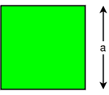
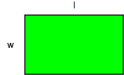

# 求正方形和矩形周长/周长的程序

> 原文:[https://www . geesforgeks . org/python-program-find-周长-周长-平方-矩形/](https://www.geeksforgeeks.org/python-program-find-perimeter-circumference-square-rectangle/)

图形的周长是所有边长的总和。要计算正方形的周长，需要一条边的长度，因为所有边都相等。要计算矩形的周长，需要矩形的长度和宽度。
**正方形的周长:**



正方形的周长由公式给出:

```
C = 4 * a
where a is the side length.
```

**例:**

```
input: 4
output: 16

input: 3
output: 12
```

## C++

```
// CPP program to find
// Circumference of a square
#include <bits/stdc++.h>
using namespace std;

int Circumference(int a)
{
    return 4 * a;
}

// Driver Code
int main()
{
    int a = 5;
    cout << "Circumference of"
         <<" a square is "
         << Circumference(a);
    return 0;
}

// This code is contributed
// by mohitw16
```

## Java 语言(一种计算机语言，尤用于创建网站)

```
// Java program to find
// Circumference of a square

import java.io.*;
class GFG
{
    int Circumference(int a)
    {
        return 4 * a;
    }

    // Driver code
    public static void main(String args[])
    {
        GFG obj = new GFG();
        int a = 5;
        System.out.println("Circumference of " +
                                "a square is " +
                          obj.Circumference(a));
    }
}

// This code is contributed
// by Anshika Goyal.
```

## 蟒蛇 3

```
# Python3 Program to find
# Circumference of a square

def Circumference(a):
        return (4 * a)

# Driver code
a = 5
c = Circumference(a)
print("Circumference of a " +
       "square is % d" % (c))
```

## C#

```
// C# program to find Circumference
// of a square
using System;

class GFG
{

    static int Circumference(int a)
    {
        return 4 * a;
    }

    // Driver Code
    public static void Main()
    {
        int a = 5;

        Console.WriteLine("Circumference" +
                       " of a square is " +
                         Circumference(a));
    }
}

// This code is contributed by vt_m.
```

## 服务器端编程语言（Professional Hypertext Preprocessor 的缩写）

```
<?php
// PHP program to find
// Circumference of a square

function Circumference($a)
{
    return 4 * $a;
}

// Driver Code
$a = 5;
echo "Circumference of a ".
              "square is ",
         Circumference($a);

// This code is contributed by ajit
?>
```

## java 描述语言

```
<script>

// Javascript program to find
// Circumference of a square
function Circumference(a)
{
    return 4 * a;
}

// Driver Code
    let a = 5;
    document.write("Circumference of"
        +" a square is "
        +Circumference(a));

// This code is contributed by Manoj

</script>
```

**输出:**

```
Circumference Of a square is 20
```

**矩形的周长:**



矩形的周长由公式给出:

```
C = 2 * (l + W)
where l is the length and W is the width.
```

**例:**

```
input: 2 4
output: 12

input: 4 6
output: 20
```

## C++

```
// C++ Program to find
// Circumference of a rectangle
#include <iostream>
using namespace std;

int Circumference(int l, int w)
{
    return (2 * (l + w));
}

// Driver code
int main()
{
    int l = 8, w = 4;

    int c = Circumference(l, w);

    cout << "Circumference of a"
         << " rectangle is "
         << c << endl;

    return 0;
}

// This code is contributed by vt_m.
```

## 蟒蛇 3

```
# Python Program to find
# Circumference of a rectangle

def Circumference(l, w):
        return (2 * (l + w))

# Driver code
l = 8
w = 4
c = Circumference(l, w)
print("Circumference of a" +
  " rectangle is % d" % (c))
```

## Java 语言(一种计算机语言，尤用于创建网站)

```
// java Program to find
// Circumference of a rectangle
import java.io.*;

class GFG
{

    static int Circumference(int l,
                             int w)
    {
        return (2 * (l + w));
    }

    // Driver code
    static public void main(String[] args)
    {
        int l = 8, w = 4;

        int c = Circumference(l, w);

        System.out.println("Circumference of " +
                         "a rectangle is " + c);
    }
}

// This code is contributed by vt_m.
```

## C#

```
// C# Program to find
// circumference of a rectangle
using System;

class GFG
{

    static int Circumference(int l,
                             int w)
    {
        return (2 * (l + w));
    }

    // Driver code
    static public void Main()
    {
        int l = 8, w = 4;

        int c = Circumference(l, w);

        Console.WriteLine("Circumference of " +
                        "a rectangle is " + c);
    }
}

// This code is contributed by vt_m.
```

## 服务器端编程语言（Professional Hypertext Preprocessor 的缩写）

```
<?php
// Php Program to find
// Circumference of a rectangle

function Circumference($l,$w)
{
    return (2 * ($l + $w));
}

// Driver code
$l = 8; $w = 4;

$c = Circumference($l, $w);

echo "Circumference of a ".
 "rectangle is " ,$c ,"\n";

// This code is contributed by aj_36.
?>
```

## java 描述语言

```
<script>
// javascript Program to find
// Circumference of a rectangle
    function Circumference(l , w)
    {
        return (2 * (l + w));
    }

    // Driver code
        var l = 8, w = 4;
        var c = Circumference(l, w);
        document.write("Circumference of " + "a rectangle is " + c);

// This code is contributed by aashish1995
</script>
```

**输出:**

```
Circumference of a rectangle is 24
```