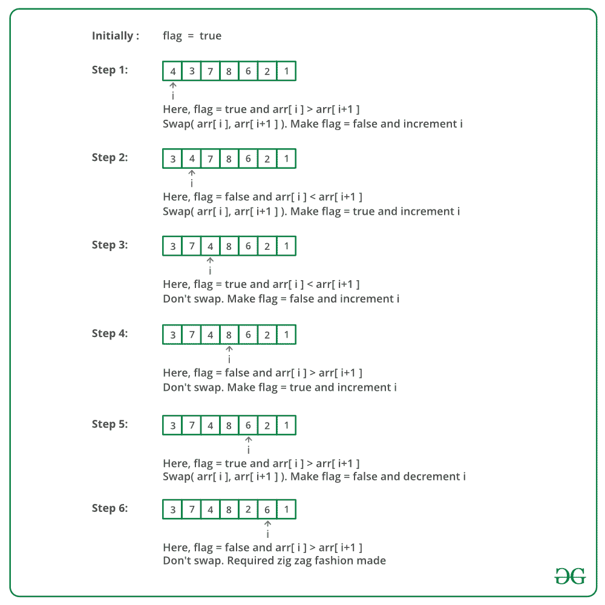

# 将数组转换成之字形的 Python 程序

> 原文:[https://www . geesforgeks . org/python-用于将数组转换为之字形的程序/](https://www.geeksforgeeks.org/python-program-for-converting-array-into-zig-zag-fashion/)

给定一个 **DISTINCT** 元素的数组，在 O(n)时间内以之字形方式重新排列数组的元素。转换后的数组应该是**a<b>c<d>e<f**的形式。

**例**:

> **输入** : arr[] = {4，3，7，8，6，2，1}
> 输出 : arr[] = {3，7，4，8，2，6，1}
> 
> **输入** : arr[] = {1，4，3，2}
> **输出** : arr[] = {1，4，2，3}

一个**简单的解决方案**是先对数组进行排序。排序后，排除第一个元素，成对交换其余元素。(即保持 arr[0]不变，交换 arr[1]和 arr[2]，交换 arr[3]和 arr[4]，等等)。
**时间复杂度** : O(N log N)既然我们需要先对数组进行排序。

我们可以使用**高效方法**在 **O(n)** 时间内转换。这个想法是使用一个经过修改的冒泡排序。

*   维护一个标志，用于表示我们当前需要哪个订单(即< or >)。
*   如果当前的两个元素不是按这个顺序排列的，那么交换这些元素，否则就不是。

让我们看看使用三个连续元素 A、B、c 的主要逻辑。

假设我们当前正在处理 B 和 C，当前关系是‘C’，因为当前关系是‘’，即 A 必须大于 B，所以关系是 A > B and B > C，我们可以推导出 A > C，所以如果我们交换 B 和 C，那么关系是 A > C 和 C < B. Finally we get the desired order **A C B**
更多解释请参考[这个](http://geeksquiz.com/converting-an-array-of-integers-into-zig-zag-fashion/)。

下图是上述方法的模拟运行:



下面是上述方法的实现:

## 计算机编程语言

```
# Python program to sort an array 
# in Zig-Zag form 

# Program for zig-zag conversion 
# of array 
def zigZag(arr, n): 

    # Flag true indicates relation "<" 
    # is expected, else ">" is expected. 
    # The first expected relation is "<" 
    flag = True

    for i in range(n - 1): 

        # "<" relation expected 
        if flag is True: 

            # If we have a situation like 
            # A > B > C, we get A > B < C 
            # by swapping B and C 
            if arr[i] > arr[i + 1]: 
                arr[i], arr[i + 1] = arr[i + 1], arr[i] 

            # ">" relation expected 
        else: 

            # If we have a situation like 
            # A < B < C, we get A < C > B  
            # by swapping B and C     
            if arr[i] < arr[i + 1]: 
                arr[i], arr[i + 1] = arr[i + 1], arr[i] 
        flag = bool(1 - flag) 
    print(arr) 

# Driver code
arr = [4, 3, 7, 8, 6, 2, 1] 
n = len(arr) 
zigZag(arr, n) 
# This code is contributed by Pratik Chhajer 
```

**输出:**

```
3  7  4  8  2  6  1 
```

**时间复杂度:**O(n)
T3】辅助空间: O(1)

更多详情请参考[将数组转换成之字形](https://www.geeksforgeeks.org/convert-array-into-zig-zag-fashion/)的完整文章！

'>',>