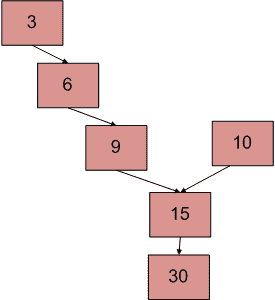

# 寻找两个链表交点的 Python 程序

> 原文:[https://www . geeksforgeeks . org/python-寻找两个链表交叉点的程序/](https://www.geeksforgeeks.org/python-program-for-finding-intersection-point-of-two-linked-lists/)

一个系统中有两个单链表。由于某种编程错误，其中一个链表的结束节点链接到第二个链表，形成一个倒 Y 形链表。写一个程序来得到两个链表合并的点。



上图显示了一个例子，两个链表有 15 个交叉点。

**方法 1(简单使用两个循环):**
使用 2 嵌套循环。外部循环将用于第一个列表的每个节点，内部循环将用于第二个列表。在内部循环中，检查第二个列表的任何节点是否与第一个链表的当前节点相同。该方法的时间复杂度为 O(M * N)，其中 M 和 N 是两个列表中的节点数。

**方法 2(标记访问节点):**
该解决方案需要修改基本链表数据结构。每个节点都有一个访问标志。遍历第一个链表，并继续标记被访问的节点。现在遍历第二个链表，如果你再次看到一个被访问的节点，那么有一个交叉点，返回相交节点。该解决方案适用于 **O(m+n)** ，但需要每个节点的附加信息。这种解决方案的变体不需要修改基本数据结构，可以使用散列来实现。遍历第一个链表，并将访问节点的地址存储在一个散列中。现在遍历第二个链表，如果你看到散列中已经存在一个地址，那么返回相交节点。

**方法 3(利用节点数的差异):**

*   获取第一个列表中节点的计数，让计数为 c1。
*   获取第二个列表中节点的计数，让计数为 c2。
*   求计数之差**d = ABS(C1–C2)**
*   现在遍历更大的列表，从第一个节点到 d 个节点，这样从这里开始，两个列表的节点数相等
*   然后，我们可以并行遍历这两个列表，直到遇到一个公共节点。(请注意，获取公共节点是通过比较节点的地址来完成的)

下图是上述方法的模拟运行:


下面是上述方法的实现:

## 蟒蛇 3

```
# Python program to implement
# the above approach
# Defining a node for LinkedList
class Node:
  def __init__(self, data):
    self.data = data
    self.next = None 

def getIntersectionNode(head1, head2):

    # Finding the total number of elements 
    # in head1 LinkedList
    c1=getCount(head1)

    # Finding the total number of elements 
    # in head2 LinkedList
    c2=getCount(head2)

    # Traverse the bigger node by 'd' so that
    # from that node onwards, both LinkedList
    # would be having same number of nodes and 
    # we can traverse them together.
    if c1 > c2:
        d = c1 - c2
        return _getIntersectionNode(d, head1,
                                    head2)
    else:
        d = c2 - c1
        return _getIntersectionNode(d, head2,
                                    head1) 

  def _getIntersectionNode(d, head1, head2):     
    current1 = head1
    current2 = head2   

    for i in range(d):
        if current1 is None:
            return -1
        current1 = current1.next

    while current1 is not None and current2 is not None:

    # Instead of values, we need to check 
    # if there addresses are same because 
    # there can be a case where value is 
    # same but that value is not an 
    # intersecting point.
        if current1 is current2:

            # or current2.data (the value 
            # would be same)
            return current1.data 

        current1 = current1.next
        current2 = current2.next

    # Incase, we are not able to find 
    # our intersecting point.
    return -1

# Function to get the count of a LinkedList
def getCount(node):
    cur=node
    count=0
    while cur is not None:
        count+=1
        cur=cur.next
    return count

# Driver code
if __name__ == '__main__':

  # Creating two LinkedList
  # 1st one: 3->6->9->15->30
  # 2nd one: 10->15->30
  # We can see that 15 would be 
  # our intersection point

  # Defining the common node  
  common = Node(15)

  #Defining the first LinkedList  
  head1 = Node(3)
  head1.next = Node(6)
  head1.next.next = Node(9)
  head1.next.next.next = common
  head1.next.next.next.next = Node(30)

  # Defining the second LinkedList  
  head2 = Node(10)
  head2.next = common
  head2.next.next = Node(30)

  print("The node of intersection is ",
         getIntersectionNode(head1,head2))
# This code is contributed by Ansh Gupta.
```

**输出:**

```
The node of intersection is 15
```

**时间复杂度:**O(m+n)
T3】辅助空间: O(1)

**方法 4(第一个列表打圈):**
感谢**萨拉瓦南曼**提供以下解决方案。
1。遍历第一个链表(计算元素数量)并创建一个循环链表。(记住最后一个节点，这样我们以后就可以打破这个循环了)。
2。现在将问题视为在第二个链表中找到循环。这样问题就解决了。
3。由于我们已经知道循环的长度(第一个链表的大小)，我们可以遍历第二个链表中的许多节点，然后从第二个链表的开始处开始另一个指针。我们必须遍历，直到它们相等，这就是所需的交点。
4。从链接列表中删除该圆。

**时间复杂度:**O(m+n)
T3】辅助空间: O(1)

**方法 5(颠倒第一个列表，做等式):**
感谢**萨拉瓦南马尼**提供了这个方法。

```
1) Let X be the length of the first linked list until intersection point.
   Let Y be the length of the second linked list until the intersection point.
   Let Z be the length of the linked list from the intersection point to End of
   the linked list including the intersection node.
   We Have
           X + Z = C1;
           Y + Z = C2;
2) Reverse first linked list.
3) Traverse Second linked list. Let C3 be the length of second list - 1\. 
     Now we have
        X + Y = C3
     We have 3 linear equations. By solving them, we get
       X = (C1 + C3 – C2)/2;
       Y = (C2 + C3 – C1)/2;
       Z = (C1 + C2 – C3)/2;
      WE GOT THE INTERSECTION POINT.
4)  Reverse first linked list.
```

优点:没有指针的比较。
缺点:修改链表(反转列表)。
**时间复杂度:**O(m+n)
T5】辅助空间: O(1)

**方法 6(遍历两个列表，比较最后一个节点的地址):**这个方法只是检测是否有交点。(感谢纽泰萨沃的建议)

```
1) Traverse list 1, store the last node address
2) Traverse list 2, store the last node address.
3) If nodes stored in 1 and 2 are same then they are intersecting.
```

该方法的时间复杂度为 O(m+n)，使用的辅助空间为 O(1)

详情请参考[完整文章写一个函数得到两个链表](https://www.geeksforgeeks.org/write-a-function-to-get-the-intersection-point-of-two-linked-lists/)的交点！