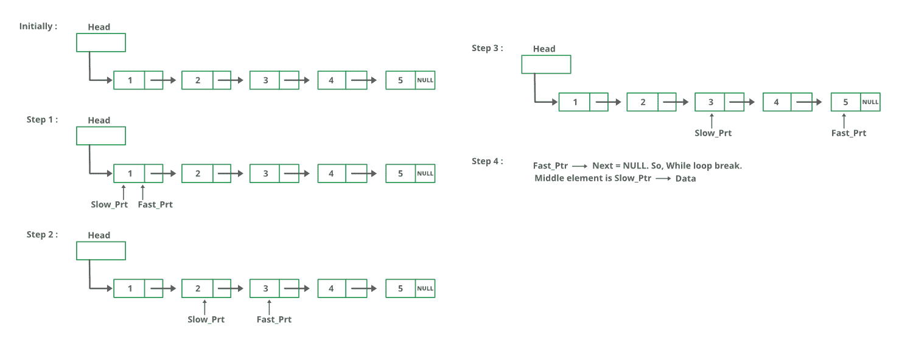

# 寻找给定链表中间元素的 Python 程序

> 原文:[https://www . geesforgeks . org/python-program-for-find-in-element-of-给定链表/](https://www.geeksforgeeks.org/python-program-for-finding-the-middle-element-of-a-given-linked-list/)

给定一个单链表，找到链表的中间。例如，如果给定的链表是 1->2->3->4->5，那么输出应该是 3。
如果有偶数个节点，那么就会有两个中间节点，我们需要打印第二个中间元素。例如，如果给定的链表是 1->2->3->4->5->6，那么输出应该是 4。

**方法 1:**
遍历整个链表，统计节点数。现在再次遍历列表，直到 count/2，并在 count/2 返回节点。

**方法 2:**
使用两个指针遍历链表。将一个指针移动一个，将另一个指针移动两个。当快速指针到达末尾时，慢速指针将到达链表的中间。

下图显示了 printMiddle 函数在代码中的工作方式:



## 蟒蛇 3

```
# Python3 program to find middle of 
# the linked list
# Node class 
class Node: 

    # Function to initialise the 
    # node object 
    def __init__(self, data): 

        # Assign data 
        self.data = data 

        # Initialize next as null  
        self.next = None  

# Linked List class contains a 
# Node object 
class LinkedList: 

    # Function to initialize head 
    def __init__(self): 
        self.head = None

    # Function to insert a new node at 
    # the beginning  
    def push(self, new_data):  
        new_node = Node(new_data)  
        new_node.next = self.head  
        self.head = new_node

    # Print the linked list
    def printList(self):
        node = self.head
        while node:
            print(str(node.data) + 
                  "->", end = "")
            node = node.next
        print("NULL")

    # Function that returns middle.
    def printMiddle(self):

        # Initialize two pointers, one will go 
        # one step a time (slow), another two 
        # at a time (fast)
        slow = self.head
        fast = self.head

        # Iterate till fast's next is null (fast 
        # reaches end)
        while fast and fast.next:
            slow = slow.next
            fast = fast.next.next

        # Return the slow's data, which would be 
        # the middle element.
        print("The middle element is ", slow.data)

# Driver code
if __name__=='__main__': 

    # Start with the empty list 
    llist = LinkedList() 

    for i in range(5, 0, -1):
        llist.push(i)
        llist.printList()
        llist.printMiddle()

# This code is contributed by Kumar Shivam (kshivi99)
```

**输出:**

```
5->NULL
The middle element is [5]

4->5->NULL
The middle element is [5]

3->4->5->NULL
The middle element is [4]

2->3->4->5->NULL
The middle element is [4]

1->2->3->4->5->NULL
The middle element is [3]
```

**方法 3:**
将中间元素初始化为 head，将一个计数器初始化为 0。从头开始遍历列表，遍历时递增计数器，当计数器为奇数时，将中间变为下一个中间>。所以 mid 只会移动列表总长度的一半。
感谢纳伦德拉·康拉尔卡尔提出这个方法。

## 蟒蛇 3

```
# Python program to implement
# the above approach

# Node class 
class Node: 

    # Function to initialise the 
    # node object 
    def __init__(self, data):

        # Assign data  
        self.data = data  

        # Initialize next as null 
        self.next = None  

# Linked List class contains a 
# Node object 
class LinkedList: 

    # Function to initialize head 
    def __init__(self): 
        self.head = None

    # Function to insert a new node at 
    # the beginning  
    def push(self, new_data):  
        new_node = Node(new_data)  
        new_node.next = self.head  
        self.head = new_node

    # Print the linked list
    def printList(self):
        node = self.head
        while node:
            print(str(node.data) + 
                      "->", end = "")
            node = node.next
        print("NULL")

    # Function to get the middle of
    #  the linked list
    def printMiddle(self):
        count = 0
        mid = self.head
        heads = self.head

        while(heads != None):

        # Update mid, when 'count'
        # is odd number 
            if count & 1:
                mid = mid.next
            count += 1
            heads = heads.next

        # If empty list is provided 
        if mid != None:
            print("The middle element is ", 
                   mid.data)

# Driver code
if __name__=='__main__': 

    # Start with the empty list 
    llist = LinkedList() 

    for i in range(5, 0, -1):
        llist.push(i)
        llist.printList()
        llist.printMiddle()

 # This code is contributed by Manisha_Ediga
```

**输出:**

```
5->NULL
The middle element is [5]

4->5->NULL
The middle element is [5]

3->4->5->NULL
The middle element is [4]

2->3->4->5->NULL
The middle element is [4]

1->2->3->4->5->NULL
The middle element is [3]
```

更多详情请参考[找到给定链表](https://www.geeksforgeeks.org/write-a-c-function-to-print-the-middle-of-the-linked-list/)中间的整篇文章！