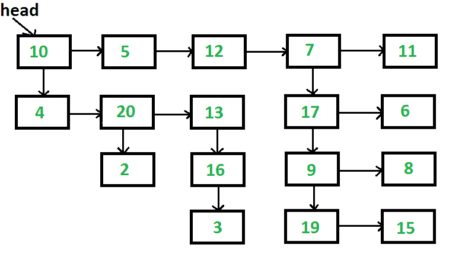

# 展平多级链表的 Python 程序

> 原文:[https://www . geesforgeks . org/python-program-for-扁平化-多级链表/](https://www.geeksforgeeks.org/python-program-for-flattening-a-multilevel-linked-list/)

给定一个链表，其中除了下一个指针之外，每个节点都有一个子指针，这个子指针可以指向也可以不指向一个单独的列表。这些子列表可能有一个或多个自己的子列表，以此类推，从而产生多级数据结构，如下图所示。你被赋予列表第一层的头。展平列表，以便所有节点都出现在单级链接列表中。您需要将列表展平，使第一层的所有节点都应该首先出现，然后是第二层的节点，依此类推。
每个节点都是一个 C 结构，定义如下。

## 蟒蛇 3

```
# A linked list node has data, 
# next pointer and child pointer 
class Node:
    def __init__(self, data):
        self.data = data
        self.next = None
        self.child = None

        # This code contributed by umadevi9616
```

[](https://media.geeksforgeeks.org/wp-content/cdn-uploads/flattenList.png)

以上列表应转换为 10-> 5-> 12-> 7-> 11-> 4-> 20-> 13-> 17-> 6-> 2-> 16-> 9-> 8-> 3-> 19-> 15

问题清楚地表明，我们需要一层一层地变平。一个解决方案的思路是，我们从第一层开始，逐个处理所有节点，如果一个节点有一个子节点，那么我们在列表的末尾追加这个子节点，否则，我们什么都不做。处理完第一级后，所有下一级节点将被追加到第一级之后。对于附加的节点，遵循相同的过程。

```
1) Take the "cur" pointer, which will point to the head 
        of the first level of the list
2) Take the "tail" pointer, which will point to the end of 
   the first level of the list
3) Repeat the below procedure while "curr" is not NULL.
    I) If the current node has a child then
    a) Append this new child list to the "tail"
        tail->next = cur->child
    b) Find the last node of the new child list and update 
       the "tail"
        tmp = cur->child;
        while (tmp->next != NULL)
            tmp = tmp->next;
        tail = tmp;
    II) Move to the next node. i.e. cur = cur->next
```

下面是上述算法的实现。

## 蟒蛇 3

```
# Python3 Program to flatten list with
# next and child pointers 

# A linked list node has data, 
# next pointer and child pointer 
class Node:
    def __init__(self, data):
        self.data = data
        self.next = None
        self.child = None

# Return Node
def newNode(data):
    return Node(data) 

# The main function that flattens
# a multilevel linked list
def flattenlist(head):

    # Base case
    if not head:
        return

    # Find tail node of first level 
    # linked list
    temp = head
    while(temp.next != None):
        temp = temp.next
    currNode = head

    # One by one traverse through all 
    # nodes of first level linked list
    # till we reach the tail node 
    while(currNode != temp):

        # If current node has a child
        if(currNode.child):

            # then append the child
            # at the end of current list 
            temp.next = currNode.child

            # and update the tail to new 
            # last node 
            tmp = currNode.child
            while(tmp.next):
                tmp = tmp.next
            temp = tmp

        # Change current node 
        currNode = currNode.next

# A utility function to print 
# all nodes of a linked list 
def printList(head): 
    if not head: 
        return
    while(head): 
        print("{}".format(head.data), 
              end = " ") 
        head = head.next

# Driver code 
if __name__=='__main__': 

    # Child list of 13
    child13 = newNode(16)
    child13.child = newNode(3)

    # Child List of 10
    head1 = newNode(4)
    head1.next = newNode(20)

    # Child of 20 
    head1.next.child = newNode(2) 
    head1.next.next = newNode(13)
    head1.next.next.child = child13

    # Child of 9
    child9 = newNode(19)
    child9.next = newNode(15)

    # Child List of 17
    child17 = newNode(9)
    child17.next = newNode(8)
    child17.child = child9

    # Child List of 7
    head2 = newNode(17)
    head2.next = newNode(6)
    head2.child = child17

    # Main List
    head = newNode(10)
    head.child = head1
    head.next = newNode(5)
    head.next.next = newNode(12)
    head.next.next.next = newNode(7)
    head.next.next.next.child = head2
    head.next.next.next.next = newNode(11)

    flattenlist(head)

    print("Flattened list is: ", end = "") 
    printList(head)
# This code is contributed by 0_hero
```

**输出:**

```
10 5 12 7 11 4 20 13 17 6 2 16 9 8 3 19 15
```

**时间复杂度:**由于每个节点最多被访问两次，因此时间复杂度为 O(n)，其中 n 是给定链表中的节点数。

更多详情请参考[整平多级链表](https://www.geeksforgeeks.org/flatten-a-linked-list-with-next-and-child-pointers/)整篇文章！