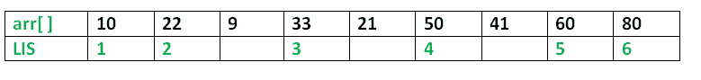

# 最长递增子序列的 Python 程序

> 原文:[https://www . geeksforgeeks . org/python-最长递增子序列程序/](https://www.geeksforgeeks.org/python-program-for-longest-increasing-subsequence/)

最长递增子序列(LIS)问题是求给定序列的最长子序列的长度，使子序列的所有元素按递增顺序排序。例如，{10，22，9，33，21，50，41，60，80}的 LIS 长度为 6，LIS 长度为{10，22，33，50，60，80}。


更多示例:

```
Input  : arr[] = {3, 10, 2, 1, 20}
Output : Length of LIS = 3
The longest increasing subsequence is 3, 10, 20

Input  : arr[] = {3, 2}
Output : Length of LIS = 1
The longest increasing subsequences are {3} and {2}

Input : arr[] = {50, 3, 10, 7, 40, 80}
Output : Length of LIS = 4
The longest increasing subsequence is {3, 7, 40, 80}

```

**最优子结构:**
让 arr[0..n-1]是输入数组，L(i)是以索引 I 结束的 LIS 的长度，因此 arr[i]是 LIS 的最后一个元素。
然后，L(i)可以递归地写成:
L(i) = 1 + max( L(j))，其中 0 < j < i 和 arr[j]<arr[I]；或者
L(i) = 1，如果不存在这样的 j。
为了找到给定数组的 LIS，我们需要返回 max(L(i))，其中 0 < i < n.
因此，我们看到 LIS 问题满足最优子结构性质，因为主问题可以使用子问题的解来解决。

下面是 LIS 问题的简单递归实现。它遵循上面讨论的递归结构。

```
# A naive Python implementation of LIS problem

""" To make use of recursive calls, this function must return
 two things:
 1) Length of LIS ending with element arr[n-1]. We use
 max_ending_here for this purpose
 2) Overall maximum as the LIS may end with an element
 before arr[n-1] max_ref is used this purpose.
 The value of LIS of full array of size n is stored 
  in * max_ref which is our final result """

# global variable to store the maximum
global maximum

def _lis(arr, n ):

    # to allow the access of global variable
    global maximum

    # Base Case
    if n == 1 :
        return 1

    # maxEndingHere is the length of LIS ending with arr[n-1]
    maxEndingHere = 1

    """Recursively get all LIS ending with arr[0], arr[1]..arr[n-2]
       IF arr[n-1] is maller than arr[n-1], and max ending with
       arr[n-1] needs to be updated, then update it"""
    for i in xrange(1, n):
        res = _lis(arr, i)
        if arr[i-1] < arr[n-1] and res + 1 > maxEndingHere:
            maxEndingHere = res + 1

    # Compare maxEndingHere with overall maximum. And
    # update the overall maximum if needed
    maximum = max(maximum, maxEndingHere)

    return maxEndingHere

def lis(arr):

    # to allow the access of global variable
    global maximum

    # length of arr
    n = len(arr)

    # maximum variable holds the result
    maximum = 1

    # The function _lis() stores its result in maximum
    _lis(arr, n)

    return maximum

# Driver program to test the above function
arr = [10, 22, 9, 33, 21, 50, 41, 60]
n = len(arr)
print "Length of lis is ", lis(arr)

# This code is contributed by NIKHIL KUMAR SINGH
```

**Output:**

```
Length of lis is  5

```

**重叠子问题:**
考虑到上面的实现，下面是大小为 4 的数组的递归树。lis(n)给出了 arr[]的 lis 长度。

```
              lis(4)
        /        |     
      lis(3)    lis(2)   lis(1)
     /           /
   lis(2) lis(1) lis(1)
   /
lis(1)

```

我们可以看到有很多子问题被一次又一次地解决。因此，该问题具有重叠子结构性质，用记忆法或制表法都可以避免同一子问题的重新计算。下面是 LIS 问题的一个列表实现。

```
# Dynamic programming Python implementation of LIS problem

# lis returns length of the longest increasing subsequence
# in arr of size n
def lis(arr):
    n = len(arr)

    # Declare the list (array) for LIS and initialize LIS
    # values for all indexes
    lis = [1]*n

    # Compute optimized LIS values in bottom up manner
    for i in range (1, n):
        for j in range(0, i):
            if arr[i] > arr[j] and lis[i]< lis[j] + 1 :
                lis[i] = lis[j]+1

    # Initialize maximum to 0 to get the maximum of all
    # LIS
    maximum = 0

    # Pick maximum of all LIS values
    for i in range(n):
        maximum = max(maximum, lis[i])

    return maximum
# end of lis function

# Driver program to test above function
arr = [10, 22, 9, 33, 21, 50, 41, 60]
print "Length of lis is", lis(arr)
# This code is contributed by Nikhil Kumar Singh
```

**Output:**

```
Length of lis is 5

```

详情请参考[动态规划|集合 3(最长递增子序列)](https://www.geeksforgeeks.org/longest-increasing-subsequence/)整篇文章！