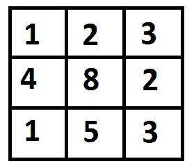

# 最小成本路径的 Python 程序

> 原文:[https://www . geesforgeks . org/python-program-for-min-cost-path/](https://www.geeksforgeeks.org/python-program-for-min-cost-path/)

给定成本矩阵 cost[][]和 cost[][]中的位置(m，n)，编写一个函数，返回从(0，0)到达(m，n)的最小成本路径的成本。矩阵的每个单元都代表了遍历该单元的成本。到达路径的总成本(m，n)是该路径上所有成本的总和(包括源和目的地)。您只能从给定单元格(即，从给定单元格(I，j))向下、向右和对角向下遍历单元格，可以遍历单元格(i+1，j)、(I，j+1)和(i+1，j+1)。你可以假设所有的成本都是正整数。

例如，在下图中，到(2，2)的最小成本路径是什么？
[](https://media.geeksforgeeks.org/wp-content/cdn-uploads/dp.png)

下图中突出显示了成本最低的路径。路径是(0，0)–>(0，1)–>(1，2)–>(2，2)。路径的成本是 8 (1 + 2 + 2 + 3)。

```
# Dynamic Programming Python implementation of Min Cost Path
# problem
R = 3
C = 3

def minCost(cost, m, n):

    # Instead of following line, we can use int tc[m + 1][n + 1] or
    # dynamically allocate memoery to save space. The following
    # line is used to keep te program simple and make it working
    # on all compilers.
    tc = [[0 for x in range(C)] for x in range(R)]

    tc[0][0] = cost[0][0]

    # Initialize first column of total cost(tc) array
    for i in range(1, m + 1):
        tc[i][0] = tc[i-1][0] + cost[i][0]

    # Initialize first row of tc array
    for j in range(1, n + 1):
        tc[0][j] = tc[0][j-1] + cost[0][j]

    # Construct rest of the tc array
    for i in range(1, m + 1):
        for j in range(1, n + 1):
            tc[i][j] = min(tc[i-1][j-1], tc[i-1][j],
                            tc[i][j-1]) + cost[i][j]

    return tc[m][n]

# Driver program to test above functions
cost = [[1, 2, 3],
        [4, 8, 2],
        [1, 5, 3]]
print(minCost(cost, 2, 2))

# This code is contributed by Bhavya Jain
```

**Output:**

```
8

```

详情请参考[动态规划|集合 6(最小成本路径)](https://www.geeksforgeeks.org/dynamic-programming-set-6-min-cost-path/)的完整文章！