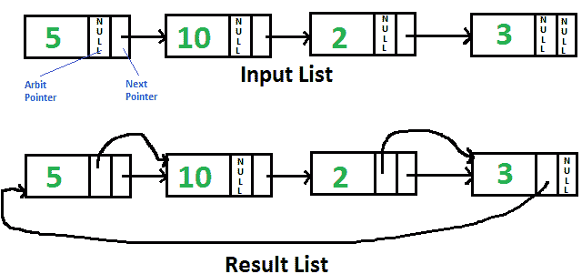

# 用任意指针指向链表中下一个更高值节点的 Python 程序

> 原文:[https://www . geesforgeks . org/python-program-for-指向下一个更高值的节点-带任意指针的链表/](https://www.geeksforgeeks.org/python-program-for-pointing-to-next-higher-value-node-in-a-linked-list-with-an-arbitrary-pointer/)

给定单链表，每个节点都有一个额外的“任意”指针，该指针当前指向空。需要使“任意”指针指向下一个更高值的节点。



**强烈建议尽量减少浏览器，先自己试试**

一个**简单的解决方法**就是逐个遍历所有节点，对于每个节点，找到当前节点下一个值较大的节点，改变下一个指针。该解决方案的时间复杂度为 0(n<sup>2</sup>)。

一个**有效的解决方案**在 0(nLogn)时间内有效。想法是对链表使用[合并排序](https://www.geeksforgeeks.org/merge-sort-for-linked-list/)。
1)遍历输入列表，并将下一个指针复制到每个节点的仲裁指针。
2)对仲裁指针形成的链表进行合并排序。

以下是上述想法的实现。所有的合并排序功能都取自[这里的](https://www.geeksforgeeks.org/merge-sort-for-linked-list/)。这里修改了所取的函数，以便它们在仲裁指针上工作，而不是在下一个指针上工作。

## 蟒蛇 3

```
# Python3 program to populate arbit pointers 
# to next higher value using merge sort
head = None

# Link l node 
class Node:

    def __init__(self, data):        
        self.data = data
        self.next = None
        self.arbit = None

# Utility function to print result 
# linked l
def printList(node, anode):

    print("Traversal using Next Pointer")

    while (node != None):
        print(node.data, end = ", ")
        node = node.next

    print("Traversal using Arbit Pointer");

    while (anode != None):
        print(anode.data, end = ", ")
        anode = anode.arbit

# This function populates arbit pointer in 
# every node to the next higher value. And
# returns pointer to the node with minimum
# value
def populateArbit(start):

    temp = start

    # Copy next pointers to arbit pointers
    while (temp != None):
        temp.arbit = temp.next
        temp = temp.next

    # Do merge sort for arbitrary pointers and
    # return head of arbitrary pointer linked l
    return MergeSort(start)

# Sorts the linked l formed by arbit pointers 
# (does not change next pointer or data)
def MergeSort(start):

    # Base case -- length 0 or 1 
    if (start == None or start.arbit == None):
        return start

    # Split head into 'middle' and
    # 'nextofmiddle' sublists 
    middle = getMiddle(start)
    nextofmiddle = middle.arbit
    middle.arbit = None

    # Recursively sort the sublists 
    left = MergeSort(start)
    right = MergeSort(nextofmiddle)

    # answer = merge the two sorted lists together 
    sortedlist = SortedMerge(left, right)

    return sortedlist

# Utility function to get the 
# middle of the linked l
def getMiddle(source):

    # Base case
    if (source == None):
        return source

    fastptr = source.arbit
    slowptr = source

    # Move fastptr by two and slow ptr by one 
    # Finally slowptr will point to middle node
    while (fastptr != None):
        fastptr = fastptr.arbit

        if (fastptr != None):
            slowptr = slowptr.arbit
            fastptr = fastptr.arbit

    return slowptr

def SortedMerge(a, b):

    result = None

    # Base cases 
    if (a == None):
        return b
    elif (b == None):
        return a

    # Pick either a or b, and recur 
    if (a.data <= b.data):
        result = a
        result.arbit = SortedMerge(a.arbit, b)
    else:
        result = b
        result.arbit = SortedMerge(a, b.arbit)

    return result

# Driver code
if __name__=='__main__':

    # Let us create the l shown above 
    head = Node(5)
    head.next = Node(10)
    head.next.next = Node(2)
    head.next.next.next = Node(3)

    # Sort the above created Linked List 
    ahead = populateArbit(head)

    print("Result Linked List is:")
    printList(head, ahead)

# This code is contributed by rutvik_56 
```

**输出:**

```
Result Linked List is:
Traversal using Next Pointer
5, 10, 2, 3,
Traversal using Arbit Pointer
2, 3, 5, 10,
```

更多详情请参考完整文章[用任意指针](https://www.geeksforgeeks.org/point-to-next-higher-value-node-in-a-linked-list-with-an-arbitrary-pointer/)指向链表中下一个更高值的节点！