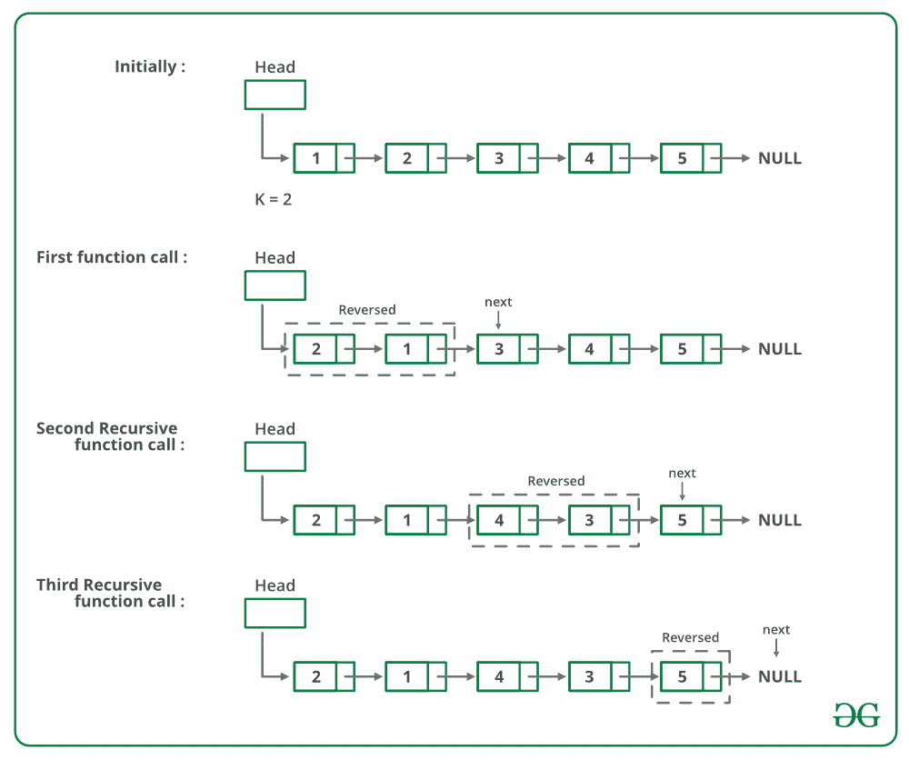

# 在给定大小的组中反转链表的 Python 程序–集合 1

> 原文:[https://www . geeksforgeeks . org/python-for-reverse-a-link-list-in-group-of-size-set-1/](https://www.geeksforgeeks.org/python-program-for-reversing-a-linked-list-in-groups-of-given-size-set-1/)

给定一个链表，编写一个函数来反转每 k 个节点(其中 k 是函数的输入)。

**示例:**

> 输入:1->【2】>【3】>【4】>【5】>【6】>【7】>【8】>【null】，K = 3
> **输出【0】**

**算法** : [*反转*](https://www.geeksforgeeks.org/reverse-a-linked-list/) *(head，k)*

*   反转大小为 k 的第一个子列表。反转时，跟踪下一个节点和上一个节点。让指向下一个节点的指针为*下一个*，指向上一个节点的指针为*上一个*。反向链表见[本帖](https://www.geeksforgeeks.org/reverse-a-linked-list/)。
*   *head- > next = reverse(next，k)* (递归调用列表的其余部分并链接两个子列表)
*   返回 *prev* ( *prev* 成为新的列表头(参见[这篇文章](https://www.geeksforgeeks.org/reverse-a-linked-list/)的一个迭代方法的图表)

下图显示了反向功能的工作原理:



下面是上述方法的实现:

## 计算机编程语言

```
# Python program to reverse a 
# linked list in group of given size

# Node class
class Node:

    # Constructor to initialize the 
    # node object
    def __init__(self, data):
        self.data = data
        self.next = None

class LinkedList:

    # Function to initialize head
    def __init__(self):
        self.head = None

    def reverse(self, head, k):      
        if head == None:
          return None
        current = head
        next = None
        prev = None
        count = 0

        # Reverse first k nodes of the linked list
        while(current is not None and 
              count < k):
            next = current.next
            current.next = prev
            prev = current
            current = next
            count += 1

        # next is now a pointer to (k+1)th node
        # recursively call for the list starting
        # from current. And make rest of the list as
        # next of first node
        if next is not None:
            head.next = self.reverse(next, k)

        # prev is new head of the input list
        return prev

    # Function to insert a new node at 
    # the beginning
    def push(self, new_data):
        new_node = Node(new_data)
        new_node.next = self.head
        self.head = new_node

    # Utility function to print the 
    # Linked List
    def printList(self):
        temp = self.head
        while(temp):
            print temp.data,
            temp = temp.next

# Driver code
llist = LinkedList()
llist.push(9)
llist.push(8)
llist.push(7)
llist.push(6)
llist.push(5)
llist.push(4)
llist.push(3)
llist.push(2)
llist.push(1)

print "Given linked list"
llist.printList()
llist.head = llist.reverse(llist.head, 3)

print "Reversed Linked list"
llist.printList()
# This code is contributed by Nikhil Kumar Singh(nickzuck_007)
```

**输出:**

```
Given Linked List
1 2 3 4 5 6 7 8 9 
Reversed list
3 2 1 6 5 4 9 8 7 
```

**复杂度分析:**

*   **时间复杂度:** O(n)。
    遍历列表只做一次，它有 n 个元素。
*   **辅助空间:** O(n/k)。
    对于每个大小为 n、n/k 或(n/k)+1 的链表，在递归过程中将进行调用。

更多详细信息，请参考完整的文章[在给定大小的组中反向链表|集合 1](https://www.geeksforgeeks.org/reverse-a-list-in-groups-of-given-size/) ！