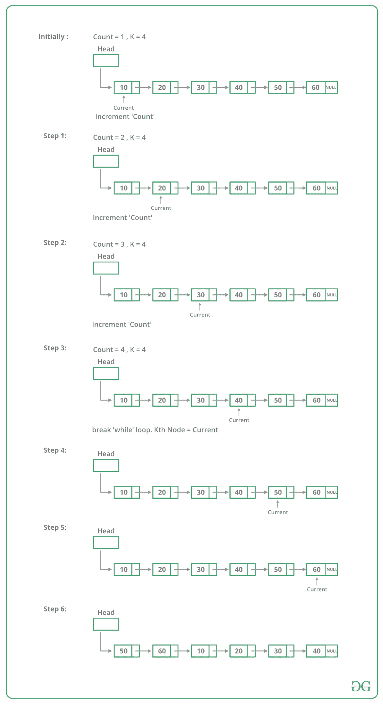

# 旋转链表的 Python 程序

> 原文:[https://www . geesforgeks . org/python-for-program-rotating-a-link-list/](https://www.geeksforgeeks.org/python-program-for-rotating-a-linked-list/)

给定一个单链表，逆时针旋转链表 k 个节点。其中 k 是给定的正整数。例如，如果给定的链表是 10->20->30->40->50->60，k 是 4，那么应该将链表修改为 50->60->10->20->30->40。假设 k 小于链表中的节点数。

**方法 1:**
要旋转链表，我们需要将第 kth 个节点的下一个节点改为 NULL，将最后一个节点的下一个节点改为前一个头节点，最后将头改为第(k+1)个节点。所以我们需要获得三个节点:第 k 个节点，(k+1)个节点和最后一个节点。
从头遍历列表，在第 kth 个节点停止。存储指向第 k 个节点的指针。接下来我们可以使用 kthNode- >获得第(k+1)个节点。一直遍历到最后，并存储一个指向最后一个节点的指针。最后，如上所述更改指针。

下图显示了旋转函数如何在代码中工作:



## 计算机编程语言

```
# Python program to rotate 
# a linked list
# Node class 
class Node:

    # Constructor to initialize 
    # the node object
    def __init__(self, data):
        self.data = data
        self.next = None

class LinkedList:

    # Function to initialize head
    def __init__(self):
        self.head = None

    # Function to insert a new node
    # at the beginning
    def push(self, new_data):
        # allocate node and put the data
        new_node = Node(new_data)

        # Make next of new node as head
        new_node.next = self.head

        # Move the head to point to the 
        # new Node
        self.head = new_node

    # Utility function to print it the 
    # linked LinkedList
    def printList(self):
        temp = self.head
        while(temp):
            print temp.data,
            temp = temp.next

    # This function rotates a linked list 
    # counter-clockwise and updates the 
    # head. The function assumes that k 
    # is smaller than size of linked list. 
    # It doesn't modify the list if k is 
    # greater than of equal to size
    def rotate(self, k):
        if k == 0: 
            return 

        # Let us understand the below code 
        # for example k = 4 and list = 
        # 10->20->30->40->50->60
        current = self.head

        # current will either point to kth 
        # or NULL after this loop current 
        # will point to node 40 in the above 
        # example
        count = 1 
        while(count <k and 
              current is not None):
            current = current.next
            count += 1

        # If current is None, k is greater 
        # than or equal to count of nodes 
        # in linked list. Don't change
        # the list in this case
        if current is None:
            return

        # current points to kth node. Store 
        # it in a variable kth node points 
        # to node 40 in the above example
        kthNode = current 

        # current will point to lsat node 
        # after this loop current will point 
        # to node 60 in above example
        while(current.next is not None):
            current = current.next

        # Change next of last node to previous 
        # head Next of 60 is now changed to 
        # node 10
        current.next = self.head

        # Change head to (k + 1)th node
        # head is not changed to node 50
        self.head = kthNode.next

        # change next of kth node to NULL 
        # next of 40 is not NULL 
        kthNode.next = None

# Driver code
llist = LinkedList()

# Create a list 
# 10->20->30->40->50->60
for i in range(60, 0, -10):
    llist.push(i)

print "Given linked list"
llist.printList()
llist.rotate(4)

print "Rotated Linked list"
llist.printList()
# This code is contributed by Nikhil Kumar Singh(nickzuck_007)
```