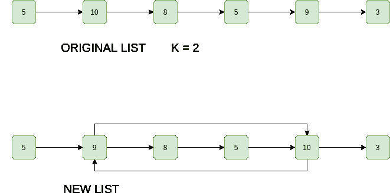

# 用于在链表中从开始到结束交换第 k 个节点的 Python 程序

> 原文:[https://www . geesforgeks . org/python-program-for-swapping-kth-node-from-with-kth-node-from-end-in-a-link-list/](https://www.geeksforgeeks.org/python-program-for-swapping-kth-node-from-beginning-with-kth-node-from-end-in-a-linked-list/)

给定一个单链表，从开始交换第 k 个节点，从结束交换第 k 个节点。**不允许数据交换，只应更改指针。**在链表数据部分很大的许多情况下，这个要求可能是合乎逻辑的(例如，学生详细信息行名称、行号、地址，..等等)。指针总是固定的(大多数编译器为 4 字节)。**示例:**

```
Input: 1 -> 2 -> 3 -> 4 -> 5, K = 2
Output: 1 -> 4 -> 3 -> 2 -> 5 
Explanation: The 2nd node from 1st is 2 and 
2nd node from last is 4, so swap them.

Input: 1 -> 2 -> 3 -> 4 -> 5, K = 5
Output: 5 -> 2 -> 3 -> 4 -> 1 
Explanation: The 5th node from 1st is 5 and 
5th node from last is 1, so swap them.
```

插图:



**方法:**思路很简单，从开始找第 k 个节点，最后第 k 个节点从开始就是第 n-k+1 个节点。交换两个节点。
*不过也有一些角落案例，必须要处理*

1.  y 紧挨着 X
2.  x 紧挨着 Y
3.  x 和 Y 是一样的
4.  x 和 Y 不存在(k 大于链表中的节点数)

下面是上述方法的实现。

## 蟒蛇 3

```
"""
A Python3 program to swap kth node from 
the beginning with kth node from the end
"""
class Node:
    def __init__(self, data, 
                 next = None):
        self.data = data
        self.next = next

class LinkedList:
    def __init__(self, *args, **kwargs):
        self.head = Node(None)

    """
    Utility function to insert a node at 
    the beginning
    @args:
        data: value of node
    """
    def push(self, data):
        node = Node(data)
        node.next = self.head
        self.head = node

    # Print linked list
    def printList(self):
        node = self.head

        while node.next is not None:
            print(node.data, end = " ")
            node = node.next

    # count number of node in linked list
    def countNodes(self):
        count = 0
        node = self.head
        while node.next is not None:
            count += 1
            node = node.next
        return count

    """
    Function for swapping kth nodes from
    both ends of linked list
    """
    def swapKth(self, k):

        # Count nodes in linked list
        n = self.countNodes()

        # Check if k is valid
        if n<k:
            return

        """
        If x (kth node from start) and 
        y(kth node from end) are same 
        """
        if (2 * k - 1) == n:
            return

        """
        Find the kth node from the beginning of 
        the linked list. We also find previous 
        of kth node because we need to update 
        next pointer of the previous. 
        """
        x = self.head
        x_prev = Node(None)
        for i in range(k - 1):
            x_prev = x
            x = x.next

        """
        Similarly, find the kth node from end 
        and its previous. kth node from end 
        is (n-k + 1)th node from beginning 
        """
        y = self.head
        y_prev = Node(None)
        for i in range(n - k):
            y_prev = y
            y = y.next

        """
        If x_prev exists, then new next of it 
        will be y. Consider the case when y->next 
        is x, in this case, x_prev and y are same. 
        So the statement "x_prev->next = y" creates 
        a self loop. This self loop will be broken
        when we change y->next. 
        """
        if x_prev is not None:
            x_prev.next = y

        # Same thing applies to y_prev
        if y_prev is not None:
            y_prev.next = x

        """
        Swap next pointers of x and y. These 
        statements also break self loop if 
        x->next is y or y->next is x 
        """
        temp = x.next
        x.next = y.next
        y.next = temp

        # Change head pointers when k is 1 or n
        if k == 1:
            self.head = y

        if k == n:
            self.head = x

# Driver Code
llist = LinkedList()
for i in range(8, 0, -1):
    llist.push(i)
llist.printList()

for i in range(1, 9):
    llist.swapKth(i)
    print("Modified List for k = ", i)
    llist.printList()
    print("")
# This code is contributed by Pulkit
```

**输出:**

```
Original Linked List: 1 2 3 4 5 6 7 8

Modified List for k = 1
8 2 3 4 5 6 7 1

Modified List for k = 2
8 7 3 4 5 6 2 1

Modified List for k = 3
8 7 6 4 5 3 2 1

Modified List for k = 4
8 7 6 5 4 3 2 1

Modified List for k = 5
8 7 6 4 5 3 2 1

Modified List for k = 6
8 7 3 4 5 6 2 1

Modified List for k = 7
8 2 3 4 5 6 7 1

Modified List for k = 8
1 2 3 4 5 6 7 8
```

**复杂度分析:**

*   **时间复杂度:** O(n)，其中 n 为列表长度。
    需要遍历列表一次。
*   **辅助空间:** O(1)。
    不需要额外空间。

更多详情请参考完整文章[在链表](https://www.geeksforgeeks.org/swap-kth-node-from-beginning-with-kth-node-from-end-in-a-linked-list/)中从开始到结束交换第 k 个节点！