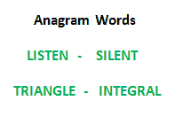

# Python 程序检查两个字符串是否互为字谜

> 原文:[https://www . geesforgeks . org/python-program-to-check-two-string-is-anagram-of-other/](https://www.geeksforgeeks.org/python-program-to-check-whether-two-strings-are-anagram-of-each-other/)

写一个函数检查两个给定的字符串是否是彼此的[字谜](http://en.wikipedia.org/wiki/Anagram)。字符串的字谜是另一个包含相同字符的字符串，只有字符的顺序可以不同。例如，“abcd”和“dabc”是彼此的字谜。



## [我们强烈建议您点击此处进行练习，然后再进入解决方案。](https://practice.geeksforgeeks.org/problems/anagram-1587115620/1)

**方法 1(使用排序):**

1.  对两个字符串进行排序
2.  比较排序后的字符串

下面是上述想法的实现:

## 计算机编程语言

```
# Python program to check whether two 
# strings are anagrams of each other

# Function to check whether two strings 
# are anagram of each other
def areAnagram(str1, str2):
    # Get lengths of both strings
    n1 = len(str1)
    n2 = len(str2)

    # If length of both strings is not 
    # same, then they cannot be anagram
    if n1 != n2:
        return 0

    # Sort both strings
    str1 = sorted(str1)
    str2 = sorted(str2)

    # Compare sorted strings
    for i in range(0, n1):
        if str1[i] != str2[i]:
            return 0

    return 1

# Driver code
str1 = "test"
str2 = "ttew"

# Function Call
if areAnagram(str1, str2):
    print(
    "The two strings are anagram of each other")
else:
    print(
    "The two strings are not anagram of each other")
# This code is contributed by Bhavya Jain
```

**输出:**

```
The two strings are not anagram of each other
```

**时间复杂度:** O(nLogn)

**方法 2(计数字符):**
该方法假设两个字符串中可能的字符集都很小。在下面的实现中，假设使用 8 位存储字符，并且可能有 256 个字符。

1.  为两个字符串创建大小为 256 的计数数组。将计数数组中的所有值初始化为 0。
2.  遍历两个字符串的每个字符，并增加相应计数数组中的字符数。
3.  比较计数数组。如果两个计数数组相同，则返回 true。

下面是上述想法的实现:

## 计算机编程语言

```
# Python program to check if two strings 
# are anagrams of each other
NO_OF_CHARS = 256

# Function to check whether two strings 
# are anagram of each other
def areAnagram(str1, str2):

    # Create two count arrays and initialize 
    # all values as 0
    count1 = [0] * NO_OF_CHARS
    count2 = [0] * NO_OF_CHARS

    # For each character in input strings, 
    # increment count in the corresponding 
    # count array
    for i in str1:
        count1[ord(i)] += 1

    for i in str2:
        count2[ord(i)] += 1

    # If both strings are of different length. 
    # Removing this condition will make the 
    # program fail for strings like "aaca" 
    # and "aca"
    if len(str1) != len(str2):
        return 0

    # Compare count arrays
    for i in xrange(NO_OF_CHARS):
        if count1[i] != count2[i]:
            return 0

    return 1

# Driver code
str1 = "geeksforgeeks"
str2 = "forgeeksgeeks"

# Function call
if areAnagram(str1, str2):
    print 
    "The two strings are anagram of each other"
else:
    print 
    "The two strings are not anagram of each other"
# This code is contributed by Bhavya Jain
```

**输出:**

```
The two strings are anagram of each other
```

**方法 3(用一个数组计数字符):**
上面的实现可以进一步用一个计数数组代替两个。我们可以在 str1 中增加字符计数数组中的值，在 str2 中减少字符计数数组中的值。最后，如果所有计数值都是 0，那么这两个字符串就是彼此的字谜。感谢**高手**提出这个优化。

## 蟒蛇 3

```
# Python program to check if two strings
# are anagrams of each other
NO_OF_CHARS = 256

# Function to check if two strings
# are anagrams of each other
def areAnagram(str1,str2):

    # Create a count array and initialize
    # all values as 0
    count=[0 for i in range(NO_OF_CHARS)]
    i=0

    # For each character in input strings,
    # increment count in the corresponding
    # count array
    for i in range(len(str1)):
        count[ord(str1[i]) - ord('a')] += 1;
        count[ord(str2[i]) - ord('a')] -= 1;

    # If both strings are of different
    # length. Removing this condition
    # will make the program fail for
    # strings like "aaca" and "aca"    
    if(len(str1) != len(str2)):
        return False;

    # See if there is any non-zero
    # value in count array
    for i in range(NO_OF_CHARS):
        if (count[i] != 0):
            return False        

    return True

# Driver code
str1="geeksforgeeks"
str2="forgeeksgeeks"

# Function call
if (areAnagram(str1, str2)):
    print(
    "The two strings are anagram of each other")
else:
    print(
    "The two strings are not anagram of each other")
# This code is contributed by patel2127
```

**输出:**

```
The two strings are anagram of each other
```

**时间复杂度:** O(n)

更多详情请参考[整篇文章检查两个字符串是否为对方的字谜](https://www.geeksforgeeks.org/check-whether-two-strings-are-anagram-of-each-other/)！