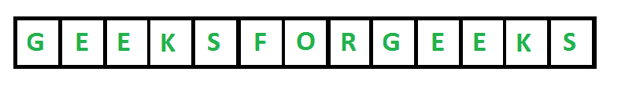
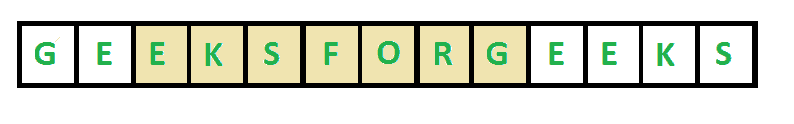
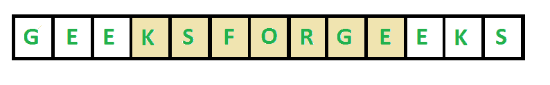

# 不重复字符寻找最长子串长度的 Python 程序

> 原文:[https://www . geesforgeks . org/python-program-to-find-最长不重复字符的子串长度/](https://www.geeksforgeeks.org/python-program-to-find-length-of-the-longest-substring-without-repeating-characters/)

给定一个字符串 **str** ，求最长子串的长度，不重复字符。

*   对于“ABDEFGABEF”，最长的子串是“BDEFGA”和“DEFGAB”，长度为 6。
*   对于“BBBB”，最长的子串是“B”，长度为 1。
*   对于“GEEKSFORGEEKS”，下图中显示了两个最长的子字符串，长度为 7

  

期望的时间复杂度是 O(n)，其中 n 是字符串的长度。

**方法 1(简单:O(n<sup>3</sup>)**:我们可以逐个考虑所有子串，检查每个子串是否包含所有唯一字符。将有 n*(n+1)/2 个子字符串。一个子串是否包含所有唯一的字符，可以通过从左到右扫描并保存一个被访问字符的映射来在线性时间内检查。这个解决方案的时间复杂度是 O(n^3).

## 蟒蛇 3

```
# Python3 program to find the length
# of the longest substring without
# repeating characters

# This functionr eturns true if all
# characters in strr[i..j] are 
# distinct, otherwise returns false
def areDistinct(strr, i, j):

    # Note : Default values in visited are false
    visited = [0] * (26)

    for k in range(i, j + 1):
        if (visited[ord(strr[k]) - 
                   ord('a')] == True):
            return False

        visited[ord(strr[k]) -
                ord('a')] = True

    return True

# Returns length of the longest substring
# with all distinct characters.
def longestUniqueSubsttr(strr):

    n = len(strr)

    # Result
    res = 0 

    for i in range(n):
        for j in range(i, n):
            if (areDistinct(strr, i, j)):
                res = max(res, j - i + 1)

    return res

# Driver code
if __name__ == '__main__':

    strr = "geeksforgeeks"
    print("The input is ", strr)

    len = longestUniqueSubsttr(strr)
    print("The length of the longest "
          "non-repeating character substring is ", len)

# This code is contributed by mohit kumar 29
```

**Output**

```
The input string is geeksforgeeks
The length of the longest non-repeating character substring is 7
```

**方法二(更好:O(n<sup>2</sup>)**思路是用[滑窗](https://www.geeksforgeeks.org/window-sliding-technique/)。每当我们看到重复时，我们就移除先前的事件并滑动窗口。

## 蟒蛇 3

```
# Python3 program to find the 
# length of the longest substring
# without repeating characters
def longestUniqueSubsttr(str):

    n = len(str)

    # Result
    res = 0 

    for i in range(n):

        # Note : Default values in 
        # visited are false
        visited = [0] * 256   

        for j in range(i, n):

            # If current character is visited
            # Break the loop
            if (visited[ord(str[j])] == True):
                break

            # Else update the result if
            # this window is larger, and mark
            # current character as visited.
            else:
                res = max(res, j - i + 1)
                visited[ord(str[j])] = True

        # Remove the first character of previous
        # window
        visited[ord(str[i])] = False

    return res

# Driver code
str = "geeksforgeeks"
print("The input is ", str)

len = longestUniqueSubsttr(str)
print("The length of the longest " 
      "non-repeating character substring is ", len)

# This code is contributed by sanjoy_62
```

**Output**

```
The input string is geeksforgeeks
The length of the longest non-repeating character substring is 7
```

**方法 4(线性时间)**:现在来说说线性时间解。这个解决方案使用额外的空间来存储已经访问过的字符的最后索引。这个想法是从左到右扫描字符串，跟踪到目前为止在 **res** 中看到的最大长度的非重复字符子字符串。当我们遍历字符串时，为了知道当前窗口的长度，我们需要两个索引。
1)尾盘指数( **j** ):我们认为当前指数为尾盘指数。
2)起始索引( **i** ):如果当前字符不在前一窗口中，则与前一窗口相同。为了检查当前字符是否出现在前一个窗口中，我们将每个字符的最后一个索引存储在一个数组中 **lasIndex[]** 。如果 lastIndex[str[j]] + 1 比之前的开始多，那么我们更新开始索引 I，否则我们保持相同的 I。

下面是上述方法的实现:

## 蟒蛇 3

```
# Python3 program to find the length
# of the longest substring
# without repeating characters
def longestUniqueSubsttr(string):

    # last index of every character
    last_idx = {}
    max_len = 0

    # starting index of current 
    # window to calculate max_len
    start_idx = 0

    for i in range(0, len(string)):

        # Find the last index of str[i]
        # Update start_idx (starting index of current window)
        # as maximum of current value of start_idx and last
        # index plus 1
        if string[i] in last_idx:
            start_idx = max(start_idx, last_idx[string[i]] + 1)

        # Update result if we get a larger window
        max_len = max(max_len, i-start_idx + 1)

        # Update last index of current char.
        last_idx[string[i]] = i

    return max_len

# Driver program to test the above function
string = "geeksforgeeks"
print("The input string is " + string)
length = longestUniqueSubsttr(string)
print("The length of the longest non-repeating character" +
      " substring is " + str(length))
```

**Output**

```
The input string is geeksforgeeks
The length of the longest non-repeating character substring is 7
```

**时间复杂度:** O(n + d)，其中 n 为输入字符串的长度，d 为输入字符串字母表中的字符数。例如，如果字符串由小写英文字符组成，那么 d 的值是 26。
T3【辅助空间: O(d)

**替代实施:**

## 计算机编程语言

```
# Here, we are planning to implement a simple sliding window methodology

def longestUniqueSubsttr(string):

    # Creating a set to store the last positions of occurrence
    seen = {}
    maximum_length = 0

    # starting the initial point of window to index 0
    start = 0 

    for end in range(len(string)):

        # Checking if we have already seen the element or not
        if string[end] in seen:

            # If we have seen the number, move the start pointer
            # to position after the last occurrence
            start = max(start, seen[string[end]] + 1)

        # Updating the last seen value of the character
        seen[string[end]] = end
        maximum_length = max(maximum_length, end-start + 1)
    return maximum_length

# Driver Code
string = "geeksforgeeks"
print("The input string is", string)
length = longestUniqueSubsttr(string)
print("The length of the longest non-repeating character substring is", length)
```

**Output**

```
The input String is geeksforgeeks
The length of the longest non-repeating character substring is 7
```

作为练习，尝试上面问题的修改版本，其中你需要打印最大长度 NRCS(上面的程序只打印它的长度)。

详情请参考完整的[最长子串长度不重复字符](https://www.geeksforgeeks.org/length-of-the-longest-substring-without-repeating-characters/)一文！