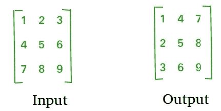

# Python 程序求矩阵转置

> 原文:[https://www . geeksforgeeks . org/python-程序查找转置矩阵/](https://www.geeksforgeeks.org/python-program-to-find-transpose-of-a-matrix/)

矩阵的转置是通过将行变为列，将列变为行来实现的。换句话说，A[][]的转置是通过将 A[i][j]改为 A[j][i]而获得的。



**对于方形矩阵:**

下面的程序找到 A[][]的转置，并将结果存储在 B[][]中，我们可以针对不同的维度改变 N。

```
# Python3 Program to find
# transpose of a matrix

N = 4

# This function stores
# transpose of A[][] in B[][]

def transpose(A,B):

    for i in range(N):
        for j in range(N):
            B[i][j] = A[j][i]

# driver code
A = [ [1, 1, 1, 1],
    [2, 2, 2, 2],
    [3, 3, 3, 3],
    [4, 4, 4, 4]]

B = A[:][:] # To store result

transpose(A, B)

print("Result matrix is")
for i in range(N):
    for j in range(N):
        print(B[i][j], " ", end='')
    print()

# This code is contributed by Anant Agarwal.
```

**Output:**

```
Result matrix is
1  2  3  4  
2  2  3  4  
3  3  3  4  
4  4  4  4

```

**对于矩形矩阵:**

下面的程序找到 A[][]的转置，并将结果存储在 B[][]。

```
# Python3 Program to find
# transpose of a matrix

M = 3
N = 4

# This function stores
# transpose of A[][] in B[][]

def transpose(A, B):

    for i in range(N):
        for j in range(M):
            B[i][j] = A[j][i]

# driver code
A = [ [1, 1, 1, 1],
    [2, 2, 2, 2],
    [3, 3, 3, 3]]

# To store result
B = [[0 for x in range(M)] for y in range(N)] 

transpose(A, B)

print("Result matrix is")
for i in range(N):
    for j in range(M):
        print(B[i][j], " ", end='')
    print()    
```

**Output:**

```
Result matrix is
1  2  3  
1  2  3  
1  2  3  
1  2  3

```

**方形矩阵原位:**

```
# Python3 Program to find
# transpose of a matrix

N = 4

# Finds transpose of A[][] in-place
def transpose(A):

    for i in range(N):
        for j in range(i+1, N):
            A[i][j], A[j][i] = A[j][i], A[i][j]

# driver code
A = [ [1, 1, 1, 1],
    [2, 2, 2, 2],
    [3, 3, 3, 3],
    [4, 4, 4, 4]]

transpose(A)

print("Modified matrix is")
for i in range(N):
    for j in range(N):
        print(A[i][j], " ", end='')
    print()

# This code is contributed by Anant Agarwal.
```

**Output:**

```
Modified matrix is
1  2  3  4  
1  2  3  4  
1  2  3  4  
1  2  3  4

```

更多详情请参考[程序寻找矩阵转置](https://www.geeksforgeeks.org/program-to-find-transpose-of-a-matrix/)的完整文章！