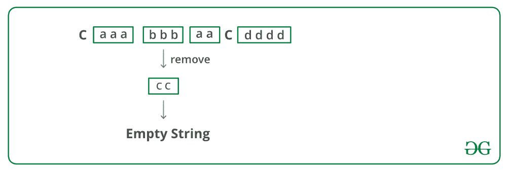

# 递归删除所有相邻副本的 Python 程序

> 原文:[https://www . geeksforgeeks . org/python-program-to-recursive-remove-all-near-duplicates/](https://www.geeksforgeeks.org/python-program-to-recursively-remove-all-adjacent-duplicates/)

给定一个字符串，递归地从该字符串中移除相邻的重复字符。输出字符串不应有任何相邻的重复项。请参见以下示例。

**示例**:

> **输入**:azxzy
> 输出 : ay
> 第一个“azxzy”降为“azzy”。
> 字符串“azzy”包含重复项，
> 因此进一步简化为“ay”。
> 
> **输入**:极客 First
> 输出 : gksfor
> 第一个“极客 foreg”降为
> “gksforgg”。字符串“gksforgg”
> 包含重复项，因此进一步
> 简化为“gksfor”。
> 
> **输入** : caaabbbaacdddd
> **输出**:空字符串
> 
> **输入**:acaaabbbacdddd
> T3】输出 : acac

在 **O(N)** 时间内，可遵循以下**方法**删除重复项:

*   从最左边的字符开始，删除左上角的重复字符(如果有)。
*   第一个字符现在必须与其相邻字符不同。长度为 n-1 的字符串(没有第一个字符的字符串)重复出现。
*   让长度为 n-1 的右子串缩减后得到的字符串为 *rem_str* 。有三种可能的情况
    1.  如果 *rem_str* 的第一个字符与原始字符串的第一个字符匹配，则从 *rem_str* 中删除第一个字符。
    2.  如果剩余字符串为空，并且最后删除的字符与原始字符串的第一个字符相同。返回空字符串。
    3.  否则，在 *rem_str* 的开头追加原始字符串的第一个字符。
*   返回 *rem_str* 。

下图是上述方法的模拟运行:



下面是上述方法的实现:

## 计算机编程语言

```
# Python program to remove all 
# adjacent duplicates from a string

# Recursively removes adjacent 
# duplicates from str and returns
# new string. las_removed is a 
# pointer to last_removed character
def removeUtil(string, last_removed):

    # If length of string is 1 or 0
    if len(string) == 0 or len(string) == 1:
        return string

    # Remove leftmost same characters 
    # and recur for remaining 
    # string
    if string[0] == string[1]:
        last_removed = ord(string[0])
        while len(string) > 1 and 
                  string[0] == string[1]:
            string = string[1:]
        string = string[1:]

        return removeUtil(string, last_removed)

    # At this point, the first 
    # character is definiotely different
    # from its adjacent. Ignore first 
    # character and recursively 
    # remove characters from remaining string
    rem_str = removeUtil(string[1:], 
                         last_removed)

    # Check if the first character 
    # of the rem_string matches 
    # with the first character of 
    # the original string
    if len(rem_str) != 0 and 
           rem_str[0] == string[0]:
        last_removed = ord(string[0])
        return (rem_str[1:])

    # If remaining string becomes 
    # empty and last removed character
    # is same as first character of 
    # original string. This is needed
    # for a string like "acbbcddc"
    if len(rem_str) == 0 and 
       last_removed == ord(string[0]):
        return rem_str

    # If the two first characters of 
    # str and rem_str don't match, 
    # append first character of str 
    # before the first character of 
    # rem_str.
    return ([string[0]] + rem_str)

def remove(string):
    last_removed = 0
    return toString(removeUtil(toList(string), 
                               last_removed))

# Utility functions
def toList(string):
    x = []
    for i in string:
        x.append(i)
    return x

def toString(x):
    return ''.join(x)

# Driver program
string1 = "geeksforgeeg"
print remove(string1)

string2 = "azxxxzy"
print remove(string2)

string3 = "caaabbbaac"
print remove(string3)

string4 = "gghhg"
print remove(string4)

string5 = "aaaacddddcappp"
print remove(string5)

string6 = "aaaaaaaaaa"
print remove(string6)

string7 = "qpaaaaadaaaaadprq"
print remove(string7)

string8 = "acaaabbbacdddd"
print remove(string8)

string9 = "acbbcddc"
print remove(string9)
# This code is contributed by BHAVYA JAIN
```

**输出:**

```
gksfor
ay
g
a
qrq
acac
a
```

**时间复杂度:**解的时间复杂度可以写成 T(n) = T(n-k) + O(k)，其中 n 是输入字符串的长度，k 是相同的第一个字符的个数。递归的解是 O(n)

感谢 **Prachi Bodke** 提出这个问题和初步解决方案。

更多详情请参考[完整文章递归移除所有相邻副本](https://www.geeksforgeeks.org/recursively-remove-adjacent-duplicates-given-string/)！