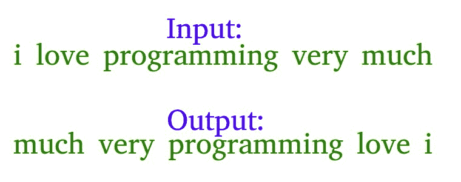

# 在给定字符串中反转单词的 Python 程序

> 原文:[https://www . geesforgeks . org/python-程序-给定字符串中的反向单词/](https://www.geeksforgeeks.org/python-program-to-reverse-words-in-a-given-string/)

**例:**让输入字符串为“我很喜欢这个节目”。该函数应该将字符串更改为“非常像我这样的程序”



**示例**:

> **输入** : s =【极客问答练习代码】
> **输出** : s =【代码练习问答极客】
> 
> **输入** : s =“擅长编码需要大量练习”
> **输出** : s =“擅长编码需要大量练习”

**算法**:

*   最初，逐个反转给定字符串的单个单词，对于上面的示例，反转单个单词后，字符串应该是“i ekil siht margorp yrev hcum”。
*   [从头到尾反转整个字符串](https://www.geeksforgeeks.org/write-a-program-to-reverse-an-array-or-string/)得到想要的输出“非常像我这个程序”在上例中。

下面是上述方法的实现:

## 蟒蛇 3

```
# Python3 program to reverse a string

# Function to reverse each word in 
# the string
def reverse_word(s, start, end):
    while start < end:
        s[start], s[end] = s[end], s[start]
        start = start + 1
        end -= 1

s = "i like this program very much"

# Convert string to list to use it as 
# a char array
s = list(s)
start = 0
while True:

    # We use a try catch block because for
    # the last word the list.index() function
    # returns a ValueError as it cannot find 
    # a space in the list
    try:
        # Find the next space
        end = s.index(' ', start)

        # Call reverse_word function
        # to reverse each word
        reverse_word(s, start, end - 1)

        #Update start variable
        start = end + 1

    except ValueError:

        # Reverse the last word
        reverse_word(s, start, len(s) - 1)
        break

# Reverse the entire list
s.reverse()

# Convert the list back to
# string using string.join() function
s = "".join(s)

print(s)

# This code is contributed by Prem Nagdeo
```

**输出:**

```
much very program this like i
```

**另一种方法:**

我们可以通过以相反的方式拆分和保存字符串来完成上述任务。

下面是上述方法的实现:

## 蟒蛇 3

```
# Python3 program to reverse a string
# s = input()
s = "i like this program very much"
words = s.split(' ')
string =[]
for word in words:
    string.insert(0, word)

print("Reversed String:")
print(" ".join(string))

# Solution proposed bu Uttam
```

**输出:**

```
Reversed String:
much very program this like i
```

**时间复杂度:** O(n)

**不使用任何额外空间:**
以上任务也可以从中间开始拆分直接对换字符串来完成。由于涉及直接交换，因此占用的空间也更少。

下面是上述方法的实现:

## 蟒蛇 3

```
# Python3 code to reverse a string

# Reverse the string
def RevString(s,l):

  # Check if number of words is even
  if l%2 == 0:

    # Find the middle word
    j = int(l/2)

    # Starting from the middle 
    # start swapping words
    # at jth position and l-1-j position
    while(j <= l - 1):
      s[j], s[l - j - 1] = s[l - j - 1], s[j]
      j += 1

  # Check if number of words is odd
  else:

    # Find the middle word
    j = int(l/2 + 1)

    # Starting from the middle 
    # start swapping the words
    # at jth position and l-1-j position
    while(j <= l - 1):
      s[j], s[l - 1 - j] = s[l - j - 1], s[j]
      j += 1

    # return the reversed sentence
    return s;

# Driver Code
s = 'getting good at coding needs a lot of practice'
string = s.split(' ')
string = RevString(string,len(string))
print(" ".join(string))
```

**输出:**

```
practice of lot a needs coding at good getting
```

更多详情请参考[给定字符串](https://www.geeksforgeeks.org/reverse-words-in-a-given-string/)倒字整篇文章！