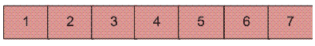
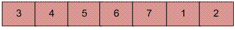

# 数组旋转块交换算法的 Python3 程序

> 原文:[https://www . geeksforgeeks . org/python 3-程序换块交换算法换阵列旋转/](https://www.geeksforgeeks.org/python3-program-for-block-swap-algorithm-for-array-rotation/)

编写一个函数 rotate(ar[]，d，n)，将大小为 n 的 arr[]旋转 d 个元素。



将上面的数组旋转 2 将构成数组



**算法:**

```
Initialize A = arr[0..d-1] and B = arr[d..n-1]
1) Do following until size of A is equal to size of B

  a)  If A is shorter, divide B into Bl and Br such that Br is of same 
       length as A. Swap A and Br to change ABlBr into BrBlA. Now A
       is at its final place, so recur on pieces of B.  

   b)  If A is longer, divide A into Al and Ar such that Al is of same 
       length as B Swap Al and B to change AlArB into BArAl. Now B
       is at its final place, so recur on pieces of A.

2)  Finally when A and B are of equal size, block swap them.
```

**递归实现:**

## 蟒蛇 3

```
# Wrapper over the recursive function leftRotateRec()
# It left rotates arr by d.
def leftRotate(arr, d, n):
    leftRotateRec(arr, 0, d, n);

def leftRotateRec(arr, i, d, n):
    '''
     * Return If number of elements to be 
     rotated is zero or equal to array size
     '''
    if (d == 0 or d == n):
        return;

    '''
     * If number of elements to be rotated 
     is exactly half of array size
     '''
    if (n - d == d):
        swap(arr, i, n - d + i, d);
        return;

    ''' If A is shorter '''
    if (d < n - d):
        swap(arr, i, n - d + i, d);
        leftRotateRec(arr, i, d, n - d);
        ''' If B is shorter '''
    else:
        swap(arr, i, d, n - d);

        ''' This is tricky '''
        leftRotateRec(arr, n - d + i, 2 * d - n, d); 

''' UTILITY FUNCTIONS '''
''' function to pran array '''
def printArray(arr, size):
    for i in range(size):
        print(arr[i], end = " ");
    print();

'''
 * This function swaps d elements starting at 
 * index fi with d elements starting at index si
 '''
def swap(arr, fi, si, d):
    for i in range(d):
        temp = arr[fi + i];
        arr[fi + i] = arr[si + i];
        arr[si + i] = temp;

# Driver Code
if __name__ == '__main__':
    arr = [1, 2, 3, 4, 5, 6, 7];
    leftRotate(arr, 2, 7);
    printArray(arr, 7);

# This code is contributed by Rohit_ranjan
```

**输出:**

```
3 5 4 6 7 1 2
```

**迭代实现:**
这里是同样算法的迭代实现。这里使用了相同的实用函数 swap()。

**时间复杂度:** O(n)
其他阵轮换法请看以下帖子:
[https://www.geeksforgeeks.org/array-rotation/](https://www.geeksforgeeks.org/array-rotation/)
[https://www . geeksforgeeks . org/程序换阵-轮换-续-反转-算法/](https://www.geeksforgeeks.org/program-for-array-rotation-continued-reversal-algorithm/)

**参考文献:**
[【http://www.cs.bell-labs.com/cm/cs/pearls/s02b.pdf】](http://www.cs.bell-labs.com/cm/cs/pearls/s02b.pdf)
如发现以上程序/算法有任何 bug 或想分享任何关于区块交换算法的补充信息，请写评论。

更多详情请参考[数组旋转的块交换算法](https://www.geeksforgeeks.org/block-swap-algorithm-for-array-rotation/)的完整文章！