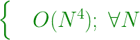
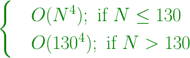
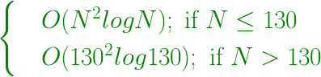

# 给定数组中异或为零的四元组对

> 原文:[https://www . geeksforgeeks . org/给定数组中带有异或零的四元组/](https://www.geeksforgeeks.org/quadruplet-pair-with-xor-zero-in-the-given-array/)

给定一个由 **N** 个整数组成的数组 **arr[]** ，使得数组中任意两个相邻元素在其二进制表示中仅在一个位置不同。任务是找出是否存在四重 **(arr[i]，arr[j]，arr[k]，arr[l])** 使得**arr[I]^ arr[j]^ arr[k]^ arr[l]= 0**。这里 **^** 表示按位异或运算，**1≤I<j<k<l≤n**。
**示例:**

> **输入:** arr[] = {1，3，7，3}
> **输出:** No
> 1 ^ 3 ^ 7 ^ 3 = 6
> **输入:** arr[] = {1，0，2，3，7}
> **输出:** Yes
> 1 ^ 0 ^ 2 ^ 3 = 0

*   **天真方法:**检查所有可能的四元组，无论它们的 xor 是否为零。但这样一个解决方案的时间复杂度将是**<u>N</u><sup><u>4</u></sup>**<u>，对于所有 N</u> 。
    **时间复杂度:**



*   **高效进场( <u>O(N</u> <sup><u>4</u></sup> <u>)，为 N&leq；130</u> ):** 我们可以说，对于大于或等于 **130** 的数组长度，我们至少可以有 **65** 个相邻对，每个相邻对表示两个元素的异或。这里假设所有相邻元素在其二进制形式中只有一个位置不同，因此将只产生一个设置位。因为我们只有 **64** 个可能的位置，所以我们可以说至少两对会有相同的异或。因此，这 4 个整数的异或将是 **0** 。对于 **N < 130** 我们可以用天真的方法。
    以下是上述办法的实施:

## C++

```
// C++ implementation of the approach
#include <bits/stdc++.h>
using namespace std;

const int MAX = 130;

// Function that returns true if the array
// contains a valid quadruplet pair
bool validQuadruple(int arr[], int n)
{

    // We can always find a valid quadruplet pair
    // for array size greater than MAX
    if (n >= MAX)
        return true;

    // For smaller size arrays, perform brute force
    for (int i = 0; i < n; i++)
        for (int j = i + 1; j < n; j++)
            for (int k = j + 1; k < n; k++)
                for (int l = k + 1; l < n; l++) {
                    if ((arr[i] ^ arr[j] ^ arr[k] ^ arr[l]) == 0) {
                        return true;
                    }
                }
    return false;
}

// Driver code
int main()
{
    int arr[] = { 1, 0, 2, 3, 7 };
    int n = sizeof(arr) / sizeof(arr[0]);

    if (validQuadruple(arr, n))
        cout << "Yes";
    else
        cout << "No";

    return 0;
}
```

## Java 语言(一种计算机语言，尤用于创建网站)

```
// Java implementation of the approach
import java.util.*;
import java.lang.*;
import java.io.*;

class GFG
{

static int MAX = 130;

// Function that returns true if the array
// contains a valid quadruplet pair
static boolean validQuadruple(int arr[], int n)
{

    // We can always find a valid quadruplet pair
    // for array size greater than MAX
    if (n >= MAX)
        return true;

    // For smaller size arrays, perform brute force
    for (int i = 0; i < n; i++)
        for (int j = i + 1; j < n; j++)
            for (int k = j + 1; k < n; k++)
                for (int l = k + 1; l < n; l++)
                {
                    if ((arr[i] ^ arr[j] ^
                         arr[k] ^ arr[l]) == 0)
                    {
                        return true;
                    }
                }
    return false;
}

// Driver code
public static void main (String[] args)
              throws java.lang.Exception
{
    int arr[] = { 1, 0, 2, 3, 7 };
    int n = arr.length;

    if (validQuadruple(arr, n))
        System.out.println("Yes");
    else
        System.out.println("No");
}
}

// This code is contributed by nidhiva
```

## 蟒蛇 3

```
# Python3 implementation of the approach
MAX = 130

# Function that returns true if the array
# contains a valid quadruplet pair
def validQuadruple(arr, n):

    # We can always find a valid quadruplet pair
    # for array size greater than MAX
    if (n >= MAX):
        return True

    # For smaller size arrays,
    # perform brute force
    for i in range(n):
        for j in range(i + 1, n):
            for k in range(j + 1, n):
                for l in range(k + 1, n):
                    if ((arr[i] ^ arr[j] ^
                         arr[k] ^ arr[l]) == 0):
                        return True

    return False

# Driver code
arr = [1, 0, 2, 3, 7]
n = len(arr)

if (validQuadruple(arr, n)):
    print("Yes")
else:
    print("No")

#  This code is contributed
# by Mohit Kumar
```

## C#

```
// C# implementation of the approach
using System;

class GFG
{

static int MAX = 130;

// Function that returns true if the array
// contains a valid quadruplet pair
static Boolean validQuadruple(int []arr, int n)
{

    // We can always find a valid quadruplet pair
    // for array size greater than MAX
    if (n >= MAX)
        return true;

    // For smaller size arrays, perform brute force
    for (int i = 0; i < n; i++)
        for (int j = i + 1; j < n; j++)
            for (int k = j + 1; k < n; k++)
                for (int l = k + 1; l < n; l++)
                {
                    if ((arr[i] ^ arr[j] ^
                         arr[k] ^ arr[l]) == 0)
                    {
                        return true;
                    }
                }
    return false;
}

// Driver code
public static void Main (String[] args)
{
    int []arr = { 1, 0, 2, 3, 7 };
    int n = arr.Length;

    if (validQuadruple(arr, n))
        Console.WriteLine("Yes");
    else
        Console.WriteLine("No");
}
}

// This code is contributed by 29AjayKumar
```

## 服务器端编程语言（Professional Hypertext Preprocessor 的缩写）

```
<?php
// PHP implementation of the approach
const MAX = 130;

// Function that returns true if the array
// contains a valid quadruplet pair
function validQuadruple($arr, $n)
{

    // We can always find a valid quadruplet pair
    // for array size greater than MAX
    if ($n >= MAX)
        return true;

    // For smaller size arrays,
    // perform brute force
    for ($i = 0; $i < $n; $i++)
        for ($j = $i + 1; $j < $n; $j++)
            for ($k = $j + 1; $k < $n; $k++)
                for ($l = $k + 1; $l < $n; $l++)
                {
                    if (($arr[$i] ^ $arr[$j] ^
                         $arr[$k] ^ $arr[$l]) == 0)
                    {
                        return true;
                    }
                }
    return false;
}

// Driver code
$arr = array(1, 0, 2, 3, 7);
$n = count($arr);

if (validQuadruple($arr, $n))
    echo ("Yes");
else
    echo ("No");

// This code is contributed by Naman_Garg
?>
```

## java 描述语言

```
<script>

// Javascript implementation
// of the approach

const MAX = 130;

// Function that returns true if the array
// contains a valid quadruplet pair
function validQuadruple(arr, n)
{

    // We can always find a valid quadruplet pair
    // for array size greater than MAX
    if (n >= MAX)
        return true;

    // For smaller size arrays, perform brute force
    for (let i = 0; i < n; i++)
        for (let j = i + 1; j < n; j++)
            for (let k = j + 1; k < n; k++)
                for (let l = k + 1; l < n; l++) {
                    if ((arr[i] ^ arr[j] ^ arr[k] ^
                         arr[l]) == 0) {
                        return true;
                    }
                }
    return false;
}

// Driver code
    let arr = [ 1, 0, 2, 3, 7 ];
    let n = arr.length;

    if (validQuadruple(arr, n))
        document.write("Yes");
    else
        document.write("No");

</script>
```

**Output:** 

```
Yes
```

*   **时间复杂度:**



*   **辅助空间:** O(1)
*   **另一种有效方法(<u>O(N</u><sup><u>2</u></sup><u>log N)，对于 N&leq；130</u> ):**
    计算所有对的异或并散列。即，将索引 I 和 j 存储在一个列表中，并以< xor，list >的形式对其进行散列。如果对于不同的 I 和 j 再次发现相同的 xor，那么我们有一个四元组对。
    以下是上述方法的实施:

## Java 语言(一种计算机语言，尤用于创建网站)

```
// Java implementation of the approach
import java.util.HashMap;
import java.util.LinkedList;
import java.util.List;
import java.util.Map;

public class QuadrapuleXor {

    static boolean check(int arr[])
    {
        int n = arr.length;

        if(n < 4)
            return false;
        if(n >=130)
            return true;

        Map<Integer,List<Integer>> map = new HashMap<>();

        for(int i=0;i<n-1;i++)
        {   
            for(int j=i+1;j<n;j++)
            {
                int k = arr[i] ^ arr[j];
                if(!map.containsKey(k))
                    map.put(k,new LinkedList<>());

                List<Integer> data = map.get(k);
                if(!data.contains(i) && !data.contains(j))
                {
                    data.add(i);
                    data.add(j);
                    if(data.size()>=4)
                        return true;
                    map.put(k, data);
                }
            }   
        }
        return false;
    }

    // Driver code
    public static void main (String[] args)
                  throws java.lang.Exception
    {
        int arr[] = { 1, 0, 2, 3, 7 };

        if (check(arr))
            System.out.println("Yes");
        else
            System.out.println("No");
    }
}

//This code contributed by Pramod Hosahalli
```

## java 描述语言

```
<script>
// Javascript implementation of the approach

function check(arr)
{
    let n = arr.length;

        if(n < 4)
            return false;
        if(n >=130)
            return true;

        let map = new Map();

        for(let i=0;i<n-1;i++)
        {  
            for(let j=i+1;j<n;j++)
            {
                let k = arr[i] ^ arr[j];
                if(!map.has(k))
                    map.set(k,[]);

                let data = map.get(k);
                if(!data.includes(i) && !data.includes(j))
                {
                    data.push(i);
                    data.push(j);
                    if(data.length>=4)
                        return true;
                    map.set(k, data);
                }
            }  
        }
        return false;
}

// Driver code
let arr=[ 1, 0, 2, 3, 7 ];
if (check(arr))
    document.write("Yes<br>");
else
    document.write("No<br>");

// This code is contributed by rag2127
</script>
```

**Output:** 

```
Yes
```

*   **时间复杂度:**



**辅助空间:** O(N <sup>2</sup> )