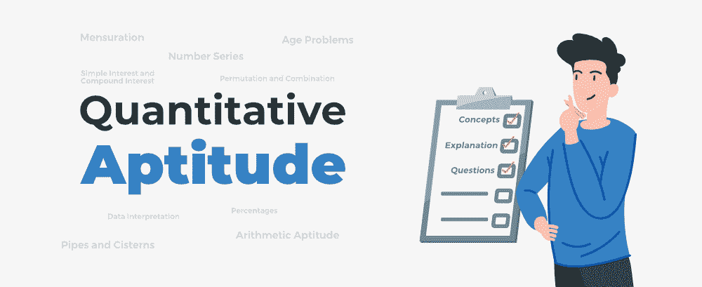

# 定量能力-概念、问题和解释

> 原文:[https://www . geesforgeks . org/quantitative-intelligence-concepts-questions-and-explain/](https://www.geeksforgeeks.org/quantitative-aptitude-concepts-questions-and-explanation/)

对于考官或雇主来说，**定量能力倾向**测试是一种经过科学验证的方法，通过基于逻辑或问题解决或数字测试的各种不同类型的问题来评估候选人的能力。通过这种测试，人们可以判断候选人执行任务的能力、认知能力以及对工作场所情况的反应方式。要掌握**职位量化能力倾向**或任何其他即将到来的考试，您首先需要了解**量化能力倾向教学大纲**或与您的考试或面试相关的量化能力倾向主题。

然后之后你需要彻底了解所有这些**量化资质概念**。此外，你需要熟悉**各种定量能力的技巧和诀窍**。最后，你需要**坚持练习能力倾向测验**。

我们将通过提供**基础到高级概念**的大量练习题来帮助你准备定量能力倾向测验的每一个题目。我们开始吧。

## 量化能力主题:

在这里，我们为您提供工程、法律、会计、金融、营销、银行、SSC、UPSC 等**数值资质** **问题****T5】的标准质量。**

*   [数字](https://www.geeksforgeeks.org/numbers/) [ [练习](https://www.geeksforgeeks.org/numbers-gq/)
*   [LCM 和 HCF](https://www.geeksforgeeks.org/lcm-and-hcf/) 【练习 [LCM](https://www.geeksforgeeks.org/lcm-gq/) & [HCF](https://www.geeksforgeeks.org/hcf-gq/)
*   [工作和工资](https://www.geeksforgeeks.org/work-and-wages/) [ [实习](https://www.geeksforgeeks.org/work-and-wages-gq/) ]
*   [管道和蓄水池](https://www.geeksforgeeks.org/pipes-and-cisterns/) [ [练习](https://www.geeksforgeeks.org/pipes-and-cisterns-gq/) ]
*   [时间速度距离](https://www.geeksforgeeks.org/time-speed-distance/) [ [练习](https://www.geeksforgeeks.org/time-speed-distance-gq/) ]
*   [火车、船和溪流](https://www.geeksforgeeks.org/trains-boats-and-streams/) [ [练习](https://www.geeksforgeeks.org/trains-boats-and-streams-2-gq/) ]
*   [百分比](https://www.geeksforgeeks.org/percentages/) [ [练习](https://www.geeksforgeeks.org/percentages-gq/)
*   [比例、比例和合伙](https://www.geeksforgeeks.org/ratio-proportion-and-partnership/) [ [实践](https://www.geeksforgeeks.org/ratio-and-proportion-gq/) ]
*   [混合和混合](https://www.geeksforgeeks.org/mixture-and-alligation/) [ [练习](https://www.geeksforgeeks.org/mixtures-and-alligation-gq/) ]
*   [代数](https://www.geeksforgeeks.org/learn-algebra-set-1/) [ [练习](https://www.geeksforgeeks.org/algebra-gq/) ]
*   [平均](https://www.geeksforgeeks.org/average/) [ [练习](https://www.geeksforgeeks.org/average/)
*   [年龄](https://www.geeksforgeeks.org/age/)[练习](https://www.geeksforgeeks.org/age-gq/)
*   [盈亏](https://www.geeksforgeeks.org/profit-and-loss/)【[惯例](https://www.geeksforgeeks.org/profit-and-loss-gq/)】
*   [简单兴趣](https://www.geeksforgeeks.org/simple-interest/) [ [练习](https://www.geeksforgeeks.org/simple-interest-gq/) ]
*   [复利](https://www.geeksforgeeks.org/compound-interest/) [ [惯例](https://www.geeksforgeeks.org/compound-interest-gq/) ]

*   [测定 2D](https://www.geeksforgeeks.org/mensuration-2d/) [ [练习](https://www.geeksforgeeks.org/mensuration-2d-gq/) ]
*   [测定 3D](https://www.geeksforgeeks.org/mensuration-3d/) [ [练习](https://www.geeksforgeeks.org/mensuration-3d-gq/) ]
*   [三角学&身高和距离](https://www.geeksforgeeks.org/trigonometry-height-and-distances/) [ [练习](https://www.geeksforgeeks.org/trigonometry-height-and-distances-gq/) ]
*   [进行](https://www.geeksforgeeks.org/progressions-ap-gp-hp/) [ [练习](https://www.geeksforgeeks.org/progressions-gq/) ]
*   [对数](https://www.geeksforgeeks.org/logarithm/) [ [练习](https://www.geeksforgeeks.org/logarithm/) ]
*   [排列组合](https://www.geeksforgeeks.org/permutation-and-combination/)【[练习](https://www.geeksforgeeks.org/permutation-and-combination-gq/)】
*   [概率](https://www.geeksforgeeks.org/probability/) [ [练习](https://www.geeksforgeeks.org/probability-3-gq/) ]
*   [几何](https://www.geeksforgeeks.org/geometry-and-co-ordinates/)【[练习](https://www.geeksforgeeks.org/geometry-and-co-ordinates/)】
*   [钟表](https://www.geeksforgeeks.org/clocks/) [ [练习](https://www.geeksforgeeks.org/clocks-clocks-clocks-gq/)
*   [日历](https://www.geeksforgeeks.org/calendar/) [ [练习](https://www.geeksforgeeks.org/calendars-gq/) ]
*   [编码-解码](https://www.geeksforgeeks.org/coding-decoding/) [ [练习](https://www.geeksforgeeks.org/coding-decoding/) ]
*   [比赛](https://www.geeksforgeeks.org/race/)【[练习](https://www.geeksforgeeks.org/race-gq/)】
*   [简化和近似](https://www.geeksforgeeks.org/simplification-and-approximation-gq/) [ [练习](https://www.geeksforgeeks.org/simplification-and-approximation-gq/) ]
*   [数据解读](https://www.geeksforgeeks.org/data-interpretation/)[练习](https://www.geeksforgeeks.org/data-interpretation-gq/)