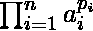
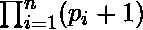

# 查询给定范围内数组乘积的除数|集合 2 (MO 算法)

> 原文:[https://www . geesforgeks . org/query-for-count-of-of-of-of-factor-of-of-of-of-a-array-in-给定范围-set-2-mos-algorithm/](https://www.geeksforgeeks.org/queries-for-count-of-divisors-of-product-of-an-array-in-given-range-set-2-mos-algorithm/)

给定一个大小为 **N** 和 **Q** 的数组**【L，R】**查询，任务是在给定的范围内找到这个数组乘积的除数。

**先决条件:** [莫氏算法](https://www.geeksforgeeks.org/mos-algorithm-query-square-root-decomposition-set-1-introduction/)[模乘逆](https://www.geeksforgeeks.org/modular-multiplicative-inverse-1-n/)[使用筛子进行素分解](https://www.geeksforgeeks.org/prime-factorization-using-sieve-olog-n-multiple-queries/)

**示例:**

> **输入:** arr[] = {4，1，9，12，5，3}，Q = {{1，3}，{3，5 } }
> T3】输出:T5】9
> 24
> 
> **输入:** arr[] = {5，2，3，1，4}，Q = {{2，4}，{1，5 } }
> T3】输出:T5】4
> 16

**进场:**

MO 算法的思想是预处理所有查询，以便一个查询的结果可以用于下一个查询。
设 **a[0…n-1]** 为输入数组， **q[0..**m-1]是一组查询。

1.  对所有查询进行排序，从 **0** 到**√n–1**的 L 值查询放在一起，然后从 **√n** 到**的所有查询 2×√n–1**依次类推。一个块中的所有查询都按照 R 值的递增顺序进行排序。
2.  逐个处理所有查询，每个查询都使用上一个查询中计算的结果。让“结果”是先前查询的结果
3.  一个数 n 可以表示为 **n = ** ，其中 *a <sub> i </sub>* 为质因数， *p <sub> i </sub>* 为它们的整数次幂。
    所以，对于这个因式分解，我们有公式可以求出除数 n 的总数，也就是:

    > 

4.  在**加法函数**中，我们将计数器数组递增为**计数器[a[I]]=计数器[a[i]]+ p <sub>i</sub>** 。让“prev”存储计数器[a[i]]的前一个值。现在随着计数器阵列的变化，结果变化为:

    > *   **结果=结果/ (prev + 1)** (除以 prev + 1 中和了前一个 p <sub>i</sub> )
    > *   **结果=(结果×(计数器【p <sub>I</sub> +1)** (现在前一个结果被中和了,所以我们用新的计数相乘,即计数器【a[i]]+1)

5.  在**移除功能**中，我们将计数器阵列递减为**计数器[a[i]] =计数器[a[I]]–p<sub>I</sub>**。现在随着计数器阵列的变化，结果变化为:

    > *   **结果=结果/ (prev + 1)** (除以 prev + 1 中和了前一个 p <sub>i</sub> )
    > *   **结果=(结果×(计数器【p <sub>I</sub> +1)** (现在前一个结果被中和了,所以我们
    >     乘以新的计数,即计数器【a[i]]+1)

下面是上述方法的实现

```
// C++ program to Count the divisors 
// of product of an Array in range 
// L to R for Q queries
#include <bits/stdc++.h>
using namespace std;

#define MAX 1000000
#define MOD 1000000007
#define ll long long int

// Variable to represent block size.
// This is made global so compare()
// of sort can use it.
int block;

// Structure to represent a query range
struct Query {
    int L, R;
};

// Store the prime factor of numbers
// till MAX
vector<pair<int, int> > store[MAX + 1];

// Initialized to store the count 
// of prime fators
int counter[MAX + 1] = {};

// Result is Initialized to 1
int result = 1;

// Inverse array to store
// inverse of number from 1 to MAX
ll inverse[MAX + 1];

// Function used to sort all queries so that 
// all queries of the same block are arranged 
// together and within a block, queries are
// sorted in increasing order of R values.
bool compare(Query x, Query y)
{
    // Different blocks, sort by block.
    if (x.L / block != y.L / block)
        return x.L / block < y.L / block;

    // Same block, sort by R value
    return x.R < y.R;
}

// Function to calculate modular
// inverse and storing it in Inverse array
void modularInverse()
{

    inverse[0] = inverse[1] = 1;
    for (int i = 2; i <= MAX; i++)
        inverse[i] = inverse[MOD % i]
                    * (MOD - MOD / i) 
                      % MOD;
}

// Function to use Sieve to compute
// and store prime numbers
void sieve()
{

    store[1].push_back({ 1, 0 });
    for (int i = 2; i <= MAX; i++)
    {
        if (store[i].size() == 0)
        {
            store[i].push_back({ i, 1 });

            for (int j = 2 * i; j <= MAX; j += i)
            {
                int cnt = 0;
                int x = j;
                while (x % i == 0)
                    cnt++, x /= i;
                store[j].push_back({ i, cnt });
            }
        }
    }
}

// Function to Add elements
// of current range
void add(int currL, int a[])
{
    int value = a[currL];
    for (auto it = store[value].begin();
         it != store[value].end(); it++) {
        // it->first is ai
        // it->second is its integral power
        int prev = counter[it->first];
        counter[it->first] += it->second;
        result = (result * inverse[prev + 1])
                 % MOD;

        result = (result *
                  (counter[it->first] + 1))
                  % MOD;
    }
}

// Function to remove elements
// of previous range
void remove(int currR, int a[])
{
    int value = a[currR];
    for (auto it = store[value].begin(); 
         it != store[value].end(); it++) {
        // it->first is ai
        // it->second is its integral power
        int prev = counter[it->first];
        counter[it->first] -= it->second;
        result = (result * inverse[prev + 1])
                  % MOD;
        result = (result *
                  (counter[it->first] + 1)) 
                  % MOD;
    }
}

// Function to print the answer.
void queryResults(int a[], int n, Query q[],
                  int m)
{
    // Find block size
    block = (int)sqrt(n);

    // Sort all queries so that queries of 
    // same blocks are arranged together.
    sort(q, q + m, compare);

    // Initialize current L, current R and
    // current result
    int currL = 0, currR = 0;

    for (int i = 0; i < m; i++) {
        // L and R values of current range
        int L = q[i].L, R = q[i].R;

        // Add Elements of current range
        while (currR <= R) {
            add(currR, a);
            currR++;
        }
        while (currL > L) {
            add(currL - 1, a);
            currL--;
        }

        // Remove element of previous range
        while (currR > R + 1)

        {
            remove(currR - 1, a);
            currR--;
        }
        while (currL < L) {
            remove(currL, a);
            currL++;
        }

        cout << result << endl;
    }
}

// Driver Code
int main()
{
    // Precomputing the prime numbers 
    // using sieve
    sieve();

    // Precomputing modular inverse of 
    // numbers from 1 to MAX
    modularInverse();

    int a[] = { 5, 2, 3, 1, 4 };
    int n = sizeof(a) / sizeof(a[0]);

    Query q[] = { { 1, 3 }, { 0, 4 } };

    int m = sizeof(q) / sizeof(q[0]);

    // Answer the queries
    queryResults(a, n, q, m);
    return 0;
}
```

**Output:**

```
4
16

```

**时间复杂度:** O(Q×sqrt(N))