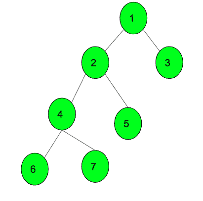

# 查询树中子树的 DFS

> 原文:[https://www . geesforgeks . org/query-for-DFS-of-a-tree 中的子树/](https://www.geeksforgeeks.org/queries-for-dfs-of-a-subtree-in-a-tree/)

给定一棵有 N 个节点和 N-1 条边的树。任务是为多个查询打印给定节点的子树的 DFS。DFS 必须包含给定的节点作为子树的根。



在上面的树中，如果给定 1 作为节点，那么子树的 DFS 将是 ***1 2 4 6 7 5 3*** 。
如果给定 2 作为节点，那么子树的 DFS 将是 ***2 4 6 7 5。*** 。

**进场:**

*   在邻接列表中添加节点之间的边。
*   调用 DFS 函数生成完整树的 DFS。
*   使用 under[]数组存储给定节点(包括该节点)下的子树的高度。
*   在 DFS 函数中，在每次递归调用中不断增加子树的大小。
*   使用哈希法将 DFS 中的节点索引标记为完整。
*   一个节点的子树的 DFS 将永远是一个从节点(**比如索引 ind** )到**(ind+子树的高度)**的连续子阵列。
*   使用散列法获取已存储的节点的索引，并打印原始 DFS 中的节点，直到索引= ind +已存储在[节点]下的子树的高度。

下面是上述方法的实现。

## C++

```
// C++ program for Queries
// for DFS of subtree of a node in a tree
#include <bits/stdc++.h>
using namespace std;
const int N = 100000;

// Adjacency list to store the
// tree nodes connection
vector<int> v[N];

// stores the index of node in DFS
unordered_map<int, int> mp;

// stores the index of node in
// original node
vector<int> a;

// Function to call DFS and count nodes
// under that subtree
void dfs(int under[], int child, int parent)
{

    // stores the DFS of tree
    a.push_back(child);

    // height of subtree
    under[child] = 1;

    // iterate for children
    for (auto it : v[child]) {

        // if not equal to parent
        // so that it does not traverse back
        if (it != parent) {

            // call DFS for subtree
            dfs(under, it, child);

            // add the height
            under[child] += under[it];
        }
    }
}

// Function to print the DFS of subtree of node
void printDFSofSubtree(int node, int under[])
{
    // index of node in the original DFS
    int ind = mp[node];

    // height of subtree of node
    int height = under[node];

    cout << "The DFS of subtree " << node << ": ";

    // print the DFS of subtree
    for (int i = ind; i < ind + under[node]; i++) {
        cout << a[i] << " ";
    }
    cout << endl;
}

// Function to add edges to a tree
void addEdge(int x, int y)
{
    v[x].push_back(y);
    v[y].push_back(x);
}

// Marks the index of node in original DFS
void markIndexDfs()
{
    int size = a.size();

    // marks the index
    for (int i = 0; i < size; i++) {
        mp[a[i]] = i;
    }
}

// Driver Code
int main()
{
    int n = 7;

    // add edges of a tree
    addEdge(1, 2);
    addEdge(1, 3);
    addEdge(2, 4);
    addEdge(2, 5);
    addEdge(4, 6);
    addEdge(4, 7);

    // array to store the height of subtree
    // of every node in a tree
    int under[n + 1];

    // Call the function DFS to generate the DFS
    dfs(under, 1, 0);

    // Function call to mark the index of node
    markIndexDfs();

    // Query 1
    printDFSofSubtree(2, under);

    // Query 1
    printDFSofSubtree(4, under);

    return 0;
}
```

## Java 语言(一种计算机语言，尤用于创建网站)

```
// Java program for queries for DFS
// of subtree of a node in a tree
import java.util.*;

class GFG{

static int N = 100000;

// Adjacency list to store the
// tree nodes connection
@SuppressWarnings("unchecked")
static Vector<Integer> []v = new Vector[N];

// Stores the index of node in DFS
static HashMap<Integer,
               Integer> mp = new HashMap<Integer,
                                         Integer>();

// Stores the index of node in
// original node
static Vector<Integer> a = new Vector<>();

// Function to call DFS and count nodes
// under that subtree
static void dfs(int under[], int child,
                int parent)
{

    // Stores the DFS of tree
    a.add(child);

    // Height of subtree
    under[child] = 1;

    // Iterate for children
    for(int it : v[child])
    {

        // If not equal to parent so that
        // it does not traverse back
        if (it != parent)
        {

            // Call DFS for subtree
            dfs(under, it, child);

            // Add the height
            under[child] += under[it];
        }
    }
}

// Function to print the DFS of subtree of node
static void printDFSofSubtree(int node, int under[])
{

    // Index of node in the original DFS
    int ind = mp.get(node);

    // Height of subtree of node
    int height = under[node];

    System.out.print("The DFS of subtree " + 
                      node + ": ");

    // Print the DFS of subtree
    for(int i = ind; i < ind + under[node]; i++)
    {
        System.out.print(a.get(i) + " ");
    }
    System.out.println();
}

// Function to add edges to a tree
static void addEdge(int x, int y)
{
    v[x].add(y);
    v[y].add(x);
}

// Marks the index of node in original DFS
static void markIndexDfs()
{
    int size = a.size();

    // Marks the index
    for(int i = 0; i < size; i++)
    {
        mp.put(a.get(i), i);
    }
}

// Driver Code
public static void main(String[] args)
{
    int n = 7;

    for(int i = 0; i < v.length; i++)
        v[i] = new Vector<Integer>();

    // Add edges of a tree
    addEdge(1, 2);
    addEdge(1, 3);
    addEdge(2, 4);
    addEdge(2, 5);
    addEdge(4, 6);
    addEdge(4, 7);

    // Array to store the height of
    // subtree of every node in a tree
    int []under = new int[n + 1];

    // Call the function DFS to
    // generate the DFS
    dfs(under, 1, 0);

    // Function call to mark the
    // index of node
    markIndexDfs();

    // Query 1
    printDFSofSubtree(2, under);

    // Query 1
    printDFSofSubtree(4, under);
}
}

// This code is contributed by Amit Katiyar
```

## 蟒蛇 3

```
# Python3 program for Queries
# for DFS of subtree of a node in a tree
N = 100000

# Adjacency list to store the
# tree nodes connection
v = [[]for i in range(N)]

# stores the index of node in DFS
mp = {}

# stores the index of node in
# original node
a = []

# Function to call DFS and count nodes
# under that subtree
def dfs(under, child, parent):

    # stores the DFS of tree
    a.append(child)

    # height of subtree
    under[child] = 1

    # iterate for children
    for it in v[child]:

        # if not equal to parent
        # so that it does not traverse back
        if (it != parent):

            # call DFS for subtree
            dfs(under, it, child)

            # add the height
            under[child] += under[it]

# Function to return the DFS of subtree of node
def printDFSofSubtree(node, under):

    # index of node in the original DFS
    ind = mp[node]

    # height of subtree of node
    height = under[node]

    print("The DFS of subtree", node, ":", end=" ")

    # print the DFS of subtree
    for i in range(ind,ind + under[node]):
        print(a[i], end=" ")
    print()

# Function to add edges to a tree
def addEdge(x, y):
    v[x].append(y)
    v[y].append(x)

# Marks the index of node in original DFS
def markIndexDfs():

    size = len(a)

    # marks the index
    for i in range(size):
        mp[a[i]] = i

# Driver Code

n = 7

# add edges of a tree
addEdge(1, 2)
addEdge(1, 3)
addEdge(2, 4)
addEdge(2, 5)
addEdge(4, 6)
addEdge(4, 7)

# array to store the height of subtree
# of every node in a tree
under = [0]*(n + 1)

# Call the function DFS to generate the DFS
dfs(under, 1, 0)

# Function call to mark the index of node
markIndexDfs()

# Query 1
printDFSofSubtree(2, under)

# Query 2
printDFSofSubtree(4, under)

# This code is contributed by SHUBHAMSINGH10
```

## C#

```
// C# program for queries for DFS
// of subtree of a node in a tree
using System;
using System.Collections.Generic;
class GFG{

static int N = 100000;

// Adjacency list to
// store the tree nodes
// connection
static List<int> []v =
       new List<int>[N];

// Stores the index of node in DFS
static Dictionary<int,
                  int> mp = new Dictionary<int,
                                           int>();

// Stores the index of node in
// original node
static List<int> a = new List<int>();

// Function to call DFS and
// count nodes under that
// subtree
static void dfs(int []under,
                int child,
                int parent)
{   
  // Stores the DFS of tree
  a.Add(child);

  // Height of subtree
  under[child] = 1;

  // Iterate for children
  foreach(int it in v[child])
  {
    // If not equal to parent
    // so that it does not
    // traverse back
    if (it != parent)
    {
      // Call DFS for subtree
      dfs(under, it, child);

      // Add the height
      under[child] += under[it];
    }
  }
}

// Function to print the DFS of
// subtree of node
static void printDFSofSubtree(int node,
                              int []under)
{   
  // Index of node in the
  // original DFS
  int ind = mp[node];

  // Height of subtree of node
  int height = under[node];

  Console.Write("The DFS of subtree " + 
                 node + ": ");

  // Print the DFS of subtree
  for(int i = ind;
          i < ind + under[node]; i++)
  {
    Console.Write(a[i] + " ");
  }
  Console.WriteLine();
}

// Function to add edges
// to a tree
static void addEdge(int x,
                    int y)
{
  v[x].Add(y);
  v[y].Add(x);
}

// Marks the index of node
// in original DFS
static void markIndexDfs()
{
  int size = a.Count;

  // Marks the index
  for(int i = 0; i < size; i++)
  {
    mp.Add(a[i], i);
  }
}

// Driver Code
public static void Main(String[] args)
{
  int n = 7;

  for(int i = 0; i < v.Length; i++)
    v[i] = new List<int>();

  // Add edges of a tree
  addEdge(1, 2);
  addEdge(1, 3);
  addEdge(2, 4);
  addEdge(2, 5);
  addEdge(4, 6);
  addEdge(4, 7);

  // Array to store the height
  // of subtree of every node
  // in a tree
  int []under = new int[n + 1];

  // Call the function DFS to
  // generate the DFS
  dfs(under, 1, 0);

  // Function call to mark the
  // index of node
  markIndexDfs();

  // Query 1
  printDFSofSubtree(2, under);

  // Query 1
  printDFSofSubtree(4, under);
}
}

// This code is contributed by Rajput-Ji
```

## java 描述语言

```
<script>

// Javascript program for queries for DFS
// of subtree of a node in a tree
var N = 100000;

// Adjacency list to
// store the tree nodes
// connection
var v = Array.from(Array(N), () => Array());

// Stores the index of node in DFS
var mp = new Map();

// Stores the index of node in
// original node
var a = [];

// Function to call DFS and
// count nodes under that
// subtree
function dfs(under, child, parent)
{

    // Stores the DFS of tree
    a.push(child);

    // Height of subtree
    under[child] = 1;

    // Iterate for children
    for(var it of v[child])
    {

        // If not equal to parent
        // so that it does not
        // traverse back
        if (it != parent)
        {

            // Call DFS for subtree
            dfs(under, it, child);

            // push the height
            under[child] += under[it];
        }
    }
}

// Function to print the DFS of
// subtree of node
function printDFSofSubtree(node, under)
{

    // Index of node in the
    // original DFS
    var ind = mp.get(node);

    // Height of subtree of node
    var height = under[node];

    document.write("The DFS of subtree " + 
                   node + ": ");

    // Print the DFS of subtree
    for(var i = ind;
            i < ind + under[node]; i++)
    {
        document.write(a[i] + " ");
    }
    document.write("<br>");
}

// Function to add edges
// to a tree
function addEdge(x, y)
{
    v[x].push(y);
    v[y].push(x);
}

// Marks the index of node
// in original DFS
function markIndexDfs()
{
    var size = a.length;

    // Marks the index
    for(var i = 0; i < size; i++)
    {
        mp.set(a[i], i);
    }
}

// Driver Code
var n = 7;
for(var i = 0; i < v.length; i++)
    v[i] = Array();

// push edges of a tree
addEdge(1, 2);
addEdge(1, 3);
addEdge(2, 4);
addEdge(2, 5);
addEdge(4, 6);
addEdge(4, 7);

// Array to store the height
// of subtree of every node
// in a tree
var under = Array(n + 1);

// Call the function DFS to
// generate the DFS
dfs(under, 1, 0);

// Function call to mark the
// index of node
markIndexDfs();

// Query 1
printDFSofSubtree(2, under);

// Query 1
printDFSofSubtree(4, under);

// This code is contributed by rutvik_56

</script>
```

**Output:** 

```
The DFS of subtree 2: 2 4 6 7 5 
The DFS of subtree 4: 4 6 7
```

**时间复杂度:** O( N + M)，其中 N 为节点数，M 为用于预计算的边数，O( N)为最坏情况下的查询。
**辅助空间:** O(N)